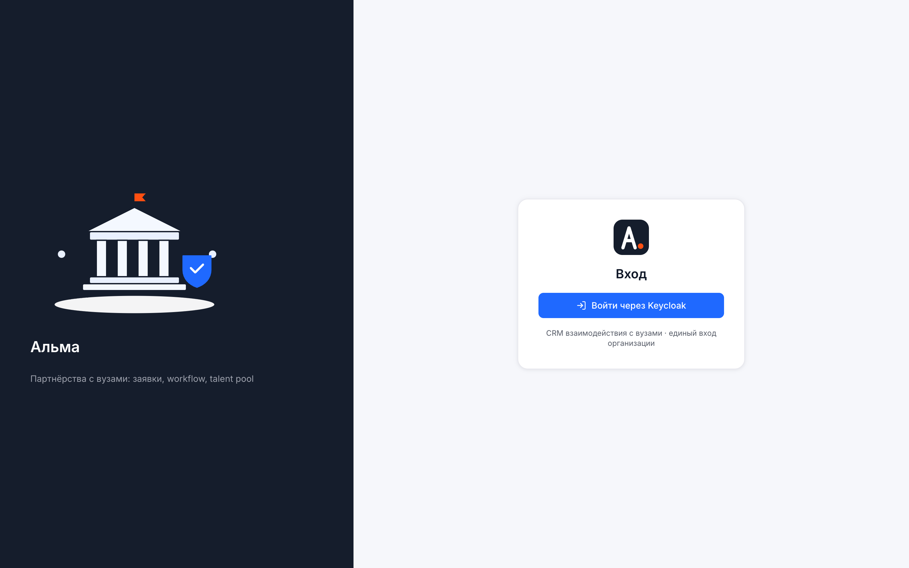
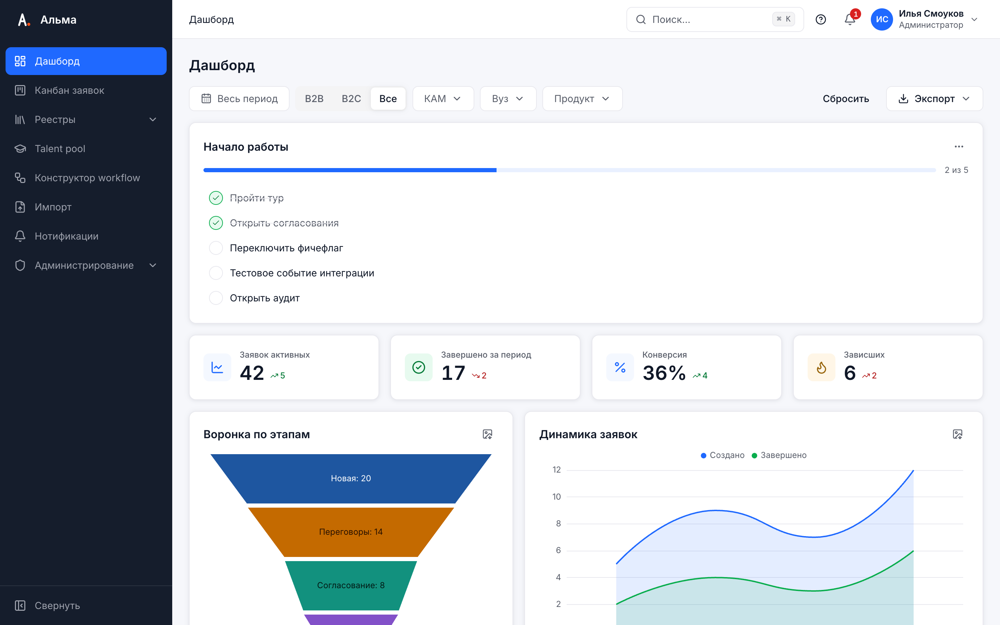
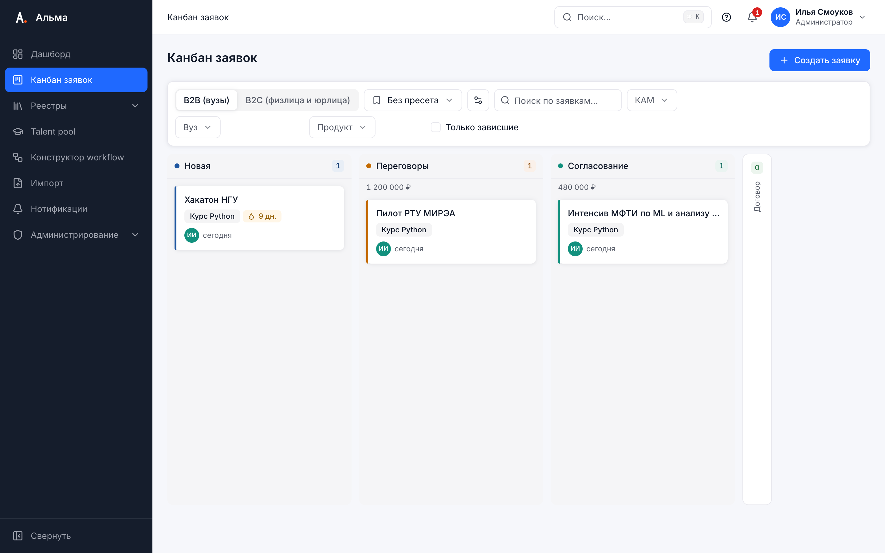
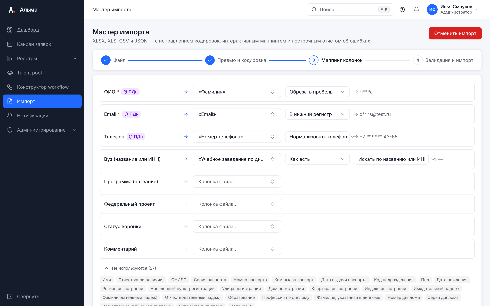
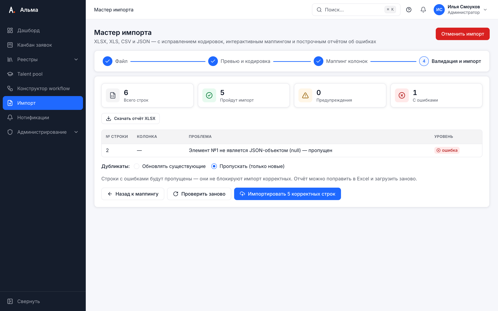
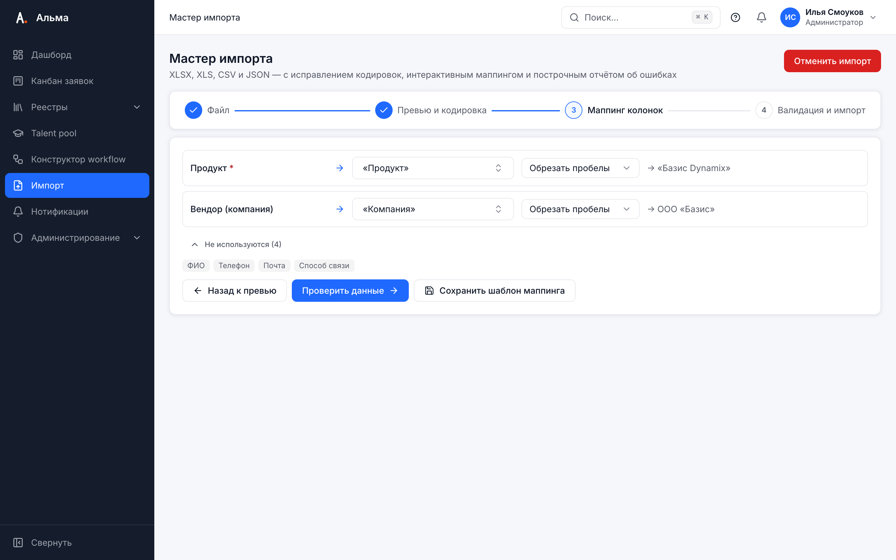
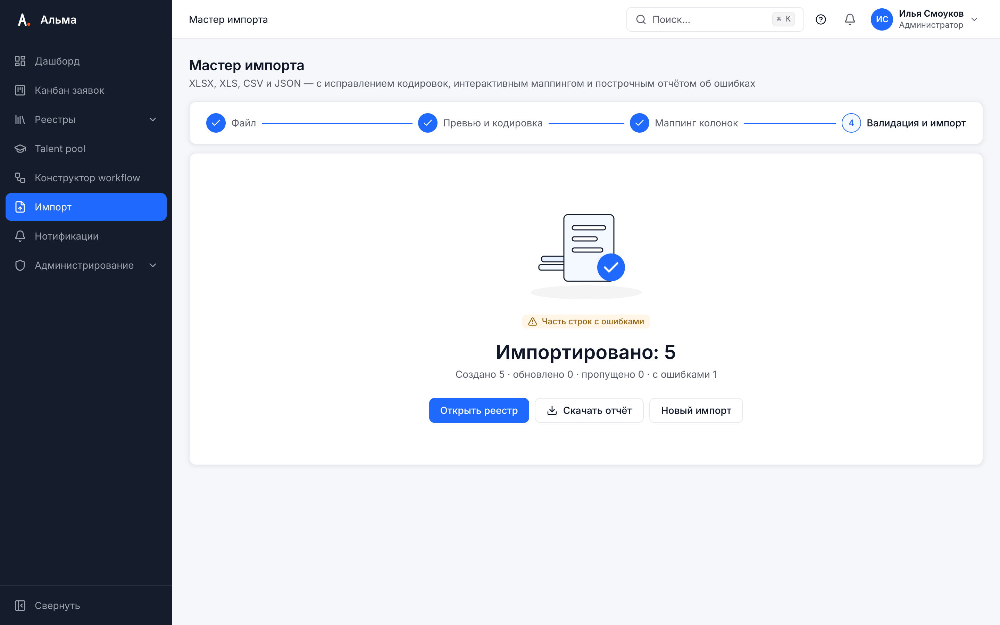

# «Альма» — CRM взаимодействия с вузами

**Живой конструктор процессов, который переводит заявки на новую схему «на лету»,
не останавливая работу людей.** Решение кейса «Ростелекома» (ЛЦТ 2026):
CRM закрытого контура для работы КАМов с вузами (B2B) и физическими/юридическими лицами (B2C).

> **🔗 Живой стенд**
> Приложение: **https://crm.168-113-158-10.nip.io** · вход: `kam1@demo` / `Demo2026!` (все роли — в разделе «Как пользоваться»)
> Заглушка LMS: https://lms.crm.168-113-158-10.nip.io · Заглушка CMS: https://cms.crm.168-113-158-10.nip.io
> Telegram-бот: [@collabse_alma_crm_bot](https://t.me/collabse_alma_crm_bot) · Keycloak: https://id.crm.168-113-158-10.nip.io
> Документация API (Swagger): https://crm.168-113-158-10.nip.io/api/v1/docs

## Оглавление

- [О системе](#о-системе)
- [Возможности](#возможности)
- [Архитектура](#архитектура)
- [Обоснование решений](#обоснование-решений)
- [Как пользоваться](#как-пользоваться)
- [Запуск](#запуск)
- [Консоль Keycloak](#консоль-keycloak)
- [Документация](#документация)
- [Тесты](#тесты)
- [Технологии](#технологии)
- [Структура репозитория](#структура-репозитория)
- [План развития](#план-развития)
- [Лицензия и команда](#лицензия-и-команда)

## О системе

«Альма» — ядро ежедневной работы КАМов с вузами: договоры, программы, продукты,
заявки B2B и B2C, комментарии с @упоминаниями и вложениями, пул талантов
студентов с воронкой «кандидат → пул талантов». Центральная идея — **живые
процессы**: руководитель меняет граф этапов в визуальном конструкторе, опасные
правки уходят на согласование администратору, а после применения все открытые
заявки переводятся на новую схему одной транзакцией — работа не встаёт ни на
минуту.

Система спроектирована для **закрытого контура**: default-deny NetworkPolicy,
у ядра нет выхода в интернет ни по коду, ни по сети; единственный под с egress
наружу — служба уведомлений (прообраз DMZ), и только она видит токен
Telegram-бота. Персональные данные студентов зашифрованы на уровне приложения
(Fernet + HMAC blind index), маскируются по умолчанию и раскрываются только
с записью в аудит — меры 152-ФЗ встроены в схему данных, а не наложены сверху.

Технически это модульный монолит FastAPI с тремя сервисами-сателлитами
(служба уведомлений, заглушки LMS и CMS), PostgreSQL 16, MinIO, KeyDB и
self-hosted Keycloak 26 — всё разворачивается в Kubernetes одной командой,
локально (k3d/minikube) или на VPS. Интерфейс — React 18 + TypeScript на
собственной токен-системе, ретемированной под дизайн-систему «Ростелекома»
gen2 («Атомаро»).

## Возможности

- 🧩 **Конструктор процессов** — визуальный редактор графа этапов (ветвления,
  возвраты с обязательным комментарием); опасные правки уходят на согласование
  администратору, а заявки **переводятся на новую схему «на лету»** одной
  транзакцией — работа не встаёт.
- 📋 **Доска заявок B2B/B2C** — перетаскивание карточек по разрешённым
  переходам, обновление всех открытых досок в реальном времени по SSE при
  публикации новой схемы.
- 📥 **Диалоговый импорт XLSX/XLS/CSV/JSON** — старый BIFF-Excel по магическим
  байтам, автоопределение битых кодировок (cp1251/koi8-r/cp866…), интерактивное
  сопоставление колонок с шаблонами и построчным отчётом ошибок.
- 🎓 **Пул талантов студентов + 152-ФЗ** — воронка «кандидат → пул талантов»,
  ПДн в БД зашифрованы (Fernet + blind index), маскирование по умолчанию,
  раскрытие только с аудитом.
- 🤖 **Telegram-бот** — уведомления и эскалация «зависших» заявок
  (порог настраивается, каскад ответственный → руководитель); авторизация через
  тот же Keycloak, команды строго по ролевой модели.
- 🔗 **Двусторонние интеграции LMS/CMS** — единый JSON-конверт с HMAC-подписью,
  повторные попытки, очередь недоставленных (DLQ); заглушки — отдельные поды
  с журналом обмена, проверяемые по сети.
- 📊 **Интерактивные аналитические панели** — ECharts с фильтрами, детализацией
  и экспортом PNG/XLSX/CSV; таблицы-реестры с личными пресетами.
- 🧭 **Адаптация сотрудников** — экран приветствия, интерактивные туры по
  ролям, контрольный список «Начало работы»; принцип «ноль тупиков».
- 🔐 **RBAC на self-hosted Keycloak** — 4 роли, каждая проверка продублирована
  на backend; закрытый контур с default-deny NetworkPolicy.

Мастер импорта проверен на реальных выгрузках «как в жизни»: имена файлов в
битой кодировке cp866, таблица с 30+ «грязными» колонками («Отчествопри
наличии)», паспорт, СНИЛС) — сопоставление предлагается автоматически, ПДн в
предпросмотре маскируются ещё до записи в БД, а паспортные колонки просто не
имеют целевых полей и в CRM не попадают; null-элементы в JSON становятся
построчными ошибками отчёта, а не отказом всего файла. Подробная аттестация —
[docs/evidence/import-export-test.md](docs/evidence/import-export-test.md).

| | |
|---|---|
|  |  |

| | |
|---|---|
|  |  |
|  |  |

Названия разделов на снимках могут незначительно отличаться от текущей версии интерфейса.

## Архитектура

Контекст системы: четыре роли работают с CRM внутри закрытого контура, внешние
системы — LMS, CMS (двусторонний обмен) и Telegram (только исходящие уведомления):

``mermaid
flowchart LR
    subgraph roles["Пользователи (VPN, закрытый контур)"]
        KAM["КАМ — ведёт вузы и заявки"]
        HEAD["Руководитель КАМов — процессы и эскалации"]
        ADM["Администратор — согласования, словари, аудит"]
        OBS["Наблюдатель — только чтение, ПДн маскированы"]
    end
    ALMA["«Альма» CRM взаимодействия с вузами"]
    LMS["LMS — система обучения (двусторонний обмен)"]
    CMS["CMS — сайт и лиды (двусторонний обмен)"]
    TGE["Telegram — уведомления и эскалации (исходящие)"]

    KAM --> ALMA
    HEAD --> ALMA
    ADM --> ALMA
    OBS --> ALMA
    ALMA <--> LMS
    ALMA <--> CMS
    ALMA --> TGE

    classDef core fill:#EBF2FF,stroke:#1F69FF,color:#101828
    classDef ext fill:#151D2C,stroke:#151D2C,color:#FFFFFF
    class ALMA core
    class LMS,CMS,TGE ext
``

Контейнерный уровень — что именно работает в кластере и кто с кем говорит:

``mermaid
flowchart TB
    USR["КАМ / head_kam / admin / observer (браузер, VPN в закрытый контур)"]
    subgraph cluster["Kubernetes, namespace crm — закрытый контур (default-deny NetworkPolicy)"]
        ING["Ingress (traefik): / → интерфейс, /api → ядро, отдельные хосты: id / lms / cms"]
        subgraph apps["Приложения (tier=app)"]
            FE["frontend React 18 + TS, Tailwind v4 + shadcn/ui (токены ДС РТК gen2), React Flow, ECharts · nginx-unprivileged :8080"]
            BE["backend :8000 — модульный монолит FastAPI workflow · requests · crm · import/export · talent_pool · reporting · integrations · notifications"]
            LMS["lms-stub :8020 журнал обмена"]
            CMS["cms-stub :8030 форма лида + журнал"]
        end
        subgraph iam["IAM (tier=iam)"]
            KC["keycloak :8080 start --import-realm"]
        end
        subgraph data["Данные (tier=data)"]
            PG[("PostgreSQL 16 ПДн — Fernet-шифртекст")]
            S3[("MinIO crm-files/imports/exports")]
            KD[("KeyDB cache-aside crm:v1:*")]
        end
        subgraph dmz["DMZ (tier=dmz) — в проде отдельный сегмент"]
            NT["notification-service :8010 FastAPI + aiogram 3 единственный egress наружу"]
        end
        CRON["CronJob stuck-check (0 * * * *)"]
        JOBS["Jobs: db-migrate, minio-init, seed-demo"]
    end
    TG["Telegram Bot API (интернет)"]
    MAX["Max / Email (Exchange) — каналы-заглушки"]

    USR --> ING
    ING --> FE
    ING -->|"/api"| BE
    ING --> KC & LMS & CMS
    FE -.->|"OIDC + PKCE"| KC
    BE --> PG & S3 & KD
    BE -->|JWKS| KC
    BE <-->|"JSON API + HMAC (двусторонне)"| LMS
    BE <-->|"JSON API + HMAC (двусторонне)"| CMS
    BE -->|"POST /api/v1/send X-Internal-Token"| NT
    NT -->|"client credentials"| KC
    NT -->|"/internal/bot/* (RBAC привязанного)"| BE
    NT -->|"long-polling :443 единственный egress"| TG
    NT -.-> MAX
    CRON -->|"POST /internal/jobs/check-stuck-requests"| BE
    JOBS --> PG & S3
    KC --> PG

    %% палитра — из токенов ДС РТК gen2 (brand-rt.md): синий base-info, оранжевый status-01, графит neutral-950
    classDef app fill:#EBF2FF,stroke:#1F69FF,color:#101828
    classDef data fill:#F9FAFB,stroke:#585D69,color:#101828
    classDef iam fill:#F9FAFB,stroke:#585D69,color:#101828
    classDef dmz fill:#FFF0EA,stroke:#FF4F12,color:#101828
    classDef ext fill:#151D2C,stroke:#151D2C,color:#FFFFFF
    class FE,BE,LMS,CMS,ING,CRON,JOBS app
    class PG,S3,KD data
    class KC iam
    class NT dmz
    class USR,TG,MAX ext
``

Сквозной сценарий «переход заявки → уведомление в Telegram» — как бизнес-событие
покидает закрытый контур через единственную разрешённую точку:

``mermaid
sequenceDiagram
    autonumber
    actor U as КАМ (браузер)
    participant FE as Интерфейс «Альмы»
    participant BE as Ядро CRM (FastAPI)
    participant PG as PostgreSQL
    participant NT as Служба уведомлений (DMZ)
    participant TG as Telegram Bot API

    U->>FE: перетаскивает карточку заявки в разрешённую колонку
    FE->>BE: POST /api/v1/requests/{id}/transitions
    BE->>PG: проверка перехода по графу + запись истории (одна транзакция)
    PG-->>BE: зафиксировано (оптимистическая блокировка по version)
    BE-->>FE: 200 — новый статус · SSE обновляет все открытые доски
    BE->>NT: POST /api/v1/send (X-Internal-Token, без ПДн)
    NT->>TG: sendMessage — единственный egress контура (:443)
    TG-->>NT: доставлено
    NT-->>BE: статус доставки (журнал уведомлений)
``

Ключевое о закрытом контуре: **у ядра CRM нет выхода в интернет ни по коду, ни
по сети** (default-deny NetworkPolicy, разрешения точка-точка между подами);
служба уведомлений — единственный под с egress наружу (только 443 и только не
в кластерные сети), токен Telegram-бота видит только она. В целевой архитектуре
она выносится в DMZ без изменения кода — общение с ядром уже идёт только по
HTTP точка-точка.

### Архитектурные диаграммы

- [docs/design/OVERVIEW.md](docs/design/OVERVIEW.md) — C4: контекст и контейнеры, сводная архитектура
- [docs/design/data-model.md](docs/design/data-model.md) — ERD: 35 таблиц PostgreSQL, шифрование ПДн, ключи KeyDB
- [docs/design/deployment.md](docs/design/deployment.md) — программно-аппаратная схема: топология k8s, DMZ, NetworkPolicy, расчёт ёмкости
- [docs/design/workflow-engine.md](docs/design/workflow-engine.md) — диаграммы процессов: графы, миграции, блокировки, SLA

Соответствие техническому заданию (полная трассировка «требование → где реализовано») — [docs/evidence/compliance.md](docs/evidence/compliance.md).

## Обоснование решений

- **Модульный монолит + сервисы-сателлиты.** Перевод заявок на новую схему
  «на лету» — это ACID-транзакция; в микросервисах она превращается в сагу с
  компенсациями — риск без выгоды. Границы сервисов проведены только там, где
  они настоящие: служба уведомлений — другой контур безопасности, заглушки
  LMS/CMS — внешние системы по определению. При этом Kubernetes даёт примитивы
  ровно под требования: HPA (300+ пользователей), CronJob («зависшие» заявки),
  NetworkPolicy (закрытый контур), Jobs (миграции и наполнение данными).
- **Outbox для интеграций.** События CRM→LMS/CMS фиксируются в БД в той же
  транзакции, что и бизнес-операция, и доставляются фоновым обработчиком:
  единый JSON-конверт, HMAC-подпись, повторные попытки, очередь недоставленных
  (DLQ). Падение внешней системы не теряет события и не откатывает работу
  пользователя.
- **Шифрование ПДн: Fernet + HMAC.** ПДн студентов лежат в БД только
  шифртекстом (Fernet, MultiFernet-ротация ключей); поиск — через blind index
  HMAC-SHA256 с отдельным ключом, без раскрытия значений; для списков —
  псевдонимизация «Фамилия И.О.». Маскирование по умолчанию для всех ролей,
  раскрытие — только явное действие с записью в аудит. Ключи живут в k8s Secret,
  генерируются при установке и в git не попадают. ПДн не просачиваются в KeyDB,
  логи, отчёты об ошибках импорта, интеграционные события и Telegram.
- **DMZ для внешних каналов.** Единственный egress закрытого контура — служба
  уведомлений (порт 443, запрет на кластерные сети); пустой токен бота — штатный
  режим console-заглушки, то есть решение работает и в контуре вовсе без выхода
  в интернет. Каналы абстрагированы: Telegram активен, Max/Email — подключаемые
  адаптеры.
- **Дизайн-система на токенах.** Tailwind v4 `@theme` в OKLCH + `tokens.ts` +
  тема ECharts, ретеминг под дизайн-систему «Ростелекома» gen2 («Атомаро»):
  синий `base-info #1F69FF`, оранжевый акцент `status-01 #FF4F12`, графитовый
  сайдбар, проверенные AA-контрасты. Шрифтовой стек `'Rostelecom Basis' → Inter`
  (файлы фирменного шрифта в репозиторий не входят — лицензия РТК). Детали —
  [docs/design/redesign.md](docs/design/redesign.md) и
  [docs/design/brand-rt.md](docs/design/brand-rt.md).

Полная аргументация выбора стека — [docs/design/OVERVIEW.md](docs/design/OVERVIEW.md) §7.

## Как пользоваться

Роли и их сценарии:

- **Администратор** — согласует опасные правки процессов (`/admin/approvals`),
  ведёт словари и функциональные переключатели, смотрит аудит и монитор
  интеграций.
- **Руководитель КАМов** — редактирует графы процессов в конструкторе, получает
  эскалации «зависших» заявок, анализирует воронку на аналитической панели.
- **КАМ** — ведёт вузы, договоры и заявки на доске, импортирует данные,
  общается в комментариях с @упоминаниями; читает всё, пишет своё.
- **Наблюдатель** — только чтение; ПДн маскированы без права раскрытия.

Демо-пользователи (Keycloak, realm `crm`, преднастроены при импорте realm):

| Логин | Пароль | Роль | Что показывает |
|---|---|---|---|
| `admin@demo` | `Demo2026!` | admin | всё + согласование изменений процессов, админка, аудит |
| `head@demo` | `Demo2026!` | head_kam | руководитель КАМов: конструктор процессов, эскалации зависших |
| `kam1@demo` | `Demo2026!` | kam | КАМ (руководитель — `head@demo`): читает всё, пишет своё |
| `kam2@demo` | `Demo2026!` | kam | второй КАМ — параллельная работа и права на «чужие» заявки |
| `observer@demo` | `Demo2026!` | observer | только чтение; ПДн маскированы без права раскрытия |

Пошаговые сценарии со снимками экрана — в [руководстве пользователя](docs/manual/Альма%20—%20руководство%20пользователя.pdf).

Привязка Telegram: CRM → `/settings/notifications` → «Привязать Telegram» →
QR/код → команда `/start <код>` боту. Команды `/my` и `/stuck` отвечают по роли
привязанного пользователя; непривязанный получает отказ.

## Запуск

### Вариант 1 — docker-compose (локальная разработка)

``sh
make dev                      # postgres + keycloak + minio + keydb + backend (hot-reload) + уведомления + заглушки
cd frontend && npm run dev    # vite на :5173, прокси /api → localhost:8000
``

`make dev-env` создаёт `deploy/compose/.env` (генерирует ключи шифрования ПДн;
файл не входит в git и не перетирается повторными запусками). Остановить — `make dev-down`.

### Вариант 2 — локальный Kubernetes (k3d, основной путь)

``sh
make k8s-secrets && make k8s-up   # 1. секреты + кластер + образы + манифесты + ожидание
make demo                         # 2. демо-данные и «зависшие» заявки → открыть `crm.localhost`
``

> `make k8s-up` сам вызывает `k8s-secrets`, поэтому шаг 1 можно сократить до
> одной команды; секреты (включая ключи шифрования ПДн) генерируются локально
> и в git не попадают.

Открывать в Chrome/Chromium/Edge по адресу `crm.localhost` — браузер
резолвит `*.localhost` в `127.0.0.1` сам: без правки `/etc/hosts` и без sudo.
`http://*.localhost` считается безопасным контекстом (Web Crypto доступен), что
обязательно для входа через Keycloak (PKCE S256).

| Адрес | Что это |
|---|---|
| `crm.localhost` | «Альма» (фронтенд `/`, API `/api` — один хост, без CORS) |
| `id.crm.localhost` | Keycloak (realm `crm`) |
| `lms.crm.localhost` | Заглушка LMS — журнал двустороннего обмена + кнопка «событие в CRM» |
| `cms.crm.localhost` | Заглушка CMS — демо-форма лида + журнал |
| `minio.crm.localhost` | Консоль MinIO (S3-хранилище файлов) |

Ingress дополнительно отвечает на алиасах `*.crm.local` для curl/API/k6
(строку для `/etc/hosts` печатает `make hosts`; для curl достаточно
`--resolve crm.local:80:127.0.0.1`). Вход в интерфейс через `http://*.local`
невозможен: это небезопасный контекст браузера, Web Crypto недоступен и
PKCE-вход падает — используйте `crm.localhost`.

Вариант minikube: `make k8s-up-minikube` (стартует с `--cni=calico` —
принудительное применение NetworkPolicy; на macOS с драйвером docker
дополнительно нужен `minikube tunnel`). Цели, применяющие манифесты
(`demo`, `seed`, `k8s-apply`), на minikube-стенде запускайте с
`OVERLAY=deploy/k8s/overlays/minikube`. Снести кластер — `make k8s-down`.

### Вариант 3 — VPS (публичный стенд)

``sh
VM_IP=<ip> VM_HOST=<ssh-host> make vm-deploy   # amd64-образы → импорт, манифесты overlay vm, cert-manager (TLS), smoke-проверка
``

Хосты — `*.<IP-через-дефисы>.nip.io` (публичный wildcard-DNS, у посетителей
ничего настраивать не нужно), TLS выпускает cert-manager.

### Живой стенд

| Адрес | Что это |
|---|---|
| https://crm.168-113-158-10.nip.io | «Альма» — вход под любым демо-пользователем |
| https://id.crm.168-113-158-10.nip.io | Keycloak (realm `crm`) |
| https://lms.crm.168-113-158-10.nip.io | Заглушка LMS — журнал двустороннего обмена |
| https://cms.crm.168-113-158-10.nip.io | Заглушка CMS — демо-форма лида |

Telegram-бот стенда — [@collabse_alma_crm_bot](https://t.me/collabse_alma_crm_bot).
Как выпустить своего бота для собственного развёртывания: получить токен у
[@BotFather](https://t.me/BotFather), вписать его в
`deploy/k8s/overlays/<k3d|minikube>/secrets/crm-telegram.env`
(`TELEGRAM_BOT_TOKEN=…`; для compose — в `deploy/compose/.env`), затем
`make k8s-apply && kubectl -n crm rollout restart deploy/notification`.
Если username бота отличается от стандартного, задайте `TELEGRAM_BOT_USERNAME`
в окружении backend и службы уведомлений. Пустой токен — штатный режим
console-заглушки: сообщения уходят в лог службы уведомлений.

<b>Частые проблемы и их решения</b>

| Симптом | Решение |
|---|---|
| `crm.localhost` не открывается | проверьте, свободен ли порт 80: `sudo lsof -i :80` — балансировщик k3d пробрасывает 80 на localhost; `*.localhost` резолвит сам Chromium/Edge (в Firefox/Safari при необходимости добавьте строку из `make hosts` с `crm.localhost`) |
| Открыли `http://crm.local` — «вход невозможен» | ожидаемо: `http://*.local` — небезопасный контекст, Web Crypto недоступен; для входа используйте `crm.localhost` |
| Поды в `Pending`/`OOMKilled` | Docker Desktop: выделите ≥ 4 CPU и ≥ 6–8 GB памяти (сумма requests стенда ≈ 1.7 CPU / 2.5 GiB + сам кластер) |
| minikube на macOS: Ingress недоступен | драйвер docker требует `sudo minikube -p crm tunnel`; либо возьмите IP из `minikube -p crm ip` |
| Keycloak долго не готов | норма: JVM + импорт realm — до 5 минут (startupProbe учитывает); `make k8s-apply` дожидается сам |
| `wait --for=condition=complete job/db-migrate` истёк | `kubectl -n crm logs job/db-migrate` — обычно не готов postgres (PVC/StorageClass overlay-я) |
| Доска заявок не обновилась после публикации схемы | SSE-поток мог оборваться — обновите страницу (F5), у фронтенда есть резервный опрос |
| Telegram-уведомления не приходят | токен не задан (режим console-заглушки — `kubectl -n crm logs deploy/notification`) либо в контуре закрыт egress |
| Изменили манифесты — как проверить без кластера | `make k8s-validate` (рендер обоих overlay + kubeconform) |
| Пересоздать демо-данные | `make seed` (идемпотентно) или `make demo` (данные + триггер «зависших») |

<b>Основные make-цели</b>

| Цель | Действие |
|---|---|
| `dev` / `dev-down` | compose-стек для разработки |
| `k8s-up` / `k8s-up-minikube` / `k8s-down` | стенд Kubernetes под ключ |
| `k8s-apply` | идемпотентный apply манифестов (Jobs пересоздаются) |
| `k8s-secrets` | генерация секретов overlay-я (в git не попадают) |
| `k8s-validate` | рендер обоих overlay + kubeconform |
| `vm-deploy` / `vm-smoke` | развёртывание на VPS и его smoke-проверка |
| `seed` / `demo` | демо-данные; `demo` дополнительно триггерит «зависшие» |
| `stuck-check` | тот же триггер для compose-стенда (паритет CronJob) |
| `realm-sync` | регенерация ConfigMap realm из `deploy/keycloak/realm-crm.json` |
| `hosts` | строка для `/etc/hosts` |
| `load-test` | k6-сценарий 300→400 VU (`deploy/load/`) |
| `logs`, `clean`, `help` | сервисные |

## Консоль Keycloak

Консоль администратора Keycloak доступна по пути `/admin/master/console/`:
на живом стенде — https://id.crm.168-113-158-10.nip.io/admin/master/console/,
на локальном — `id.crm.localhost`/admin/master/console/.

Данные для входа генерируются при установке и хранятся только в секрете кластера:

``sh
kubectl -n crm get secret crm-keycloak-admin -o jsonpath='{.data.username}' | base64 -d; echo
kubectl -n crm get secret crm-keycloak-admin -o jsonpath='{.data.password}' | base64 -d; echo
``

> **Внимание: две разные формы входа.** Консоль администратора — это realm
> `master` и служебная учётная запись из секрета `crm-keycloak-admin`;
> вход в саму CRM — realm `crm` и демо-пользователи из таблицы выше.
> Учётные записи не взаимозаменяемы: демо-пользователи в консоль не входят,
> а администратор консоли не имеет ролей CRM.

Сервисные клиенты realm: `crm-frontend` (public + PKCE), `crm-notification` и
`crm-integration` (confidential, роли `svc_notification`/`svc_integration`),
`crm-loadtest` (Direct Access Grants — только для нагрузочного тестирования).
Секреты confidential-клиентов генерируются `make k8s-secrets` и подставляются
Keycloak при импорте realm — в git они не попадают.

## Документация

- **Документация API (OpenAPI 3 / Swagger UI)** — [живой стенд](https://crm.168-113-158-10.nip.io/api/v1/docs); при локальном запуске — тот же путь `/api/v1/docs`, машиночитаемая схема — `/api/v1/openapi.json` (135 методов REST API).

- **[Руководство пользователя (PDF)](docs/manual/Альма%20—%20руководство%20пользователя.pdf)** — пошаговые сценарии по ролям со снимками экрана
- **Презентация** — [docs/presentation/](docs/presentation/)
- **Аттестации и доказательства** — [docs/evidence/](docs/evidence/):
  - [compliance.md](docs/evidence/compliance.md) — соответствие техническому заданию
  - [k8s-evidence.md](docs/evidence/k8s-evidence.md) — доказательства развёртывания в Kubernetes с живого кластера
  - [load-report.md](docs/evidence/load-report.md) — отчёт нагрузочного тестирования (300+ пользователей)
  - [import-export-test.md](docs/evidence/import-export-test.md) — аттестация импорта/экспорта на реальных «грязных» данных
- **Проектная документация** — [docs/design/](docs/design/):
  - [OVERVIEW.md](docs/design/OVERVIEW.md) — сводная архитектура, C4, трассировка требований
  - [data-model.md](docs/design/data-model.md) — PostgreSQL: DDL 35 таблиц, шифрование ПДн, ключи KeyDB
  - [api-contract.md](docs/design/api-contract.md) — REST `/api/v1`, матрица RBAC, интеграционный конверт
  - [workflow-engine.md](docs/design/workflow-engine.md) — семантика движка процессов: графы, миграции, блокировки, SLA
  - [deployment.md](docs/design/deployment.md) — k8s, секреты, NetworkPolicy, k6, расчёт ёмкости
  - [ux.md](docs/design/ux.md) — экраны, роли в интерфейсе, конструктор процессов
  - [redesign.md](docs/design/redesign.md) — дизайн-система CRM: токены, компоненты, движение, адаптация
  - [brand-rt.md](docs/design/brand-rt.md) — ретеминг под ДС «Ростелекома» gen2: палитра, соответствие токенов, контрасты

## Тесты

Всего **392 юнит-теста** (pytest, без учёта параметризаций): 274 в backend,
82 в службе уведомлений, 36 в заглушках LMS/CMS; фронтенд — строгая проверка
типов + сборка.

| Сервис | Команды |
|---|---|
| backend (274) | `cd backend && uv sync && uv run pytest` (линт: `uv run ruff check .`) |
| notification (82) | `cd services/notification && uv sync && uv run pytest` |
| lms-stub / cms-stub (36) | `cd services/lms-stub && uv sync && uv run pytest` (аналогично cms-stub) |
| frontend | `cd frontend && npm ci && npm run typecheck && npm run build` |

Нагрузочное тестирование — k6-сценарий с разгоном до 300 VU и пиком 400
(`make load-test`); пороги SLA зашиты в сценарий (p95 < 500 мс, p99 < 1000 мс,
ошибок < 1%), параллельно наблюдается работа HPA
(`kubectl -n crm get hpa backend -w`, реплики 2 → 6 → 2). Отчёт выполненного
прогона — [docs/evidence/load-report.md](docs/evidence/load-report.md), скрипт
и docker-вариант запуска — `deploy/load/README.md`.

Аттестация импорта/экспорта на реальных данных —
[docs/evidence/import-export-test.md](docs/evidence/import-export-test.md).

## Технологии

- **Backend:** Python 3.12, FastAPI, SQLAlchemy 2 (async), Pydantic v2, Alembic;
  импорт — `openpyxl`, `xlrd 2.x`, `charset-normalizer`; криптография —
  `cryptography` (Fernet, работает офлайн); aiogram 3 в службе уведомлений.
- **Frontend:** React 18 + TypeScript, Vite, Tailwind CSS v4 + shadcn/ui
  (собственная токен-система), TanStack Table (реестры с личными пресетами),
  @xyflow/react (конструктор процессов), Apache ECharts (аналитические панели
  со встроенным экспортом PNG), motion (единый язык движения с уважением
  `prefers-reduced-motion`), keycloak-js (OIDC + PKCE). Без CDN: шрифты
  @fontsource, иконки lucide, иллюстрации — встроенный SVG.
- **Данные и инфраструктура:** PostgreSQL 16, MinIO (S3), KeyDB (cache-aside,
  осознанно без персистентности — падение кэша деградирует в чтение из БД),
  Keycloak 26, Kubernetes (k3d / minikube / VPS-k3s), kustomize, cert-manager,
  k6, GitHub Actions.
- **Порты компонентов:** backend 8000 · frontend nginx 8080 (Service 80) ·
  notification 8010 · lms-stub 8020 · cms-stub 8030 · keycloak 8080 ·
  postgres 5432 · minio 9000/9001 · keydb 6379.

## Структура репозитория

``
backend/                  # модульный монолит FastAPI (workflow, requests, crm, import_export, …)
frontend/                 # React 18 + TS + Vite (Tailwind v4, shadcn/ui, TanStack Table, motion, React Flow, ECharts)
services/notification/    # FastAPI + aiogram 3 (Telegram-бот, DMZ)
services/lms-stub/        # заглушка LMS (журнал обмена, тестовые события)
services/cms-stub/        # заглушка CMS (демо-форма лида)
deploy/compose/           # docker-compose.dev.yml — локальная разработка
deploy/k8s/base/          # kustomize base: Deployments, StatefulSets, Jobs, CronJobs, NetworkPolicy
deploy/k8s/overlays/      # k3d, minikube, vm (VPS)
deploy/keycloak/          # realm-crm.json — канонический экспорт realm
deploy/scripts/           # генерация секретов, синхронизация realm-ConfigMap, развёртывание на VPS
deploy/load/              # k6-сценарий нагрузочного тестирования + README запуска
docs/design/              # проектная документация (архитектура, данные, API, дизайн)
docs/evidence/            # аттестации: соответствие ТЗ, k8s, нагрузочное, импорт/экспорт
docs/manual/              # руководство пользователя (PDF)
docs/screenshots/         # снимки экрана для README
.github/workflows/        # CI: тесты и линтеры сервисов, сборка интерфейса и образов, валидация манифестов
``

## План развития

- **Асинхронный транспорт интеграций (KeyDB Streams)** — настройка
  `integration_mode: stream` уже принимается API; следующий шаг — переключение
  транспорта конверта `IntegrationEvent` с HTTP на шину
  (`docs/design/api-contract.md` §13).
- **Idempotency-Key для мутирующих запросов** — заголовок с дедупликацией
  повторов на уровне API (сейчас идемпотентность обеспечивается на уровне
  бизнес-операций: наполнение данными, миграции, согласования).
- **Каналы уведомлений Max и Email (Exchange)** — включение существующих
  адаптеров-заглушек службы уведомлений.
- **TLS для локального стенда** — заготовка в `docs/design/deployment.md` §3.6
  (на VPS-стенде TLS уже работает через cert-manager).

## Лицензия и команда

Код — под лицензией [MIT](LICENSE). Названия и фирменные цвета «Ростелекома»
использованы в учебно-демонстрационных целях (ЛЦТ 2026) и не являются
продукцией ПАО «Ростелеком»; файлы фирменного шрифта в репозиторий не входят.

Сделано командой **Collabse**. Вопросы и предложения приветствуются в Issues.
