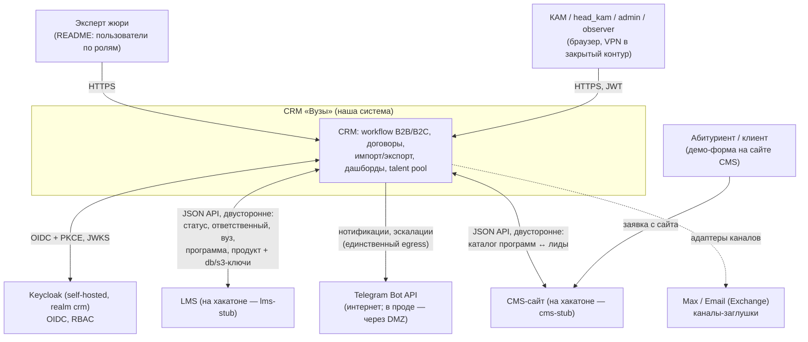
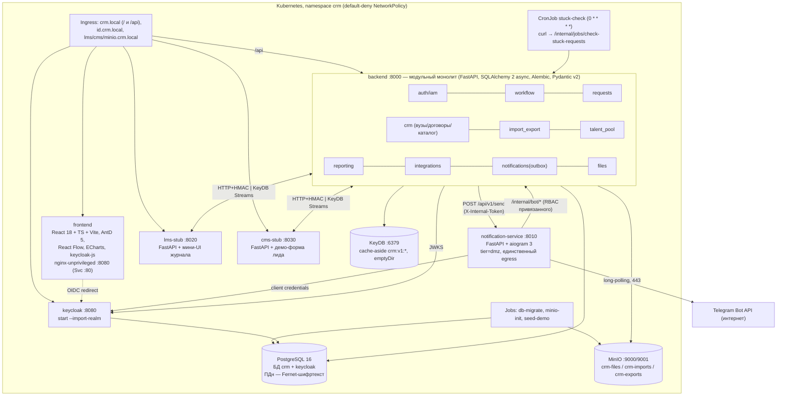

# OVERVIEW — сводная архитектура решения (ЛЦТ 2026, CRM для работы с вузами)

> Документ главного архитектора. Связывает пять проектных документов в одну систему,
> фиксирует сквозные решения и разрешённые противоречия. При любом конфликте между
> документами действует иерархия авторитетности из §2 этого документа.
>
> Источник требований — `PLAN.md` (решения кейсодержателя, Q&A 16.09.2026).
> Чек-лист «не прикопаться» — §8: **каждое** решение кейсодержателя из PLAN.md §2–4
> построчно трассировано на место в системе.

Состав проектной документации:

| Документ | Зона ответственности |
|---|---|
| `docs/design/data-model.md` | PostgreSQL 16: 35 таблиц, DDL, шифрование ПДн, KeyDB-ключи, seed |
| `docs/design/api-contract.md` | REST `/api/v1`, RBAC-матрица, импорт/экспорт, интеграционный конверт |
| `docs/design/workflow-engine.md` | Семантика движка: графы, миграции, локи, SLA, инварианты |
| `docs/design/deployment.md` | k8s (kustomize base + overlays), compose, секреты, NetworkPolicy, k6 |
| `docs/design/ux.md` | Экраны, роли в UI, тема AntD, конструктор, демо-сценарий защиты |

---

## 1. Система одним абзацем

CRM — ядро работы КАМов с вузами (B2B) и физлицами/юрлицами (B2C). Два редактируемых
workflow-графа с ветвлениями, возвратами и админ-апрувом опасных изменений; заявки мигрируют
на новую схему «на лету» одной транзакцией. Вокруг ядра: договоры «1 договор — N продуктов»,
ручное ранжирование программ, диалоговый импорт XLSX/XLS/CSV/JSON с интерактивным маппингом и
устойчивостью к кодировкам, интерактивные дашборды ECharts с экспортом, Talent Pool студентов
с шифрованием ПДн (152-ФЗ), двусторонние интеграции с LMS/CMS на заглушках через единый
JSON-конверт, Telegram-бот нотификаций с авторизацией через self-hosted Keycloak и эскалацией
«зависших» заявок по k8s CronJob. Всё разворачивается в Kubernetes (minikube/k3d) в закрытом
контуре: default-deny NetworkPolicy, единственный egress наружу — notification-service (DMZ).

## 2. Иерархия авторитетности документов (правило разрешения конфликтов)

1. **`data-model.md`** — истина по именам сущностей/таблиц/колонок, DDL, схеме шифрования,
   KeyDB-ключам (префикс `crm:v1:`).
2. **`api-contract.md`** — истина по путям и телам эндпоинтов, ролям API, кодам ошибок,
   интеграционному конверту.
3. Остальные документы следуют первым двум; расхождение = дефект документа, а не выбор кодера.

### 2.1 Терминологический мост (зафиксирован, менять запрещено)

| Слой БД (data-model) | Слой API (api-contract) | UI (ux) |
|---|---|---|
| таблица `deal` | ресурс `Request`, пути `/requests` | «заявка» |
| `workflow_stage` | `status` (в схеме workflow) | «этап» |
| `workflow_stage.sort_order` | поле `position` | порядок колонки канбана |
| `workflow_transition.is_return` | `kind: "forward" \| "return"` | «↩ возврат» |
| `deal_stage_history.kind = system_migration` | history `kind: "migrated"` | событие миграции в таймлайне |
| `deal.stage_entered_at` | `status_updated_at` | «N дней на этапе» |
| `program.priority_rank` (меньше = выше) | `priority_rank` | колонка «Приоритет» |
| `workflow_change_request` | ресурс `/workflows/{id}/changes` | «пакет на согласовании» |

### 2.2 Роли (канонический список всего проекта)

Люди (realm `crm`): **`admin`**, **`head_kam`** (руководитель КАМов), **`kam`**,
**`observer`** (read-only, ПДн маскируются, раскрытие недоступно).
Сервисные роли confidential-клиентов: **`svc_notification`** (клиент `crm-notification`,
Telegram-бот), **`svc_integration`** (клиент `crm-integration`, bearer-альтернатива HMAC).
Клиенты Keycloak: `crm-frontend` (public + PKCE), `crm-notification`, `crm-integration`,
`crm-loadtest` (Direct Access Grants — только нагрузочное).
Правило видимости: kam **читает всё, пишет своё**; эскалации — по `app_user.manager_id`.
Преднастроенные пользователи realm: `admin@demo`, `head@demo`, `kam1@demo`, `kam2@demo`,
`observer@demo` — публикуются в README (требование PLAN §2).

---

## 3. C4: контекст системы



## 4. C4: контейнеры



### 4.1 Сводка модулей backend (модульный монолит)

| Модуль (`backend/app/modules/…`) | Таблицы (владение) | Ключевые API | Документ |
|---|---|---|---|
| `auth` (iam) | `app_user` (зеркало Keycloak, upsert по `keycloak_sub`) | `/auth/me` (permissions для UI) | api-contract §2, §12 |
| `workflow` | `workflow`, `workflow_stage`, `workflow_transition`, `workflow_change_request` | `/workflows*`, `/requests/{id}/transitions`, `/internal/jobs/check-stuck-requests` | workflow-engine.md |
| `requests` | `deal`, `deal_stage_history`, `deal_comment` | `/requests*` (CRUD, board, history, comments, reopen) | api-contract §4 |
| `crm` (справочники/договоры) | `university`, `university_contact`, `counterparty`, `interaction_type`, `product`, `program`, `contract`, `contract_product` | `/universities*`, `/contracts*`, `/products*`, `/programs*` (+priority) | api-contract §3 |
| `import_export` | `import_session`, `import_row_error` | `/import/sessions*`, `/export/jobs*`, `/admin/dictionaries*` | api-contract §6–7, §10.1 |
| `talent_pool` | `student`, `student_status_history`, `federal_project`, `activity`, `activity_schedule`, `student_activity` | `/students*` (+reveal), `/activities*` | api-contract §8 |
| `reporting` | — (читает всё) | `/reports/*` (+ `/reports/dashboard`) | api-contract §7.2 |
| `integrations` | `integration_event`, `external_link` | `/integrations/{lms,cms}/webhook`, `/admin/integration/*`, relay | api-contract §13 |
| `notifications` | `notification_rule`, `notification`, `app_setting` | `/notifications*`, `/internal/bot/*`, relay → :8010 | api-contract §9 |
| `files` | `file_object` | `/files/{id}/download`, вложения сущностей | data-model §9.2 |
| `admin` | `audit_log`, фичефлаги (в `app_setting`) | `/admin/*` | api-contract §10 |
| `core` (сквозное) | — | outbox-emit/relay, SSE-хаб `/events/stream`, KeyDB cache-aside, Idempotency-Key | data-model §10 |

Сателлиты: `services/notification` (aiogram 3 + FastAPI, каналы telegram/email-stub/max-stub),
`services/lms-stub`, `services/cms-stub` (маленькие FastAPI с мини-UI журнала обмена).

---

## 5. Сквозные механизмы (как части соединяются)

1. **Транзакционные outbox'ы в PG** — три, все пишутся в одной транзакции с бизнес-изменением:
   `notification` (→ relay → notification-service `POST /api/v1/send`),
   `integration_event` (→ relay → HTTP+HMAC в заглушки, либо KeyDB Streams `bus:*` при
   `integration_mode=stream`), `audit_log` (append-only). Отдельной «шины событий движка» нет.
2. **Realtime UI — SSE** `GET /api/v1/events/stream` (топики `workflow.changed`,
   `request.transitioned`, `request.comment_added`, `telegram.linked`, `flags.updated`,
   `notification.created`); fan-out между репликами — KeyDB pub/sub `crm:v1:events`;
   фолбэк — поллинг. WebSocket не используется.
3. **Единый реестр событий** (data-model §9.4 = api-contract §9): `request.created/transitioned/
   assigned/stuck/comment_added`, `workflow.change_requested/changed`,
   `student.talent_pool_added`, `import.finished`, `integration.lead_received/delivery_failed`.
4. **Идемпотентность**: мутирующие POST — `Idempotency-Key` (KeyDB `crm:v1:idem:*`, 24 ч);
   интеграции — `event_id` (KeyDB `crm:v1:intg:seen:*` + UNIQUE в `integration_event`);
   нотификации — `notification_id` и `dedup_key`; optimistic locking — поле `version`
   (409 `stale_version`).
5. **Конкурентность workflow**: advisory-локи PG — переходы берут shared, применение схемы
   эксклюзивный; переход перечитывает ребро из живой схемы (409). «Работа не встаёт».
6. **Кэш** — KeyDB cache-aside, префикс `crm:v1:`, инвалидация `DEL` строго after_commit,
   деградация в PG при недоступности; расшифрованные ПДн в кэш не попадают никогда.
7. **Файлы** — только через backend (`GET /files/{id}/download`, режим proxy по умолчанию,
   presigned TTL 10 мин); ключ `{entity_type}/{entity_id}/{file_id}/{safe_name}`,
   бакеты `crm-files/crm-imports/crm-exports`.
8. **Внутренняя аутентификация контура**: люди — JWT Keycloak; бот → backend — client
   credentials `crm-notification`; backend → notification-service и CronJob → backend —
   `X-Internal-Token`; webhook'и заглушек — HMAC `X-Webhook-Signature`
   (per-system секреты в Secret `crm-internal`).

---

## 6. Ключевые зафиксированные решения (резолюция открытых вопросов проектировщиков)

| # | Вопрос | Решение |
|---|---|---|
| Р-1 | Список ролей (расходился во всех 5 доках) | `admin, head_kam, kam, observer` + `svc_notification, svc_integration` (§2.2). Realm-шаблон и все доки приведены |
| Р-2 | Имя сущности заявки | БД `deal` ↔ API `/requests` ↔ UI «заявка» — мост §2.1, никто не переименовывает |
| Р-3 | Модель изменения workflow (draft-снапшот vs пакет операций) | **Пакет операций** `POST /workflows/{id}/changes` + таблица `workflow_change_request`; черновик конструктора — клиентский (localStorage); опасные операции (`rename_status`, `delete_status`) — всегда pending + `confirm_name` (посимвольный ввод имени) + approve админом; апрув = атомарное применение (окна «одобрено-не применено» нет). Автор-админ может одобрить свой пакет — approve и есть второй шаг |
| Р-4 | Guard-условия переходов: форсировать или нет | `condition` — **подсказка** (JSON-DSL, backend аннотирует доступные переходы); жёстко форсируются только граф + `allowed_roles` + `requires_comment`. Переходы делают только люди |
| Р-5 | Единица порога зависания (часы vs дни), дефолт (7 vs 14) | **Дни**, дефолт **14** («1–2 недели»), диапазон 1–60; каскад rule → stage → workflow → app_setting |
| Р-6 | Механика эскалации (роль-иерархия vs manager_id; маркеры на deal vs dedup) | Двухступенчатая: порог → ответственный; **1.5×порога → `manager_id`**; повтор не чаще `repeat_every_days` (3); состояние — в `notification.dedup_key` (+KeyDB-guard), колонок-маркеров на `deal` нет |
| Р-7 | CronJob: имя, расписание, endpoint | `stuck-check`, ежечасно `0 * * * *`, `POST /api/v1/internal/jobs/check-stuck-requests`, `X-Internal-Token`; compose-паритет — `make stuck-check` (ofelia не берём) |
| Р-8 | TG-код: формат/TTL/хранение | 6 цифр, TTL 10 мин, KeyDB `crm:v1:tg:link:{code}`, `GETDEL`; привязка в `app_user` (отдельной таблицы нет); бот бьёт в `POST /internal/bot/bind` |
| Р-9 | Доставка нотификаций (pull vs push) | Push: outbox `notification` в PG → relay backend'а → `POST notification:8010/api/v1/send` (X-Internal-Token, идемпотентность по `notification_id`) |
| Р-10 | Realtime UI (SSE vs WebSocket vs поллинг) | **SSE** `/api/v1/events/stream` + KeyDB pub/sub fan-out; фолбэк поллинг (§5.2) |
| Р-11 | Seed-воронки (3 варианта) | Канон — api-contract §5.1: B2B `new→first_contact→negotiation→contract_prep→contract_signed→in_learning→completed(+rejected)`; B2C `new→consultation→proposal→payment_pending→paid→in_learning→completed(+rejected)`; `in_learning` несёт `triggers_lms_handover` |
| Р-12 | Приоритет программ (больше=выше vs меньше=выше) | `priority_rank`, **меньше = выше** (data-model); API/UX приведены |
| Р-13 | PDF-отчёт | **Вне MVP**: фичефлаг `report_pdf=off`; «растровые/файловые форматы» закрыты PNG (ECharts, клиент) + XLSX/CSV (сервер) |
| Р-14 | Шифровать ли `university_contact` | **Нет**: деловые контакты представителей юрлиц в договорной работе — не ПДн-скоуп прототипа; механизм (`*_enc` + TypeDecorator) расширяем без изменения архитектуры — проговаривается на защите |
| Р-15 | Quiet hours и канал Max | Вне MVP: `notification_quiet_hours` — зарезервированная настройка; Max/Email — адаптеры-заглушки с реальными настройками в UI (подключаемость показываем) |
| Р-16 | Контракт реальных LMS/CMS «обещан позже» | Конверт `IntegrationEvent` зафиксирован (api-contract §13.1, состав payload — дословно от кейсодержателя); при получении контракта меняется только транспортный адаптер |
| Р-17 | Обезличенные данные организаторов ещё не пришли | Схему не меняют: пополняется словарь синонимов `suggested_mapping` и демо-сид; колонки `deal`/`university` покрывают ожидаемые поля таблиц КАМов |
| Р-18 | Кодировки импорта (chardet vs charset-normalizer) | **charset-normalizer**, цепочка `utf-8-sig→utf-8→cp1251→koi8-r→cp866`; XLS — `xlrd 2.x`, XLSX — `openpyxl`, формат по magic bytes |
| Р-19 | Раскрытие ПДн | Все выдачи маскированы для всех ролей; открытые значения — только `POST /students/{id}/reveal` (60 с в UI, аудит-событие `student.pii_revealed`); observer — без раскрытия и без файлов студентов |
| Р-20 | Ключи ПДн | Secret `crm-pii`: `PII_FERNET_KEYS` (MultiFernet, первый активный) + `PII_HMAC_KEY` (blind index); ротация `python -m app.tools.rekey` |

---

## 7. Обоснование стека (аргументация для защиты)

### 7.1 Python + React — внутри рекомендованного списка

Организаторы допускают Kotlin/Python/Node.js/React; обоснование обязательно только при отходе.
Мы не отходим, но аргументируем по существу:

- **Python 3.12 + FastAPI + SQLAlchemy 2 (async) + Pydantic v2**: асинхронный IO-bound профиль
  CRM (списки, карточки, интеграции); Pydantic v2 даёт строгие контракты и автогенерацию
  OpenAPI → типы TS для фронта; Alembic — воспроизводимые миграции (отдельный k8s Job);
  экосистема импорта (`openpyxl`, `xlrd`, `charset-normalizer`) и криптографии
  (`cryptography`/Fernet — аудитированная библиотека, работает офлайн) закрывает требования
  «XLS + битые кодировки» и 152-ФЗ без экзотики.
- **React 18 + TS + Vite + Ant Design 5**: энтерпрайз-паттерны CRM (таблицы, формы, Drawer)
  из коробки, русская локаль; **@xyflow/react** — стандарт де-факто визуальных редакторов
  графов → конструктор workflow (кор №1) без велосипедов; **Apache ECharts** — интерактивные
  дашборды со встроенным PNG-экспортом (`getDataURL`) — дословно требование «экспорт в
  растровые форматы», офлайн, без CDN; **keycloak-js (OIDC + PKCE)** — официальный адаптер
  self-hosted Keycloak, роли из `realm_access.roles`.

### 7.2 Почему модульный монолит + полноценный Kubernetes

PLAN §2 допускает «монолит с feature-флагами или микросервисы (+minikube/k3s)». Мы берём
модульный монолит и **всё равно** полноценный k8s — лучшее из обоих:

1. **Транзакционность кор-требования.** «Изменение workflow на лету: заявки сопоставляются,
   работа не встаёт» — это одна ACID-транзакция над схемой, заявками, историей и outbox'ами.
   В микросервисах это сага с компенсациями — риск без выгоды на хакатоне.
2. **Границы сервисов — только там, где они настоящие**: notification-service (другой контур
   безопасности — единственный egress в интернет, DMZ-стори; long-polling runtime), lms-stub и
   cms-stub (по определению *внешние* системы — двусторонность проверяется честно, по сети).
3. **k8s даёт операционные примитивы, отвечающие требованиям напрямую**: HPA 2→6 реплик
   (план на 300+ пользователей), CronJob (зависшие заявки), NetworkPolicy default-deny
   (закрытый контур), Jobs (миграции/сиды/бакеты), probes и самовосстановление. Feature-флаги
   монолита при этом есть (`/admin/feature-flags`, SSE `flags.updated`).
4. **Путь масштабирования не закрыт**: stateless-реплики за балансировщиком (дословно
   предложение кейсодержателя), модули общаются через явные интерфейсы пакетов — вынос модуля
   в сервис механический; расчёт ёмкости и k6-отчёт — deployment.md §8.

### 7.3 Почему KeyDB

Прямая рекомендация кейсодержателя («легковеснее Redis»); redis-протокол → `redis-py` без
изменений. Используем как: cache-aside (карточки/страницы/дашборды — то, что кейсодержатель
называл кэшированием), TTL-хранилище one-time кодов бота и Idempotency-Key, pub/sub для SSE
fan-out, Streams — асинхронная «шина данных» интеграций (`integration_mode=stream`). Осознанно
без персистентности (emptyDir): потеря кэша ничего не ломает — падение KeyDB деградирует в
чтение из PG, а не роняет CRM.

### 7.4 152-ФЗ и закрытый контур — пакет мер

| Мера | Где |
|---|---|
| Шифрование ПДн на уровне приложения: Fernet (AES-128-CBC + HMAC, `cryptography`), MultiFernet-ротация | data-model §8; `student.*_enc`, `counterparty(person).*_enc` |
| Поиск без раскрытия: blind index HMAC-SHA256 (отдельный ключ) от нормализованного значения | data-model §8.2–8.3 |
| Псевдонимизация: `display_name` «Фамилия И.О.» для списков/кэша/сортировки | data-model §8.3 |
| Маскирование по умолчанию + явное раскрытие с аудитом (60 с) | api-contract §8.3, ux §12.2 |
| Ключи только в k8s Secret `crm-pii`, видимы только backend/jobs; генерация при установке, в git не попадают | deployment §3.7 |
| ПДн не попадают: в KeyDB, логи (фильтр), `audit_log`/`import_row_error` (маскирование), бэкапы (шифртекст), интеграционные события, Telegram | data-model §8.5 |
| Право на забвение: мягкое удаление + физическая очистка CronJob'ом через 30 дней | api-contract §8.1, §11.2 |
| Закрытый контур: default-deny NetworkPolicy, у ядра нет egress в интернет ни по коду, ни по сети; notification — прообраз DMZ | deployment §3.11 |
| Нет CDN: шрифты/иконки/JS в бандле; файлы — только через backend (proxy) | ux §1.1, api-contract §3.2 |
| Безопасность библиотек: пины версий, `uv.lock`/`npm ci`, `pip-audit`/`npm audit` в CI | deployment §9 |

---

## 8. Чек-лист «не прикопаться»: решения кейсодержателя → реализация

### 8.1 PLAN.md §2 — построчно

| № | Решение кейсодержателя (PLAN §2) | Где реализовано |
|---|---|---|
| W1 | Два workflow: B2B (вузы) и B2C (физлица + юрлица) — отдельные процессы | 2 строки `workflow` (b2b/b2c), `deal.pipeline` + CHECK клиента (data-model §5–6); переключатель доски B2B/B2C (ux §7.1); seed обоих графов (workflow-engine §4–5) |
| W2 | В B2C — возможность добавлять новые варианты взаимодействия | Редактируемый справочник `interaction_type` (data-model §4.4) + конструктор добавляет этапы/ветки без кода (workflow-engine §5.2, ux §10); демо-шаг 2 |
| W3 | Workflow един для всех внутри типа, версионирование запрещено | Одна живая схема, мутация in-place, никаких version-полей (workflow-engine §2.1, data-model §5.1); «версий нет» в UI (ux §10.4) |
| W4 | Изменения применяются сразу для всех | Approve = атомарное применение одной транзакцией; SSE `workflow.changed` перестраивает все открытые доски (workflow-engine §6.4, ux §7.2) |
| W5 | Ветвления — да | Несколько исходящих переходов; `condition`-подсказка ветвления (workflow-engine §3.2); канбан подсвечивает разрешённые колонки (ux §7.2) |
| W6 | Возвраты на предыдущие шаги — да (бюрократия) | `is_return` + обязательный комментарий (CHECK в БД, data-model §5.1); красный пунктир и модалка причины (ux §7.2, §10.2) |
| W7 | При изменении «на лету» заявки сопоставляются на новую схему, работа не встаёт | Миграция в транзакции применения; advisory-локи shared/exclusive — переходы не блокируются вне окна применения (workflow-engine §6.3–6.5); история `system_migration`; демо-шаг 6 |
| W8 | Переименование/удаление статуса — только с апрувом администратора («защита от дурака») | Опасные операции всегда `pending` + `confirm_name` (посимвольный ввод) + approve только admin (api-contract §5.3, workflow-engine §6.2, ux §10.5, §14.4) |
| W9 | При удалении статуса заявки переносятся на соседний (лучше предыдущий) | `migrate_to_status_id`: обязателен, только сосед по ребру, дефолт — предыдущий по `sort_order` (workflow-engine §6.3, data-model §5.3, ux §10.5) |
| W10 | Один вуз: договор как правило один, продуктов несколько (могут расширяться) | `contract` (владелец вуз XOR контрагент) + `contract_product` M:N с `added_by/added_at`; второй активный договор — UI-warning, не запрет (data-model §4.6, api-contract §3.2, ux §9.1) |
| W11 | Параллельных взаимодействий ≤ 2, разные направления/роли; не переусложнять | Несколько открытых `deal` на вуз без constraint; warning при 3-й активной; kam читает всё/пишет своё (data-model §6.1, workflow-engine §4.1, api-contract §12.2) |
| A1 | Keycloak в своей инфраструктуре (endpoint не дадут) | Self-hosted Keycloak 26, `start --import-realm` из ConfigMap, БД в том же PG (deployment §3.4) |
| A2 | RBAC по ролям из ТЗ; отображение UI строго по ролевой модели — кор | Роли §2.2; RBAC-матрица api-contract §12; `permissions` из `/auth/me`; фронт — guard'ы/`Can`/menuConfig, backend дублирует все проверки (ux §3) |
| A3 | README: публичное описание пользователей по ролям (без передачи паролей экспертам напрямую) | Преднастроенные пользователи realm-JSON → README (deployment §3.4, ux §3.1); публично, без приватных VPN-конфигов |
| I1 | CRM↔LMS и CRM↔CMS двусторонние, на заглушках; двусторонность проверяется | 4 направления на одном конверте (api-contract §13.2–13.4); заглушки — отдельные процессы с UI журнала на lms/cms.crm.local (deployment §1, §3.6); монитор интеграций с журналом ←/→ и тест-событиями (ux §14.5); демо-шаги 3, 8 |
| I2 | JSON по API; можно асинхронно через шину данных | Конверт `IntegrationEvent`; `integration_mode: http \| stream` (KeyDB Streams `bus:*`) — переключается настройкой без смены конверта (api-contract §13.1, §13.7) |
| I3 | Состав JSON: статус, ответственный, вуз, программа, продукт + ключи связи с БД и S3 | Payload ровно из пяти блоков + `links.db_keys`/`links.s3_keys` (api-contract §13.1, data-model §9.3 — пример) |
| I4 | Обезличенные примеры данных пришлют шарой | Р-17: словарь синонимов маппинга и демо-сид пополняются, схема не меняется |
| I5 | Обогащение из открытых источников — только разовая предзагрузка, без runtime-интернета; загрузка через диалоговое окно в админке (JSON/таблицы) | `/admin/dictionaries` + тот же мастер импорта (`dictionary:*`) и JSON-POST (api-contract §10.1, ux §14.2); у ядра нет egress по NetworkPolicy — «двойной ответ» (deployment §3.11) |
| E1 | Поддержка XLSX **и XLS** (старый Excel); устойчивость к битым кодировкам при загрузке/выгрузке | `openpyxl`/`xlrd 2.x` по magic bytes; charset-normalizer с перебором 5 кодировок; экспорт CSV utf-8(BOM)/cp1251, разделитель `;` (api-contract §6.2, §7.1); демо-шаг 4 «чиним кракозябры селектом» (ux §11.2) |
| E2 | Маппинг полей — интерактивный диалоговый менеджер | 5-шаговая сессия импорта, `suggested_mapping` + ручной маппер + шаблоны, построчный отчёт ошибок XLSX (api-contract §6, ux §11) |
| E3 | Отчёты: интерактивные дашборды (фильтры, теги) с экспортом в растровые/файловые форматы; Grafana или своё | Своё: ECharts-дашборд с drill-down по URL (ux §6), JSON-агрегаты `/reports/*` (api-contract §7.2), PNG на фронте (`getDataURL`), XLSX/CSV через `/export/jobs` |
| D1 | PostgreSQL + MinIO S3 — одобренная схема | PG 16 (35 таблиц) + MinIO (3 бакета), `file_object` с ключами связи; StatefulSet+PVC (data-model, deployment §3.4) |
| D2 | Студенты пофамильно: ФИО + email (минимальная персуха); шифрование/обезличивание в БД | `student.full_name_enc/email_enc` (Fernet) + HMAC blind index + `display_name`-псевдонимизация (data-model §7–8); маскирование+reveal (§7.4 выше) |
| D3 | Проверять безопасность библиотек; всё в закрытом контуре | Пины, lock-файлы, pip-audit/npm audit; без CDN; NetworkPolicy default-deny (§7.4) |
| D4 | ЭЦП тестировать не нужно | В системе отсутствует — осознанно (нет соответствующих API/таблиц) |
| N1 | Монолит с feature-флагами или микросервисы; для микросервисов — minikube/k3s | Модульный монолит + фичефлаги + **полноценный k8s с обоими overlay: minikube и k3d(k3s)** — перекрываем требование в обе стороны (§7.2, deployment §1, §4) |
| N2 | Кэш KeyDB (легковеснее Redis): карточки, документы, страницы; оффлайн-режим не делаем | Cache-aside таблица ключей/TTL (data-model §10): `deal:{id}` — карточки, `deal:list/dash` — страницы, presigned-доступ — документы; оффлайн-режима нет |
| N3 | Нагрузка: свой отчёт нагрузочного тестирования; план масштабирования на 300+ (реплики/балансировка) | k6-сценарий 300→400 VU с thresholds, HPA 2→6, расчёт ёмкости и `docs/defense/load-report.md` (deployment §8) |
| N4 | Диаграммы: C4/BPMN, связей, программно-аппаратная, БД | C4 контекст+контейнеры (этот документ §3–4), ERD ×4 (data-model §2), sequence/state/flowchart в api-contract/workflow-engine/ux, топология и DMZ-контур (deployment §3.2, §3.11) |
| N5 | Мобильная версия не нужна — адаптивная вёрстка; доступ с мобильных через VPN | Адаптив до планшета, канбан scroll-snap, тач-drag (ux §4.3); мобильного приложения нет |
| N6 | LLM — только если реально дополняет и работает офлайн; не приоритет | Не делаем; фичефлаг `llm_features` выключен с подписью «в закрытом контуре — выключено» (ux §14.3) — осознанность видна жюри |
| N7 | Ранжирование программ: ручное изменение приоритетов КАМами/админами; автоформула — бонус | `priority_rank` + drag/▲▼ + audit (data-model §4.5, api-contract §3.4, ux §9.4); режим «по заявкам» — read-only бонус за флагом `auto_ranking` |
| N8 | Встроенный мессенджер: в идеале да, заглушки допустимы | Комментарии заявки: @упоминания, вложения из MinIO, SSE-realtime (data-model §6.3, ux §8.1) |
| N9 | Figma — плюс, не обязателен; брендбук — «рюшечки», главное юзерфрендли и гибкость | Дизайн-система токенов AntD, юзерфрендли-принципы «ноль тупиков», пресеты таблиц (ux §1–2, §4.2); Figma — по остаточному принципу |

### 8.2 PLAN.md §3 — Telegram-бот

| Решение | Где реализовано |
|---|---|
| Notification Service с абстракцией каналов: Telegram (реальный), Max/Email — подключаемые (заглушки, но с настройкой) | services/notification: адаптеры каналов; `/notifications/channels` со статусами active/stub; настройки в UI (api-contract §9.1, ux §13.1) |
| Авторизация бота через тот же Keycloak: `/start <one-time code>`, связка chat_id с пользователем и ролями | Код 6 цифр TTL 10 мин (KeyDB GETDEL) → бот под client credentials `crm-notification` → `POST /internal/bot/bind` → `app_user.tg_chat_id` (api-contract §9.2, sequence в ux §13.3) |
| Команды бота отдают данные строго по ролевой модели | `/internal/bot/users/{chat_id}/*`: backend резолвит chat_id → user и применяет его RBAC; непривязанный — отказ (api-contract §9.3) |
| События: переходы по этапам; «зависшие» с настраиваемым порогом 1–2 недели; эскалация ответственному и вышестоящей роли (руководителю КАМа) | Реестр событий §5.3; порог 14 дней (1–60, каскад); ступень 1 — ответственный, ступень 2 (1.5×) — manager_id (workflow-engine §8, Р-5/Р-6) |
| Адресация: по нику ТГ, по email или по роли — настраиваемо | `notification_rule.recipient_type`: responsible / manager_of_responsible / role / user / tg_username / email (data-model §9.4) |
| Закрытый контур: notification-gateway в DMZ (точка-точка), отразить на диаграмме | NetworkPolicy: notification — единственный egress наружу; Mermaid-диаграмма DMZ-контура (deployment §3.11); §4 этого документа |

### 8.3 PLAN.md §4 — Talent Pool

| Решение | Где реализовано |
|---|---|
| Карточка студента: ФИО, email, вуз, программа/продукт, федпроект/активность, воронка кандидат→обучается→выпускник→talent pool | `student` + `funnel_status` (4 статуса) + `student_status_history` (data-model §7); карточка с табами (ux §12.3) |
| Привязка к сквозному расписанию активностей и к B2C-workflow | `activity` + `activity_schedule` (единый календарь по `starts_at`) + `student_activity`; связь через `counterparty_id` → B2C-заявка (data-model §7.3, §7.1) |
| Загрузка списков XLSX/XLS/JSON через тот же диалоговый импорт | Общий конвейер `entity_type=students`, дедуп upsert по `email_hmac` (api-contract §8.1, §6) |
| Хранение с шифрованием/псевдонимизацией; файлы (резюме, сертификаты) в MinIO | §7.4; `file_object entity_type='student'`; observer — без файлов |
| Выгрузки и фильтры для КАМов/админов; уведомления по talent pool | Фильтры/пресеты/экспорт (ux §12.1); `student.talent_pool_added` → notification (data-model §9.4) |
| Позиционирование: доп. функционал сверх ТЗ | Отдельный шаг демо (№5) + отчёт `talent-pool-funnel` на дашборде |

### 8.4 PLAN.md §6 — «Не делаем» (осознанные отсутствия)

Оффлайн-режим, мобильное приложение, ЭЦП, runtime-обогащение из интернета, версионирование
workflow — **отсутствуют в схеме БД, API и UI намеренно**; каждое отсутствие проговаривается
на защите со ссылкой на решение кейсодержателя.

---

## 9. Инфраструктура: порты, структура репо, демо

### 9.1 Порты (зафиксированы)

backend 8000 · frontend 80 (nginx-unprivileged 8080 внутри) · notification 8010 ·
lms-stub 8020 · cms-stub 8030 · keycloak 8080 · postgres 5432 · minio 9000/9001 · keydb 6379.
Ingress-хосты: `crm.local` (`/` — фронт, `/api` — backend, CORS не нужен), `id.crm.local`,
`lms.crm.local`, `cms.crm.local`, `minio.crm.local`.

### 9.2 Структура репозитория (зафиксирована)

```
backend/                  # модульный монолит FastAPI (модули — §4.1)
frontend/                 # React 18 + TS + Vite
services/notification/    # FastAPI + aiogram 3 (Telegram-бот)
services/lms-stub/        # заглушка LMS
services/cms-stub/        # заглушка CMS
deploy/k8s/base/          # kustomize base (Deployments, StatefulSets, Jobs, CronJob, NetworkPolicy)
deploy/k8s/overlays/{minikube,k3d}/
deploy/compose/           # docker-compose.dev.yml — локальная разработка
deploy/keycloak/          # crm-realm.template.json + render-realm.sh
docs/design/              # этот пакет документов
docs/defense/             # отчёт нагрузочного, материалы защиты
PLAN.md  README.md  Makefile
```

### 9.3 Демо-сценарий защиты

Поминутный 5-минутный сценарий (8 шагов, три окна ролей + телефон) — ux §15; демо-данные —
идемпотентный `make seed`/`make demo` (включая заведомо зависшие заявки и XLS-файл в cp1251
с битыми строками); 3-минутный сценарий движка — workflow-engine §11.

---

## 10. Риски и внешние зависимости (остаются открытыми на стороне организаторов)

1. **Контур организаторов** (заявка до ~25.09): ВМ → k3d + nip.io; managed k8s → третий
   overlay (deployment §10.1). Base не меняется.
2. **Egress в контуре закрыт совсем** → notification в режиме console-заглушки (пустой
   `TELEGRAM_BOT_TOKEN` уже поддержан), демо бота — с ноутбука команды.
3. **Реальный контракт LMS/CMS** → меняется только транспортный адаптер (Р-16).
4. **Обезличенные данные** → пополнение словаря синонимов маппинга и сида (Р-17).
5. Пины образов `minio/minio`, `eqalpha/keydb` — зафиксировать тегами при первом коммите
   манифестов (deployment §10.4).
