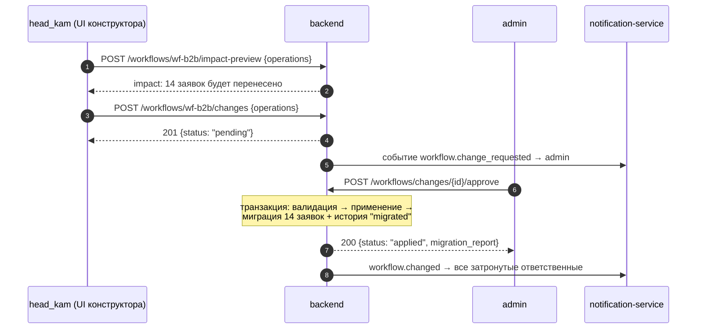
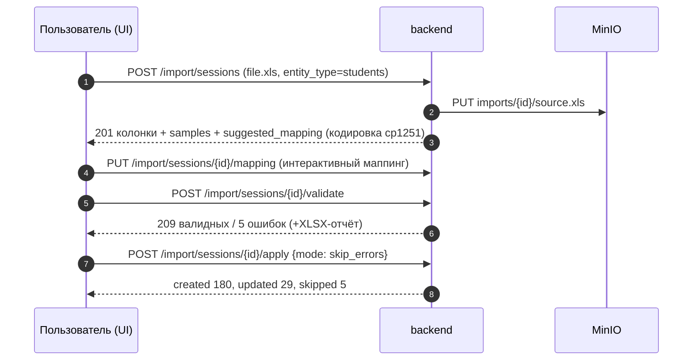
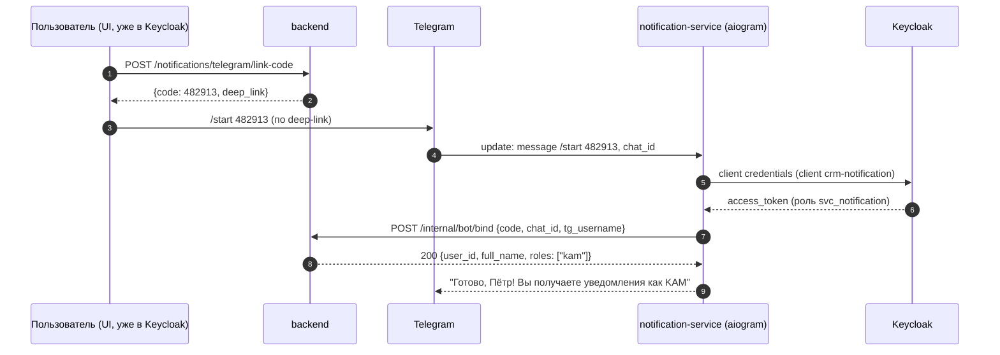
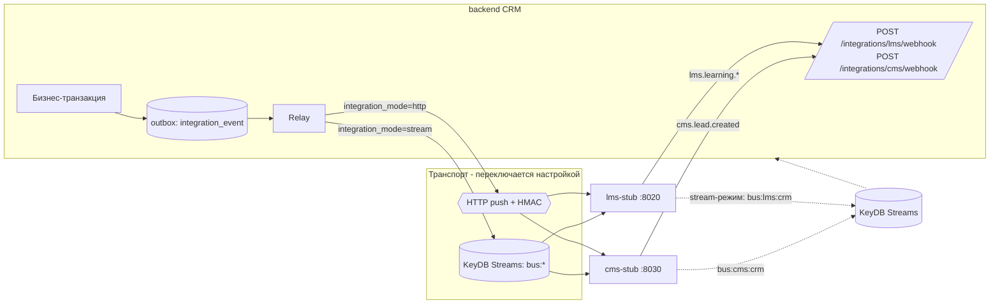
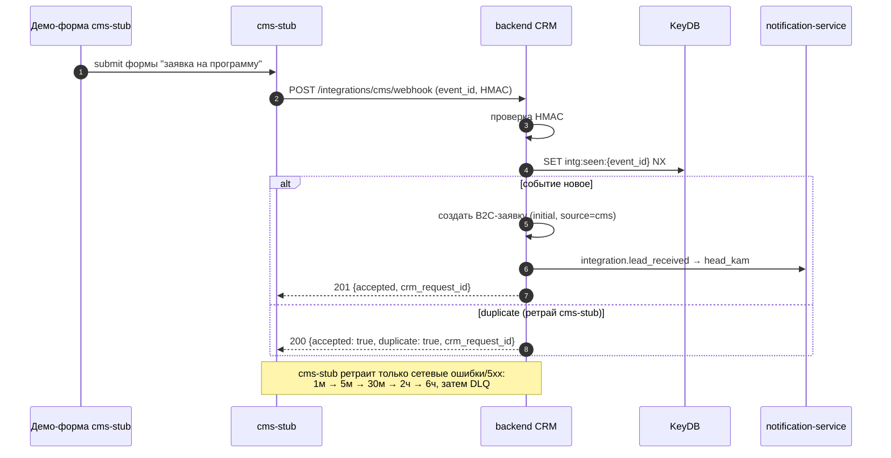

# Контракт REST API бэкенда CRM + интеграционные контракты

Документ — часть проектной документации решения ЛЦТ 2026 «CRM для работы с вузами».
Источник требований: `PLAN.md` (раздел 2 — решения кейсодержателя). В конце документа —
таблица трассировки «решение кейсодержателя → раздел контракта».

Статус: **зафиксирован**. По этому документу пишется код backend (FastAPI), frontend (React),
notification-service, lms-stub, cms-stub без дополнительных вопросов.

---

## 1. Общие соглашения

### 1.1. Базовые URL и порты

| Сервис | Base URL (внутри кластера) | Порт | Префикс API |
|---|---|---|---|
| backend (CRM API) | `http://backend:8000` | 8000 | `/api/v1` |
| notification-service | `http://notification:8010` | 8010 | `/api/v1` |
| lms-stub | `http://lms-stub:8020` | 8020 | `/api/v1` |
| cms-stub | `http://cms-stub:8030` | 8030 | `/api/v1` |
| Keycloak | `http://keycloak:8080` | 8080 | `/realms/crm` |

Снаружи (ingress) фронтенд проксирует `/api/*` на backend, `/auth/*` (realm-эндпоинты) на Keycloak.
Все примеры ниже — относительно `/api/v1` backend, если не указан другой сервис.

### 1.2. Аутентификация и авторизация

- **Люди**: OIDC Authorization Code + PKCE через Keycloak (realm `crm`, public client `crm-frontend`).
  Каждый запрос к API — заголовок `Authorization: Bearer <access_token>` (JWT).
  Backend валидирует подпись по JWKS realm'а (кэш ключей в KeyDB, TTL 10 мин), проверяет `iss`, `aud`, `exp`.
- **Роли** читаются из `realm_access.roles` токена. Ролевая модель (см. §12):
  - `admin` — администратор системы;
  - `head_kam` — руководитель КАМов;
  - `kam` — key account manager;
  - `observer` — наблюдатель/аудитор (read-only, ПДн маскируются).
  - Сервисные роли (только для confidential-клиентов, не для людей): `svc_notification`
    (клиент `crm-notification`, client credentials — используется Telegram-ботом),
    `svc_integration` (клиент `crm-integration` — для заглушек LMS/CMS при вызове webhook-эндпоинтов,
    если вместо HMAC используется bearer; см. §13.6).
- **CronJob** (проверка зависших заявок) аутентифицируется статическим токеном
  `X-Internal-Token` из K8s Secret (см. §11.1) — без Keycloak, чтобы CronJob оставался
  однострочным `curl`.
- 401 — токен отсутствует/просрочен/невалиден. 403 — токен валиден, но роль не даёт доступ
  (или объект вне зоны видимости пользователя, см. §12.2).

### 1.3. Формат данных

- `Content-Type: application/json; charset=utf-8` везде, кроме загрузки файлов (`multipart/form-data`)
  и скачивания (`application/octet-stream` / MIME файла).
- Идентификаторы — UUID v4, строкой.
- Даты/время — ISO 8601 в UTC: `2026-09-16T10:30:00Z`. Даты без времени — `2026-09-16`.
- Денежные суммы — строка decimal: `"150000.00"`, поле `currency` (`RUB` по умолчанию).
- Все мутабельные сущности имеют поле `version` (int, optimistic locking): `PATCH`/`PUT`
  обязан передать текущий `version`; при расхождении — `409 stale_version`.
- Заголовок `X-Request-Id` (uuid): если клиент не прислал — генерирует backend; всегда
  возвращается в ответе и пишется в логи (`trace_id` в теле ошибки = `X-Request-Id`).

### 1.4. Формат ошибок (единый)

```json
{
  "error": {
    "code": "validation_error",
    "message": "Ошибка валидации данных",
    "details": [
      {"field": "email", "code": "invalid_format", "message": "Некорректный email"}
    ],
    "trace_id": "6f9a1c2e-6f1b-4e0e-9c1a-2b3c4d5e6f70"
  }
}
```

`message` — человекочитаемый, на русском (показывается в UI как есть).
`code` — машинный, стабильный. `details` — опционален (валидация, построчные ошибки импорта).

| HTTP | `code` | Когда |
|---|---|---|
| 400 | `validation_error` | Ошибка валидации тела/параметров (Pydantic) |
| 400 | `import_bad_format` | Файл импорта не распознан (не XLSX/XLS/CSV/JSON) |
| 400 | `import_encoding_error` | Не удалось определить кодировку (после перебора, §8.2) |
| 400 | `workflow_invalid_schema` | Схема workflow после операции невалидна (нет initial, недостижимый статус) |
| 401 | `unauthorized` | Нет/просрочен токен |
| 403 | `forbidden` | Роль/зона видимости не позволяет |
| 403 | `workflow_change_requires_approval` | Попытка применить rename/delete статуса без апрува |
| 404 | `not_found` | Объект не найден (или вне зоны видимости — не раскрываем существование) |
| 409 | `conflict` | Нарушение уникальности (дубль ИНН вуза и т.п.) |
| 409 | `stale_version` | Optimistic lock: version устарел |
| 409 | `workflow_invalid_transition` | Переход не разрешён схемой workflow |
| 409 | `idempotency_conflict` | Повтор `Idempotency-Key` с другим телом запроса |
| 413 | `file_too_large` | Файл > лимита (импорт: 20 МБ; вложения: 50 МБ) |
| 422 | `unprocessable` | Семантическая ошибка (например, target-статус миграции = удаляемый) |
| 429 | `rate_limited` | Превышение лимита (KeyDB token bucket; заголовок `Retry-After`) |
| 500 | `internal_error` | Необработанная ошибка (детали только в логах) |
| 502 | `integration_unavailable` | Синхронный вызов LMS/CMS/notification не удался после ретраев |

### 1.5. Пагинация, сортировка, фильтрация

Все списки — limit/offset:

```
GET /api/v1/requests?limit=25&offset=50&sort=-created_at&status_id=<uuid>&search=МФТИ
```

- `limit` (1..200, по умолчанию 25), `offset` (>=0, по умолчанию 0).
- `sort`: имя поля, префикс `-` — по убыванию; несколько через запятую: `sort=-priority,created_at`.
- `search` — подстрочный поиск по «естественным» полям сущности (описано у каждого эндпоинта).
- Фильтры — плоские query-параметры; массив значений — повтором параметра: `status_id=a&status_id=b`.

Ответ-конверт списка (везде одинаковый):

```json
{
  "items": [ { } ],
  "total": 137,
  "limit": 25,
  "offset": 50
}
```

### 1.6. Идемпотентность мутаций

`POST`-эндпоинты создания (заявки, переходы, импорт-apply, экспорт-job) принимают заголовок
`Idempotency-Key: <uuid>` (опционален для UI, обязателен для интеграций и бота).
Ключ хранится в KeyDB (`crm:v1:idem:{key}` → hash тела + сериализованный ответ, TTL 24 ч):
повтор с тем же телом → повтор сохранённого ответа (200/201 c заголовком `Idempotency-Replayed: true`);
повтор с другим телом → `409 idempotency_conflict`.

> **Roadmap.** Generic-механизм `Idempotency-Key` (произвольный POST) в текущей
> реализации не включён: идемпотентность обеспечивается точечно — `version` в
> переходах заявок, дедупликация импорта, `notification_id`/`dedup_key` в
> нотификациях и внутренних job. Заголовок принимается, но replay-хранилище
> KeyDB — вехой после MVP.

### 1.7. Health-пробы (без аутентификации)

| Метод/путь | Назначение |
|---|---|
| `GET /healthz` | liveness: процесс жив, всегда `200 {"status":"ok"}` |
| `GET /readyz` | readiness: проверка коннекта к PG и KeyDB; `503` если нет |

Есть у всех четырёх сервисов (backend, notification, lms-stub, cms-stub).

---

## 2. Auth / профиль

### 2.1. `GET /auth/me`

Роли: любой аутентифицированный. Источник данных для отрисовки UI по ролевой модели
(кор-требование «отображение интерфейса строго по ролям»): фронт скрывает разделы по
`permissions`, backend всё равно проверяет на каждом запросе.

```json
{
  "id": "u-uuid",
  "username": "kam.ivanov",
  "full_name": "Иванов Пётр Сергеевич",
  "email": "ivanov@corp.local",
  "roles": ["kam"],
  "manager_id": "u-uuid-head",
  "permissions": [
    "requests:read", "requests:write", "requests:transition",
    "universities:read", "universities:write",
    "contracts:read", "contracts:write",
    "programs:read", "programs:priority",
    "students:read", "students:write",
    "reports:read", "import:run", "export:run",
    "workflow:read", "comments:write", "notifications:self"
  ],
  "telegram": {"linked": true, "tg_username": "ivanov_p", "linked_at": "2026-09-20T10:00:00Z"}
}
```

`permissions` вычисляются на backend из ролей по матрице §12 (единственный источник истины —
модуль `backend/app/modules/auth/permissions.py`, фронт ничего не хардкодит).

### 2.2. Служебные UI-эндпоинты (SSE, пресеты, поиск, фичефлаги)

| Метод/путь | Описание | Роли |
|---|---|---|
| `GET /events/stream` | **SSE**-канал realtime-обновлений UI. События: `workflow.changed` (схема опубликована → доски перечитывают колонки), `request.transitioned`, `request.comment_added` (в data — `request_id`), `telegram.linked` (закрывает модалку привязки), `flags.updated`, `notification.created` (колокольчик). Формат кадра: `event: <topic>\ndata: <json>`. Fan-out между репликами backend — KeyDB pub/sub `crm:v1:events`. Фолбэк фронта — поллинг | все (JWT) |
| `GET /ui/presets?screen=` | Сохранённые пресеты таблиц/фильтров текущего пользователя | все |
| `POST /ui/presets` / `PATCH /ui/presets/{id}` / `DELETE /ui/presets/{id}` | CRUD пресета | все (только свои) |
| `GET /search?q=` | Глобальный поиск (Cmd+K): вузы, заявки, студенты (по `display_name`), договоры; ответ — группы `{universities:[], requests:[], students:[], contracts:[]}` до 5 записей в группе | все |
| `GET /flags` | Активные фичефлаги (`{"auto_ranking": false, "report_pdf": false, …}`) | все |
| `GET /admin/feature-flags` / `PATCH /admin/feature-flags/{name}` | Управление флагами (`{"enabled": true}`); изменение публикует SSE `flags.updated` | admin |

Контракт пресета (тело POST / ответа; `screen` также используется для шаблонов маппинга импорта —
`screen: "import:students"`):

```json
{
  "id": "b9c1…",
  "screen": "registry.universities",
  "name": "Мои вузы ЦФО",
  "is_default": true,
  "state": {
    "filters": {"region": ["ЦФО"], "kam_user_id": ["me"]},
    "sort": {"field": "updated_at", "order": "desc"},
    "columns": ["name", "region", "contracts_count", "active_requests", "kam"],
    "page_size": 50
  }
}
```

---

## 3. Вузы, контакты, договоры, продукты, программы

### 3.1. Вузы (`/universities`)

| Метод/путь | Описание | Роли (write) |
|---|---|---|
| `GET /universities` | Список. Фильтры: `search` (название/ИНН/город), `region`, `kam_user_id`, `has_active_contract` (bool) | все |
| `POST /universities` | Создать | admin, head_kam, kam |
| `GET /universities/{id}` | Карточка (+агрегаты: счётчики договоров/заявок/студентов) | все |
| `PATCH /universities/{id}` | Изменить (c `version`) | admin, head_kam, kam (свои — см. §12.2) |
| `DELETE /universities/{id}` | Деактивация (`is_active=false`), запрещено при активных заявках → `409 conflict` | admin |
| `GET /universities/{id}/contacts` | Контактные лица вуза | все |
| `POST /universities/{id}/contacts` | Добавить контакт | admin, head_kam, kam |
| `PATCH /universities/{id}/contacts/{contact_id}` | Изменить | admin, head_kam, kam |
| `DELETE /universities/{id}/contacts/{contact_id}` | Удалить | admin, head_kam |

Тело вуза (создание/карточка):

```json
{
  "id": "un-uuid",
  "name": "Московский физико-технический институт",
  "short_name": "МФТИ",
  "inn": "5008006211",
  "kpp": "500801001",
  "region": "Московская область",
  "city": "Долгопрудный",
  "website": "https://mipt.ru",
  "kam_user_id": "u-uuid",
  "notes": "…",
  "is_active": true,
  "version": 3,
  "created_at": "…", "updated_at": "…"
}
```

Уникальность: `inn` (при непустом) → `409 conflict`. Обогащение из открытых источников —
только разовой предзагрузкой через импорт справочников (§10.1), runtime-выхода в интернет нет.

### 3.2. Договоры (`/contracts`)

Правило кейсодержателя: у вуза как правило один договор, продуктов несколько. API не
запрещает второй договор, но UI подсвечивает предупреждением (поле `warning_duplicate` в ответе
создания, если у вуза уже есть договор со статусом `active`).

| Метод/путь | Описание | Роли (write) |
|---|---|---|
| `GET /contracts` | Фильтры: `university_id`, `counterparty_id`, `status` (`draft/negotiation/active/completed/terminated`), `search` (номер) | все |
| `POST /contracts` | Создать | admin, head_kam, kam |
| `GET /contracts/{id}` | Карточка + список файлов | все |
| `PATCH /contracts/{id}` | Изменить | admin, head_kam, kam |
| `DELETE /contracts/{id}` | Мягкое удаление | admin |
| `POST /contracts/{id}/files` | `multipart/form-data`, поле `file`; сохранение в MinIO | admin, head_kam, kam |
| `GET /contracts/{id}/files` | Список файлов | все |
| `DELETE /contracts/{id}/files/{file_id}` | Удалить файл | admin, head_kam |

Тело договора:

```json
{
  "id": "ct-uuid",
  "university_id": "un-uuid",
  "counterparty_id": null,
  "number": "Д-2026/041",
  "status": "active",
  "signed_at": "2026-02-01",
  "valid_from": "2026-02-01",
  "valid_to": "2027-02-01",
  "amount": "1200000.00",
  "currency": "RUB",
  "product_ids": ["pr-uuid-1", "pr-uuid-2"],
  "version": 1
}
```

Владелец договора — вуз **или** контрагент (ровно один из `university_id`/`counterparty_id`,
CHECK в БД).
```json
```

Файл (ответ загрузки; общий формат файлов для всего API — договоры, студенты, отчёты импорта):

```json
{
  "id": "f-uuid",
  "file_name": "contract_D-2026-041.pdf",
  "content_type": "application/pdf",
  "size_bytes": 482133,
  "s3_key": "contract/ct-uuid/f-uuid/contract_D-2026-041.pdf",
  "uploaded_by": "u-uuid",
  "created_at": "…"
}
```

Скачивание любого файла: `GET /files/{file_id}/download` → backend проверяет RBAC и
отдаёт `302 Location: <presigned MinIO URL, TTL 10 мин>` (или проксирует поток, если MinIO не
опубликован наружу — режим `FILE_DELIVERY=proxy|presigned`, по умолчанию `proxy`, т.к. закрытый контур).

### 3.3. Продукты (`/products`)

Продукт — направление/услуга компании (ДПО, корпоративное обучение, олимпиады…).

| Метод/путь | Роли (write) |
|---|---|
| `GET /products` (фильтры: `search`, `is_active`) | все |
| `POST /products` | admin, head_kam |
| `GET /products/{id}` | все |
| `PATCH /products/{id}` | admin, head_kam |
| `DELETE /products/{id}` (мягкое; `409` при привязанных программах) | admin |

```json
{"id": "pr-uuid", "name": "ДПО: Data Science", "code": "dpo-ds", "description": "…", "is_active": true, "version": 2}
```

### 3.4. Программы и приоритеты курсов (`/programs`)

Программа — конкретный курс/программа обучения; привязана к продукту, опционально к вузу.
Ранжирование по востребованности — **ручное изменение приоритета КАМами/админами** (решение
кейсодержателя); автоформула — бонус, в контракт не входит.

| Метод/путь | Описание | Роли (write) |
|---|---|---|
| `GET /programs` | Фильтры: `product_id`, `university_id`, `is_active`, `search`; сортировка по умолчанию `priority_rank` (по возрастанию: меньше = выше) | все |
| `POST /programs` | Создать | admin, head_kam, kam |
| `GET /programs/{id}` | Карточка | все |
| `PATCH /programs/{id}` | Изменить | admin, head_kam, kam |
| `DELETE /programs/{id}` | Мягкое удаление | admin |
| `PATCH /programs/{id}/priority` | `{"priority_rank": 80, "version": 4}` — точечное изменение | admin, head_kam, kam |
| `POST /programs/priorities/reorder` | Массовое: `{"items":[{"id":"…","priority_rank":10},{"id":"…","priority_rank":20}]}` (drag&drop в UI) | admin, head_kam, kam |

```json
{
  "id": "pg-uuid",
  "product_id": "pr-uuid",
  "university_id": "un-uuid",
  "name": "Практикум по ML, весна-2027",
  "priority_rank": 80,
  "seats": 30,
  "starts_on": "2027-02-15",
  "is_active": true,
  "published_to_cms": true,
  "cms_external_id": "cms-item-17",
  "lms_course_id": "lms-course-244",
  "version": 4
}
```

`priority_rank` — int, **меньше = выше** в списках и на дашборде (дефолт 1000). История изменений
приоритета пишется в аудит-лог (§10.4). `cms_external_id`/`lms_course_id` — read-only, вычисляются
из `external_link` (data-model.md §9.3).

---

## 4. Заявки B2B/B2C (`/requests`)

Единая сущность `Request` с полем `workflow_type: "b2b" | "b2c"`. B2B — взаимодействие с вузом;
B2C — физлицо или юрлицо (поле `client_kind: "person" | "company"`). Оба живут каждый в своём
workflow (§5).

### 4.1. Эндпоинты

| Метод/путь | Описание | Роли (write) |
|---|---|---|
| `GET /requests` | Список. Фильтры: `workflow_type`, `status_id` (multi), `assignee_id`, `university_id`, `product_id`, `program_id`, `stuck` (bool, см. §11), `created_from`, `created_to`, `source` (`manual/import/cms`), `search` (название/клиент) | все |
| `GET /requests/board` | Канбан-агрегат: `?workflow_type=b2b` → колонки по статусам, счётчики, первые N карточек в каждой | все |
| `POST /requests` | Создать (статус = initial статус схемы; менять статус при создании нельзя) | admin, head_kam, kam |
| `GET /requests/{id}` | Карточка: поля + текущий статус + доступные переходы + последние комментарии | все |
| `PATCH /requests/{id}` | Изменить поля (не статус!) | admin, head_kam, kam-ответственный |
| `POST /requests/{id}/assign` | `{"assignee_id":"u-uuid"}` — смена ответственного | admin, head_kam; kam — только взять неназначенную на себя |
| `GET /requests/{id}/transitions` | Доступные переходы для текущего пользователя (вкл. возвраты) | все |
| `POST /requests/{id}/transitions` | Выполнить переход (§4.3) | admin, head_kam, kam-ответственный |
| `GET /requests/{id}/history` | История: переходы, смены ответственного, изменения полей | все |
| `GET /requests/{id}/comments` / `POST …` / `DELETE …/{comment_id}` | Комментарии (§4.4) | см. §4.4 |
| `POST /requests/{id}/reopen` | Переоткрыть из терминального статуса: `{"to_status_id": "…", "comment": "…"}` (comment обязателен; запись истории `kind: transition`, `reason: reopen`) | **только admin** |
| `DELETE /requests/{id}` | Мягкое удаление | admin |

### 4.2. Тело заявки

```json
{
  "id": "rq-uuid",
  "workflow_type": "b2b",
  "title": "МФТИ — ДПО Data Science, поток весна-2027",
  "university_id": "un-uuid",
  "client_kind": null,
  "counterparty_id": null,
  "interaction_type_id": null,
  "client": null,
  "contract_id": "ct-uuid",
  "product_id": "pr-uuid",
  "program_id": "pg-uuid",
  "status": {"id": "st-uuid", "code": "negotiation", "name": "Переговоры", "color": "#1677ff"},
  "assignee": {"id": "u-uuid", "full_name": "Иванов Пётр Сергеевич"},
  "source": "manual",
  "external_refs": {"cms_lead_id": null, "lms_enrollment_id": null},
  "amount": "1200000.00",
  "status_updated_at": "2026-09-10T08:00:00Z",
  "is_stuck": false,
  "stuck_days": 6,
  "description": "…",
  "version": 7,
  "created_at": "…", "updated_at": "…"
}
```

Для B2C: `university_id` = null, `counterparty_id` — обязателен, `client_kind` = `person|company`
(проекция `counterparty.kind`), `interaction_type_id` — тип взаимодействия из редактируемого
справочника, `client` — сериализация контрагента:
`{"full_name": "…", "email": "…", "phone": "…", "company_name": null, "inn": null}`.
ПДн клиента-физлица шифруются на уровне хранения так же, как студенты (см. §9.4);
для роли `observer` поля `client.full_name/email/phone` отдаются маскированными.

### 4.3. Переход по статусу (вкл. возвраты)

```
POST /api/v1/requests/{id}/transitions
Idempotency-Key: 9d1f…
{
  "to_status_id": "st-uuid-contract-prep",
  "comment": "Согласовали КП, готовим договор",
  "version": 7
}
```

Правила:
- Переход валиден, только если в схеме workflow есть транзиция `current → to_status_id`
  и роль пользователя входит в её `allowed_roles`. Иначе `409 workflow_invalid_transition`
  с `details[0].message` = список допустимых переходов.
- **Возвраты** — обычные транзиции с `kind: "return"` (в БД — флаг `is_return`; бюрократия:
  «вернуть на доработку»). Для `kind: "return"` и любых транзиций с `requires_comment: true`
  (например, «Отказ») поле `comment` обязательно (`400 validation_error`, если пусто).
- Переход обновляет `status_updated_at` (сбрасывает счётчик «зависания»).
- Побочные эффекты (в одной транзакции + outbox, §13.7): запись в историю; событие в
  notification-service (§11.3); если целевой статус имеет флаг `triggers_lms_handover` —
  интеграционное событие `crm.request.handed_over` в LMS (§13.2).

Ответ `200` — обновлённая заявка (как §4.2).

История (`GET /requests/{id}/history`) — элементы:

```json
{
  "id": "h-uuid",
  "kind": "transition",
  "from_status": {"id": "…", "code": "negotiation", "name": "Переговоры"},
  "to_status": {"id": "…", "code": "contract_prep", "name": "Подготовка договора"},
  "is_return": false,
  "comment": "…",
  "actor": {"id": "u-uuid", "full_name": "…"},
  "created_at": "…"
}
```

(`kind`: `transition | assign | field_change | created | migrated` — `migrated` пишется при
миграции заявки на новую схему workflow, §5.4.)

### 4.4. Комментарии

`POST /requests/{id}/comments` — `{"text": "…"}` → `201` c объектом комментария
(`id, text, author{id,full_name}, created_at`). Писать могут admin, head_kam, kam
(любой видящий заявку, кроме observer). Удаление — автор или admin, мягкое
(`deleted_at`, текст в выдаче заменяется на `"(удалено)"`).

---

## 5. Workflow: CRUD, изменение схемы с апрувом, миграция заявок

### 5.1. Модель

Два workflow — `b2b` и `b2c`, **единые для всех, без версионирования** (решение кейсодержателя).
Изменения применяются сразу для всех заявок. В `b2c` добавление новых «вариантов
взаимодействия» = операции `add_status` / `add_transition` (§5.3).

Схема (`GET /workflows/{id}`):

```json
{
  "id": "wf-b2b",
  "type": "b2b",
  "name": "Взаимодействие с вузами",
  "updated_at": "…",
  "statuses": [
    {"id": "st-1", "code": "new",            "name": "Новая",                "color": "#8c8c8c", "is_initial": true,  "is_terminal": false, "terminal_outcome": null,   "stuck_threshold_days": 7,    "triggers_lms_handover": false, "position": 0},
    {"id": "st-2", "code": "first_contact",  "name": "Первичный контакт",    "color": "#13c2c2", "is_initial": false, "is_terminal": false, "terminal_outcome": null,   "stuck_threshold_days": 14,   "triggers_lms_handover": false, "position": 1},
    {"id": "st-3", "code": "negotiation",    "name": "Переговоры",           "color": "#1677ff", "is_initial": false, "is_terminal": false, "terminal_outcome": null,   "stuck_threshold_days": 14,   "triggers_lms_handover": false, "position": 2},
    {"id": "st-4", "code": "contract_prep",  "name": "Подготовка договора",  "color": "#722ed1", "is_initial": false, "is_terminal": false, "terminal_outcome": null,   "stuck_threshold_days": 14,   "triggers_lms_handover": false, "position": 3},
    {"id": "st-5", "code": "contract_signed","name": "Договор подписан",     "color": "#52c41a", "is_initial": false, "is_terminal": false, "terminal_outcome": null,   "stuck_threshold_days": 14,   "triggers_lms_handover": false, "position": 4},
    {"id": "st-6", "code": "in_learning",    "name": "Передано в обучение",  "color": "#a0d911", "is_initial": false, "is_terminal": false, "terminal_outcome": null,   "stuck_threshold_days": null, "triggers_lms_handover": true,  "position": 5},
    {"id": "st-7", "code": "completed",      "name": "Завершена",            "color": "#237804", "is_initial": false, "is_terminal": true,  "terminal_outcome": "won",  "stuck_threshold_days": null, "triggers_lms_handover": false, "position": 6},
    {"id": "st-8", "code": "rejected",       "name": "Отказ",                "color": "#f5222d", "is_initial": false, "is_terminal": true,  "terminal_outcome": "lost", "stuck_threshold_days": null, "triggers_lms_handover": false, "position": 7}
  ],
  "transitions": [
    {"id": "tr-1", "from_status_id": "st-1", "to_status_id": "st-2", "kind": "forward", "name": "Взять в работу",     "requires_comment": false, "allowed_roles": ["kam","head_kam","admin"]},
    {"id": "tr-2", "from_status_id": "st-2", "to_status_id": "st-3", "kind": "forward", "name": "Начать переговоры",  "requires_comment": false, "allowed_roles": ["kam","head_kam","admin"]},
    {"id": "tr-3", "from_status_id": "st-3", "to_status_id": "st-4", "kind": "forward", "name": "Готовить договор",   "requires_comment": false, "allowed_roles": ["kam","head_kam","admin"]},
    {"id": "tr-4", "from_status_id": "st-4", "to_status_id": "st-3", "kind": "return",  "name": "Вернуть в переговоры","requires_comment": true, "allowed_roles": ["kam","head_kam","admin"]},
    {"id": "tr-5", "from_status_id": "st-4", "to_status_id": "st-5", "kind": "forward", "name": "Договор подписан",   "requires_comment": false, "allowed_roles": ["head_kam","admin"]},
    {"id": "tr-6", "from_status_id": "st-5", "to_status_id": "st-6", "kind": "forward", "name": "Передать в обучение","requires_comment": false, "allowed_roles": ["kam","head_kam","admin"]},
    {"id": "tr-7", "from_status_id": "st-6", "to_status_id": "st-7", "kind": "forward", "name": "Завершить",          "requires_comment": false, "allowed_roles": ["kam","head_kam","admin"]},
    {"id": "tr-8", "from_status_id": "st-2", "to_status_id": "st-8", "kind": "forward", "name": "Отказ",              "requires_comment": true,  "allowed_roles": ["kam","head_kam","admin"]},
    {"id": "tr-9", "from_status_id": "st-3", "to_status_id": "st-8", "kind": "forward", "name": "Отказ",              "requires_comment": true,  "allowed_roles": ["kam","head_kam","admin"]},
    {"id": "tr-10","from_status_id": "st-4", "to_status_id": "st-8", "kind": "forward", "name": "Отказ",              "requires_comment": true,  "allowed_roles": ["kam","head_kam","admin"]}
  ]
}
```

Инварианты схемы (проверяются на каждой операции, иначе `400 workflow_invalid_schema`):
ровно один `is_initial`; ≥1 `is_terminal`; каждый нетерминальный статус имеет исходящую
транзицию; каждый статус достижим из initial; `code` уникален внутри workflow;
удалять/переименовывать initial нельзя (переименование initial — тоже через апрув, удаление — запрещено, `422`).

Ветвления — несколько исходящих транзиций из одного статуса (`kind: forward`); возвраты —
`kind: return` (в БД — флаг `is_return`; «отказ» — обычный forward в терминальный `lost`-статус с
`requires_comment: true`). API-поле `kind` — проекция флага, поле `position` — проекция колонки
`sort_order`, `stuck_threshold_days: null` = наследовать порог workflow. У транзиции может быть
`condition` (JSON-DSL, workflow-engine.md §3.3) — декларативная подсказка ветвления: backend
аннотирует ею список доступных переходов (`available: true/false` + причина), но при `POST` не
блокирует — жёстко проверяются только существование ребра, `allowed_roles` и `requires_comment`.
Стартовый B2C-workflow: `new → consultation → proposal → payment_pending → paid → in_learning →
completed` + `rejected` + возврат `payment_pending → proposal`; сиды в Alembic-миграции
(файлы `backend/app/modules/workflow/seeds/{b2b,b2c}.json`).

### 5.2. Эндпоинты workflow

| Метод/путь | Описание | Роли |
|---|---|---|
| `GET /workflows` | `[{id, type, name, statuses_count, active_requests, updated_at}]` | все |
| `GET /workflows/{id}` | Полная схема (§5.1) — для конструктора React Flow и канбана | все |
| `POST /workflows/{id}/impact-preview` | Предпросмотр влияния операций до отправки (§5.3) | admin, head_kam |
| `POST /workflows/{id}/changes` | Создать изменение схемы (пакет операций) | admin, head_kam |
| `GET /workflows/{id}/changes` | Список изменений; фильтр `status=pending/applied/rejected` | admin, head_kam; observer — read |
| `GET /workflows/changes/{change_id}` | Карточка изменения + impact | admin, head_kam, observer |
| `POST /workflows/changes/{change_id}/approve` | Апрув → применение + миграция (§5.4) | **только admin** |
| `POST /workflows/changes/{change_id}/reject` | `{"reason":"…"}` | **только admin** |

### 5.3. Операции изменения схемы

`POST /workflows/{id}/changes`:

```json
{
  "comment": "Добавляем этап пилота и убираем 'Первичный контакт'",
  "operations": [
    {"op": "add_status", "status": {"code": "pilot", "name": "Пилотный проект", "color": "#fa8c16", "stuck_threshold_days": 21, "position": 3}},
    {"op": "add_transition", "transition": {"from_code": "negotiation", "to_code": "pilot", "kind": "forward", "name": "Запустить пилот", "allowed_roles": ["kam","head_kam","admin"]}},
    {"op": "rename_status", "status_id": "st-2", "new_name": "Первый контакт", "confirm_name": "Первичный контакт"},
    {"op": "delete_status", "status_id": "st-2", "migrate_to_status_id": "st-1", "confirm_name": "Первичный контакт"},
    {"op": "update_transition", "transition_id": "tr-5", "patch": {"allowed_roles": ["head_kam","admin"], "requires_comment": true}},
    {"op": "delete_transition", "transition_id": "tr-9"}
  ]
}
```

Классификация операций («защита от дурака» — решение кейсодержателя):

| Операция | Класс | Поведение |
|---|---|---|
| `add_status`, `add_transition` | безопасная | admin — применяется сразу (`status: "applied"`); head_kam — уходит на апрув |
| `rename_status`, `delete_status` | **опасная** | всегда `status: "pending"`, применение только через `approve` админом. Если сам admin отправил только опасные операции — всё равно создаётся pending-change, и админ подтверждает его отдельным `approve` (двухшаговое подтверждение) |
| `update_transition`, `delete_transition`, `update_status` (цвет/SLA/position) | нейтральная | admin — сразу; head_kam — на апрув |

Пакет с хотя бы одной опасной операцией целиком уходит в `pending`.
Опасные операции обязаны нести `confirm_name` — точное текущее название статуса, введённое
пользователем посимвольно («защита от дурака», сверка на бэке; несовпадение → `422 unprocessable`).
`delete_status` **обязан** указать `migrate_to_status_id`; UI по умолчанию подставляет
предыдущий **соседний** (связанный ребром) по `position` статус («лучше предыдущий» — цитата
кейсодержателя); нельзя указывать удаляемый или терминальный статус (`422 unprocessable`).
Пакет хранится в таблице `workflow_change_request` (data-model.md §5.2).

Ответ создания:

```json
{
  "id": "wfc-uuid",
  "workflow_id": "wf-b2b",
  "status": "pending",
  "author": {"id": "u-uuid", "full_name": "…"},
  "operations": [ "…как в запросе…" ],
  "impact": {
    "affected_requests_total": 14,
    "by_status": [{"status_id": "st-2", "status_name": "Первичный контакт", "count": 14, "migrate_to": {"id": "st-1", "name": "Новая"}}]
  },
  "created_at": "…"
}
```

`POST /workflows/{id}/impact-preview` принимает тот же массив `operations` и возвращает только блок `impact` —
конструктор показывает «будет перенесено 14 заявок» до сохранения.

### 5.4. Апрув и миграция заявок

`POST /workflows/changes/{change_id}/approve` (admin) — атомарно в одной транзакции БД:

1. Повторная валидация схемы с учётом текущего состояния (схема могла измениться после
   создания change → при конфликте `409 conflict`, автор пересоздаёт).
2. Применение операций к схеме.
3. **Миграция заявок**: все заявки в удалённом статусе `UPDATE ... SET status_id = migrate_to_status_id`,
   каждой пишется запись истории `kind: "migrated"` с комментарием
   `"Статус 'Первичный контакт' удалён администратором, заявка перенесена в 'Новая'"`.
   Переименование миграции не требует (id статуса сохраняется). Работа не останавливается:
   заявки продолжают жить по новой схеме сразу после commit'а.
4. Инвалидация кэша схемы в KeyDB (`wf:{id}`), событие `workflow.changed` в notification-service.

Ответ:

```json
{
  "id": "wfc-uuid",
  "status": "applied",
  "approved_by": {"id": "u-uuid-admin", "full_name": "…"},
  "applied_at": "…",
  "migration_report": {
    "migrated_requests": 14,
    "by_status": [{"from": "Первичный контакт", "to": "Новая", "count": 14}]
  }
}
```



---

## 6. Импорт (XLSX/XLS/CSV/JSON, интерактивный маппинг)

Пятишаговый конвейер: **upload → распознавание → маппинг → валидация → применение**.
Одна сессия импорта (`import_session`) живёт 24 часа, состояние в PG, файл в MinIO
(`imports/{session_id}/source.<ext>`).

### 6.1. Эндпоинты

| Метод/путь | Описание |
|---|---|
| `POST /import/sessions` | `multipart/form-data`: `file`, `entity_type`. Ответ — распознанная структура |
| `GET /import/sessions/{id}` | Текущее состояние сессии (для восстановления диалога) |
| `PUT /import/sessions/{id}/mapping` | Сохранить маппинг колонок и опции |
| `POST /import/sessions/{id}/validate` | Прогнать валидацию без записи |
| `POST /import/sessions/{id}/apply` | Применить (идемпотентно по `Idempotency-Key`) |
| `DELETE /import/sessions/{id}` | Отменить сессию |
| `GET /import/sessions` | Мои сессии (admin видит все): фильтр `state` |

Роли: admin, head_kam, kam (permission `import:run`); `entity_type=dictionary:*` — только admin (§10.1).

`entity_type`: `universities | university_contacts | contracts | programs | requests_b2b |
requests_b2c | students | dictionary:<name>`.

### 6.2. Распознавание файла и кодировок

Ответ `POST /import/sessions` (`201`):

```json
{
  "id": "imp-uuid",
  "entity_type": "students",
  "state": "mapping",
  "file": {"file_name": "студенты_мфти.xls", "format": "xls", "size_bytes": 812311},
  "detected": {
    "encoding": "cp1251",
    "encoding_confidence": 0.98,
    "sheets": [{"index": 0, "name": "Лист1", "rows": 214}],
    "active_sheet": 0,
    "header_row": 0,
    "columns": [
      {"index": 0, "name": "ФИО", "samples": ["Иванов Иван Иванович", "Петрова Анна Сергеевна", "Сидоров П.К."]},
      {"index": 1, "name": "Эл. почта", "samples": ["ivanov@example.com", "petrova@example.com", "—"]},
      {"index": 2, "name": "ВУЗ", "samples": ["МФТИ", "МФТИ", "МФТИ"]},
      {"index": 3, "name": "Программа", "samples": ["ML-2027", "ML-2027", "DS-2026"]}
    ]
  },
  "target_fields": [
    {"field": "full_name", "label": "ФИО", "required": true},
    {"field": "email", "label": "Email", "required": true},
    {"field": "university", "label": "Вуз (название или ИНН)", "required": false},
    {"field": "program", "label": "Программа (код или название)", "required": false},
    {"field": "federal_project", "label": "Федеральный проект", "required": false},
    {"field": "funnel_status", "label": "Статус воронки", "required": false}
  ],
  "suggested_mapping": [
    {"source_column": 0, "target_field": "full_name", "confidence": 0.95},
    {"source_column": 1, "target_field": "email", "confidence": 0.9},
    {"source_column": 2, "target_field": "university", "confidence": 0.85},
    {"source_column": 3, "target_field": "program", "confidence": 0.8}
  ]
}
```

Требования устойчивости (решение кейсодержателя — «XLSX **и XLS**, битые кодировки»):

- **XLSX** — `openpyxl` (read-only mode); **XLS** (BIFF, старый Excel) — `xlrd==2.x`
  (поддержка `.xls` в нём осталась); формат определяется по magic bytes, не по расширению.
- **CSV/TSV** — определение кодировки `charset-normalizer` перебором `utf-8-sig → utf-8 →
  cp1251 → koi8-r → cp866`; разделитель — `csv.Sniffer` (`,` `;` `\t`). Если уверенность < 0.5 —
  `400 import_encoding_error`, в `details` — список пробованных кодировок; пользователь может
  передать кодировку явно в опциях маппинга (`options.encoding`).
- **JSON** — массив объектов; ключи объектов становятся «колонками».
- `suggested_mapping` — эвристика по словарю синонимов заголовков (`фио|ф.и.о.|fio →
  full_name`, `почта|e-mail|email|эл. почта → email`, …), реализуется таблицей в коде.
  Пользователь всегда может переопределить — маппинг **интерактивный, не жёсткий**.

### 6.3. Маппинг

`PUT /import/sessions/{id}/mapping`:

```json
{
  "mapping": [
    {"source_column": 0, "target_field": "full_name"},
    {"source_column": 1, "target_field": "email", "transform": "lowercase"},
    {"source_column": 2, "target_field": "university", "lookup": "by_name_or_inn"},
    {"source_column": 3, "target_field": "program", "lookup": "by_code_or_name"}
  ],
  "options": {
    "sheet": 0,
    "header_row": 0,
    "encoding": null,
    "update_strategy": "upsert",
    "match_by": ["email"],
    "skip_empty_rows": true,
    "default_values": {"funnel_status": "candidate"}
  }
}
```

`transform`: `trim | lowercase | uppercase | date_ru (дд.мм.гггг→ISO) | phone_normalize`.
`update_strategy`: `create_only | upsert | update_only`. `match_by` — поля-ключи дедупликации.
Неcмаппленные колонки игнорируются; отсутствие required-поля → `400 validation_error` сразу.

### 6.4. Валидация и применение

`POST /import/sessions/{id}/validate` → `200`:

```json
{
  "state": "validated",
  "total_rows": 214,
  "valid_rows": 209,
  "error_rows": 5,
  "errors": [
    {"row": 17, "column": "email", "code": "invalid_format", "message": "Некорректный email: 'ivanov@'"},
    {"row": 42, "column": "university", "code": "lookup_not_found", "message": "Вуз 'МГТУ им. Баумана' не найден. Создайте вуз или исправьте название"},
    {"row": 58, "column": null, "code": "duplicate_in_file", "message": "Дубликат по email со строкой 31"}
  ],
  "errors_truncated": false,
  "error_report_file_id": "f-uuid"
}
```

В `errors` — первые 200; полный отчёт — XLSX-файл в MinIO (скачать через `GET /files/{id}/download`).
(`state: "validated"` в ответе `validate` соответствует состоянию `preview` машины состояний
`import_session` в data-model.md §9.1 — dry-run выполнен, ждём подтверждения.)

`POST /import/sessions/{id}/apply` — тело `{"mode": "skip_errors"}` (`skip_errors` — грузим
валидные, `all_or_nothing` — 422 если есть ошибки). До 5 000 строк — синхронно; больше —
`202 {"state":"applying"}`, прогресс через `GET /import/sessions/{id}`
(`progress: {"done": 3100, "total": 12000}`; фронт поллит раз в 2 с). Ответ по завершении:

```json
{
  "state": "completed",
  "result": {"created": 180, "updated": 29, "skipped": 5, "failed": 0, "report_file_id": "f-uuid"},
  "applied_at": "…"
}
```

(финальное состояние — `completed`, как в машине состояний `import_session`, data-model.md §9.1)



---

## 7. Экспорт и отчёты

### 7.1. Экспорт данных (XLSX/CSV/JSON)

| Метод/путь | Описание |
|---|---|
| `POST /export/jobs` | Создать выгрузку |
| `GET /export/jobs/{id}` | Статус |
| `GET /export/jobs/{id}/download` | Скачать результат (`302` на presigned / proxy-поток) |
| `GET /export/jobs` | Мои выгрузки |

`POST /export/jobs`:

```json
{
  "entity_type": "requests",
  "format": "xlsx",
  "filters": {"workflow_type": "b2b", "status_id": ["st-3"], "created_from": "2026-01-01"},
  "columns": ["title", "university.name", "status.name", "assignee.full_name", "amount", "created_at"],
  "options": {"encoding": "cp1251", "csv_delimiter": ";"}
}
```

- `format`: `xlsx | csv | json`. Для CSV: `options.encoding` — `utf-8` (с BOM, чтобы Excel
  не ломал кириллицу) или `cp1251`; разделитель по умолчанию `;` (русский Excel).
  Это ответ на «устойчивость к кодировкам при выгрузке».
- `entity_type`: `requests | universities | contracts | programs | students | report:<code>`
  (агрегаты из §7.2 тоже выгружаются файлом).
- `columns` — опционально; поддерживают dot-нотацию по связям; без них — полный дефолтный набор.
- ≤ 10 000 строк — синхронный ответ `201 {"status":"done","file":{…}}`; больше — `202
  {"status":"running"}` + поллинг. RBAC: выгружается ровно то, что пользователь видит в
  списках (те же фильтры видимости §12.2); `students` для observer — маскированные ПДн.

### 7.2. Отчёты для дашбордов (JSON-агрегаты)

Дашборды рисует фронт (Apache ECharts) по JSON-агрегатам; **растровый экспорт графиков
(PNG) выполняется на фронте** через `echartsInstance.getDataURL({pixelRatio: 2})` — backend
для растра эндпоинта не имеет (зафиксировано как обязанность фронта). Файловый экспорт
таблиц-основ — через §7.1 (`entity_type: "report:<code>"`).

| Метод/путь | Отчёт | Параметры |
|---|---|---|
| `GET /reports/funnel` | Воронка по статусам workflow (counts + суммы) | `workflow_type`, `from`, `to`, `kam_id`, `product_id` |
| `GET /reports/kam-workload` | Нагрузка КАМов: активные заявки/вузы/зависшие по каждому | `workflow_type` |
| `GET /reports/stuck` | Зависшие заявки (детализация §11) | `workflow_type`, `threshold_days` (override) |
| `GET /reports/universities-coverage` | Вузы: с договором / в работе / без контакта, по регионам | `region` |
| `GET /reports/programs-demand` | Программы по приоритету + число заявок | `product_id` |
| `GET /reports/talent-pool-funnel` | Воронка студентов: кандидат→обучается→выпускник→talent pool | `university_id`, `federal_project` |
| `GET /reports/dynamics` | Динамика создания/закрытия заявок по неделям | `workflow_type`, `from`, `to` |
| `GET /reports/dashboard` | Агрегат всех виджетов дашборда одним запросом (KPI + funnel + dynamics + kam-workload + programs-demand + talent-pool-funnel) | все фильтры панели дашборда |

Единый формат ответа отчёта:

```json
{
  "report": "funnel",
  "generated_at": "2026-09-16T12:00:00Z",
  "params": {"workflow_type": "b2b", "from": "2026-01-01", "to": null},
  "series": [
    {"key": "new", "label": "Новая", "color": "#8c8c8c", "value": 12, "amount": "1400000.00"},
    {"key": "negotiation", "label": "Переговоры", "color": "#1677ff", "value": 7, "amount": "5200000.00"}
  ]
}
```

(для `dynamics` — `series: [{key, label, points: [{date, value}]}]`; для табличных отчётов —
`rows: [{…}]` + `columns: [{key,label}]`). Ответы кэшируются в KeyDB 60 секунд
(ключ `crm:v1:dash:{code}:{hash(params+visibility_scope)}`, data-model.md §10).

Роли: `reports:read` — все, включая observer; `kam` видит агрегаты только по своей зоне
видимости, `head_kam/admin/observer` — по всем.

---

## 8. Talent Pool (студенты)

### 8.1. Эндпоинты

| Метод/путь | Описание | Роли (write) |
|---|---|---|
| `GET /students` | Фильтры: `search` (по `display_name` / blind-index точного email), `university_id`, `program_id`, `funnel_status`, `federal_project_id`, `activity_id`. ПДн во всех выдачах маскированы | все |
| `POST /students` | Создать | admin, head_kam, kam |
| `GET /students/{id}` | Карточка + файлы + активности + история статусов (ПДн маскированы) | все |
| `POST /students/{id}/reveal` | Раскрыть ПДн: возвращает открытые `full_name/email/phone`, пишет аудит-событие `student.pii_revealed` (кто, когда, кого); UI прячет значения через 60 с | admin, head_kam, kam (observer — 403) |
| `PATCH /students/{id}` | Изменить | admin, head_kam, kam |
| `DELETE /students/{id}` | Мягкое удаление (право на забвение 152-ФЗ: физически чистится джобой через 30 дней) | admin |
| `POST /students/{id}/status` | Переход по воронке | admin, head_kam, kam |
| `GET /students/{id}/history` | История воронки | все |
| `POST /students/{id}/files` | Резюме/сертификаты → MinIO (`students/{id}/…`) | admin, head_kam, kam |
| `GET /students/{id}/files` / `DELETE …/{file_id}` | Файлы | все / admin, head_kam |
| `GET /activities` | Сквозное расписание активностей: фильтры `from`, `to`, `kind`, `federal_project` | все |
| `POST /activities` / `PATCH /activities/{id}` / `DELETE …` | CRUD активностей | admin, head_kam |
| `POST /activities/{id}/participants` | `{"student_ids": ["…"]}` — записать студентов | admin, head_kam, kam |
| `DELETE /activities/{id}/participants/{student_id}` | Отписать | admin, head_kam, kam |

Импорт списков студентов (XLSX/XLS/JSON) — через общий конвейер §6 с `entity_type=students`
(решение кейсодержателя «предусмотреть подгрузку списков»). Экспорт — §7.1.

### 8.2. Тело студента

```json
{
  "id": "stu-uuid",
  "display_name": "Иванов И.И.",
  "full_name": "И***в И.И.",
  "email": "i***v@example.com",
  "university_id": "un-uuid",
  "program_id": "pg-uuid",
  "federal_project_id": "fp-uuid",
  "counterparty_id": "cp-uuid",
  "b2c_request_id": "rq-uuid",
  "funnel_status": "studying",
  "files_count": 2,
  "version": 3,
  "created_at": "…", "updated_at": "…"
}
```

`full_name`/`email` — **всегда маскированы** в списках/карточках/экспортах; открытые значения —
только `POST /students/{id}/reveal` (с аудитом). `b2c_request_id` — производное: последняя
B2C-заявка контрагента `counterparty_id`.

Воронка: `candidate → studying → graduate → talent_pool` (ровно 4 статуса, data-model.md §7.2).
`POST /students/{id}/status`: `{"to": "talent_pool", "comment": "Приглашён в кадровый резерв", "version": 3}` —
допустимые переходы: соседний вперёд, любой назад (исправление ошибок/отчисление — с `comment`);
иначе `409 conflict`. Переход в `talent_pool` порождает событие `student.talent_pool_added`
в notification-service.

### 8.3. ПДн и маскирование (152-ФЗ)

- `full_name` и `email` хранятся в PG зашифрованными (Fernet; детали — data-model.md §8).
  Поиск по точному ФИО/email — через blind-index (HMAC) колонки; подстрочный — по `display_name`.
- **Маскирование серверное и тотальное**: все роли получают маскированные значения по умолчанию;
  раскрытие — только явный `POST /students/{id}/reveal` с аудитом (admin/head_kam/kam).
- `observer`: раскрытие недоступно (403), экспорт — только маскированные данные, файлы студентов
  недоступны (403).
- В интеграционные события (§13) и в Telegram-бот ПДн студентов не передаются никогда.

---

## 9. Нотификации и Telegram-бот

### 9.1. Настройки пользователя

| Метод/путь | Описание | Роли |
|---|---|---|
| `GET /notifications/settings` | Мои настройки | все |
| `PUT /notifications/settings` | Изменить | все |
| `POST /notifications/test` | `{"channel": "telegram"}` — тестовая отправка «Проверка связи» в выбранный канал | все |
| `GET /notifications/channels` | Справочник каналов и их состояния | все |
| `GET /notifications` | In-app лента уведомлений; фильтр `unread=true` | все |
| `POST /notifications/read` | `{"ids": ["…"]}` или `{"all": true}` | все |

`GET /notifications/settings` → `PUT` тем же телом:

```json
{
  "channels": {
    "in_app": {"enabled": true},
    "telegram": {"enabled": true, "linked": true},
    "email": {"enabled": false, "address": "ivanov@corp.local"},
    "max": {"enabled": false, "address": null}
  },
  "events": {
    "request.transitioned": {"enabled": true, "only_mine": true},
    "request.assigned": {"enabled": true},
    "request.stuck": {"enabled": true},
    "request.comment_added": {"enabled": true, "only_mine": true},
    "workflow.changed": {"enabled": true},
    "student.talent_pool_added": {"enabled": false},
    "integration.lead_received": {"enabled": true}
  },
  "version": 2
}
```

`GET /notifications/channels`:

```json
{"items": [
  {"code": "in_app",  "name": "В приложении", "status": "active"},
  {"code": "telegram","name": "Telegram",     "status": "active"},
  {"code": "email",   "name": "Email (Exchange)", "status": "stub"},
  {"code": "max",     "name": "Max",          "status": "stub"}
]}
```

Каналы `email` и `max` — подключаемые заглушки (настройка видна, отправка логируется
notification-service'ом и видна в его `GET /api/v1/outbox` — этого достаточно по PLAN §3).
Адресация — по привязанному TG, по email или по роли — определяется настройками получателя
и матрицей эскалаций (§9.4).

### 9.2. Привязка Telegram: one-time code

| Метод/путь | Кто вызывает | Описание |
|---|---|---|
| `POST /notifications/telegram/link-code` | пользователь (UI) | Сгенерировать одноразовый код |
| `DELETE /notifications/telegram/link` | пользователь (UI) | Отвязать свой chat_id |
| `POST /internal/bot/bind` | бот (svc_notification) | Обменять код на привязку |
| `GET /internal/bot/bindings/{chat_id}` | бот | Кто привязан + роли |
| `DELETE /internal/bot/bindings/{chat_id}` | бот (команда /unlink) | Отвязка со стороны бота |

`POST /notifications/telegram/link-code` → `201`:

```json
{
  "code": "482913",
  "deep_link": "https://t.me/lct_crm_bot?start=482913",
  "expires_at": "2026-09-16T12:10:00Z"
}
```

Код — 6 цифр, TTL 10 минут, одноразовый, хранится в KeyDB `crm:v1:tg:link:{code}` → `user_id`
(атомарное чтение-удаление `GETDEL`). Повторный запрос инвалидирует предыдущий код пользователя.

`POST /internal/bot/bind` (бот, Bearer от client credentials клиента `crm-notification`):

```json
{"code": "482913", "chat_id": 199401234, "tg_username": "ivanov_p"}
```

Ответы: `200 {"user_id":"u-uuid","full_name":"Иванов Пётр Сергеевич","roles":["kam"]}`;
`404 not_found` — код неверен/просрочен; `409 conflict` — chat_id уже привязан к другому
пользователю (сначала `/unlink`). Привязка хранится в PG **в `app_user`**
(`tg_chat_id` UNIQUE, `tg_username`, `tg_linked_at` — data-model.md §3; отдельной таблицы нет),
успешный bind публикует SSE `telegram.linked` (закрывает модалку в UI) и пишет `audit_log`.



### 9.3. Данные для команд бота (строго по ролям)

Бот **не имеет собственного доступа к данным**: на каждую команду он ходит в backend,
backend резолвит `chat_id → user_id` и применяет обычную RBAC/зону видимости этого
пользователя (§12). Непривязанный chat_id → `404` → бот отвечает «Привяжите аккаунт в CRM».

| Метод/путь (роль `svc_notification`) | Команда бота | Ответ |
|---|---|---|
| `GET /internal/bot/users/{chat_id}/summary` | `/status` | `{"active_requests": 12, "stuck": 2, "waiting_approval": 1, "role_labels": ["KAM"]}` |
| `GET /internal/bot/users/{chat_id}/requests?stuck=true&limit=10` | `/stuck` | items §4.2 (сокращённые карточки: id, title, status, stuck_days) |
| `GET /internal/bot/users/{chat_id}/requests?limit=10` | `/my` | то же без фильтра stuck |
| `GET /internal/bot/users/{chat_id}/notifications?unread=true` | `/inbox` | лента §9.1 |

### 9.4. Контракт backend → notification-service

Backend шлёт события в notification-service `POST http://notification:8010/api/v1/send`
(заголовок `X-Internal-Token` — общий секрет контура; источник — outbox-таблица `notification`
в PG, фоновый relay, ретраи при недоступности; data-model.md §9.4).
Notification-service сам решает, кому и в какие каналы доставить (читает настройки получателей
через `GET /internal/notification-recipients?event=…` backend'а — или получает список получателей
в событии; для хакатона: **получатели вычисляются backend'ом и передаются в событии**):

```json
{
  "notification_id": "ntf-uuid",
  "event": "request.stuck",
  "created_at": "2026-09-16T03:00:12Z",
  "recipients": [
    {"user_id": "u-uuid-kam",  "channels": ["in_app", "telegram"], "telegram_chat_id": 199401234, "email": null},
    {"user_id": "u-uuid-head", "channels": ["in_app", "email"],    "telegram_chat_id": null, "email": "head@corp.local"}
  ],
  "payload": {
    "request_id": "rq-uuid",
    "title": "МФТИ — ДПО Data Science",
    "status": "Переговоры",
    "stuck_days": 15,
    "threshold_days": 14,
    "url": "/requests/rq-uuid"
  },
  "template": "request_stuck"
}
```

Ответ `202 {"accepted": true}`. Идемпотентность — по `notification_id`.
Эскалация зашита в вычисление `recipients`: для `request.stuck` ступень 1 (порог) — ответственный
KAM; ступень 2 (1.5×порога) — его `manager_id` (руководитель КАМа); порог — каскад
`notification_rule.params.threshold_days` → `stuck_threshold_days` статуса (§5.1) → workflow →
глобальная настройка (§10.3).

Шаблоны (`template`): `request_stuck`, `request_transitioned`, `request_assigned`,
`comment_added`, `workflow_change_requested`, `workflow_changed`, `talent_pool_added`,
`lead_received`, `test_message` — тексты в notification-service (Jinja2, русские).

Для отладки/демо у notification-service есть `GET /api/v1/outbox?channel=email&limit=50`
(роль admin через того же Keycloak) — журнал отправок, в т.ч. заглушечных email/max.

---

## 10. Админка

### 10.1. Справочники через диалог (JSON/таблицы)

Требование кейсодержателя: разовая предзагрузка данных «через диалоговое окно в админке
(JSON / таблицы)». Два пути, оба **только admin**:

1. **JSON напрямую** — `POST /admin/dictionaries/{name}/import` с телом
   `{"items": [ {…}, {…} ], "update_strategy": "upsert"}` → `200 {"created": 120, "updated": 15, "failed": 0, "errors": []}`.
2. **Таблицы (XLSX/XLS/CSV)** — общий конвейер импорта §6 с `entity_type=dictionary:<name>`
   (тот же диалог маппинга).

| Метод/путь | Описание |
|---|---|
| `GET /admin/dictionaries` | `[{"name": "regions", "label": "Регионы", "items_count": 89}, …]` |
| `GET /admin/dictionaries/{name}/items` | Постранично, `search` |
| `POST /admin/dictionaries/{name}/import` | JSON-загрузка (выше) |
| `POST /admin/dictionaries/{name}/items` / `PATCH …/{id}` / `DELETE …/{id}` | Точечный CRUD |

Справочники: `regions`, `federal_projects`, `universities_registry` (предзагрузка вузов РФ из
открытых источников — офлайн), `request_sources`, `activity_kinds`, `tags`.

### 10.2. Пользователи

Источник пользователей — Keycloak (realm import с преднастроенными пользователями). Backend
синхронизирует профиль в PG при первом входе (по `sub`). Админка:

| Метод/путь | Описание | Роли |
|---|---|---|
| `GET /admin/users` | Список из PG-реплики (`id, username, full_name, email, roles, manager_id, telegram_linked, last_login_at`); фильтр `role` | admin, head_kam (read) |
| `PATCH /admin/users/{id}` | Только `{"manager_id": "u-uuid"}` — иерархия для эскалаций. Роли меняются в Keycloak, не через CRM API | admin |
| `POST /admin/users/sync` | Принудительная синхронизация списка из Keycloak Admin API | admin |

### 10.3. Настройки системы

`GET /admin/settings` / `PUT /admin/settings` (admin):

```json
{
  "stuck_threshold_days": 14,
  "stuck_escalate_to_manager": true,
  "integration_mode": "http",
  "file_delivery": "proxy",
  "version": 5
}
```

`stuck_threshold_days` — настраиваемый порог «зависания» (1–2 недели по кейсодержателю;
допустимые значения 1..60). `integration_mode`: `http | stream` (§13.7).

### 10.4. Аудит и DLQ интеграций

| Метод/путь | Описание | Роли |
|---|---|---|
| `GET /admin/audit-log` | Фильтры: `entity_type`, `entity_id`, `actor_id`, `from`, `to`, `action` | admin, observer |
| `GET /admin/integration/events` | Журнал интеграционных событий (§13): фильтры `direction`, `system`, `status` (`delivered/retrying/dead`) | admin, observer |
| `POST /admin/integration/events/{event_id}/retry` | Повторить доставку события из DLQ | admin |

---

## 11. Internal: CronJob «зависшие заявки» и служебные эндпоинты

### 11.1. `POST /internal/jobs/check-stuck-requests`

Вызывается **K8s CronJob** `stuck-check` (расписание `0 * * * *` — ежечасно, порог измеряется
днями; образ `curlimages/curl`):

```
POST /api/v1/internal/jobs/check-stuck-requests
X-Internal-Token: <из K8s Secret internal-job-token>
Idempotency-Key: <генерирует CronJob: uuidgen>
```

Защита: сравнение токена (constant-time) со значением из env `INTERNAL_JOB_TOKEN`
(K8s Secret; в compose — из `.env`). Неверный/отсутствующий токен → `401`. Дополнительно
NetworkPolicy ограничивает источник кластером. Keycloak не используется намеренно —
CronJob остаётся тривиальным `curl` (демо-стори для жюри).

Логика: выбрать заявки в нетерминальных статусах, где
`now() - status_updated_at > threshold`, `threshold = coalesce(status.stuck_threshold_days,
workflow.stuck_threshold_days, settings.stuck_threshold_days)` → пометить `is_stuck` и отправить
`request.stuck` (§9.4): при пороге — ответственному, при 1.5×порога — эскалация его руководителю
(`manager_id`). Дубли давятся уникальным `notification.dedup_key`
(`stuck:{request_id}:{status_id}:{ступень}:{bucket}` c бакетом `repeat_every_days`, data-model.md §9.4)
+ быстрый guard KeyDB `crm:v1:stuck:guard:{request_id}`.

Ответ `200`:

```json
{
  "checked": 240,
  "stuck_found": 7,
  "newly_stuck": 2,
  "notifications_sent": 4,
  "escalations_sent": 4,
  "duration_ms": 312
}
```

Повторный вызов безопасен (идемпотичен по смыслу: без дублей уведомлений благодаря suppress-ключу).

### 11.2. Прочие internal

| Метод/путь | Auth | Описание |
|---|---|---|
| `POST /internal/jobs/purge-deleted` | `X-Internal-Token` | Физическое удаление soft-deleted старше 30 дней (152-ФЗ), CronJob раз в сутки |
| `POST /internal/jobs/outbox-relay` | `X-Internal-Token` | Принудительный прогон outbox-доставки (§13.7); обычно relay работает фоновой задачей внутри backend, эндпоинт — для отладки |
| `/internal/bot/*` | Bearer, роль `svc_notification` | §9.2–9.3 |

---

## 12. RBAC-матрица

### 12.1. Роль × эндпоинты

Обозначения: **C**reate / **R**ead / **U**pdate / **D**elete / **X** — спецоперация; `—` — 403.

| Модуль / операция | admin | head_kam | kam | observer | svc_notification | svc_integration |
|---|---|---|---|---|---|---|
| `GET /auth/me` | R | R | R | R | — | — |
| Вузы `/universities` | CRUD | CRU | CRU (свои¹) | R | — | — |
| Контакты вузов | CRUD | CRUD | CRU | R | — | — |
| Договоры `/contracts` (+файлы) | CRUD | CRUD | CRU (свои¹) | R (без скачивания файлов) | — | — |
| Продукты `/products` | CRUD | CRU | R | R | — | — |
| Программы `/programs` | CRUD | CRU | CRU | R | — | — |
| Приоритеты программ (`/priority`, `/reorder`) | X | X | X | — | — | — |
| Заявки: чтение/список/канбан | R | R | R (все²) | R | — | — |
| Заявки: создание | C | C | C | — | — | — |
| Заявки: изменение полей | U | U | U (ответственный) | — | — | — |
| Заявки: переход по статусу | X | X | X (ответственный + `allowed_roles` транзиции) | — | — | — |
| Заявки: назначение ответственного | X | X | X (только взять свободную на себя) | — | — | — |
| Заявки: удаление | D | — | — | — | — | — |
| Комментарии | CRD (любые) | CR + D свои | CR + D свои | — | — | — |
| Workflow: чтение схемы | R | R | R | R | — | — |
| Workflow: изменения (`/changes`, `/impact-preview`) | C | C | — | R (списки) | — | — |
| Workflow: approve/reject | X | — | — | — | — | — |
| Импорт `/import/*` | X | X | X | — | — | — |
| Импорт справочников (`dictionary:*`) | X | — | — | — | — | — |
| Экспорт `/export/*` | X | X | X | X (маскир. ПДн) | — | — |
| Отчёты `/reports/*` | R | R | R (своя зона²) | R | — | — |
| Студенты `/students` (все выдачи маскированы) | CRUD | CRU | CRU | R | — | — |
| Студенты: раскрытие ПДн (`/reveal`, с аудитом) | X | X | X | — | — | — |
| Студенты: файлы | CRUD | CRU | CRU | — | — | — |
| UI-инфраструктура (`/events/stream`, `/ui/presets`, `/search`, `/flags`) | X | X | X | X | — | — |
| Активности `/activities` | CRUD | CRUD | R + участники | R | — | — |
| Нотификации: свои настройки/лента/тест/TG-код | X | X | X | X | — | — |
| Админ: справочники | CRUD | — | — | — | — | — |
| Админ: пользователи | RU | R | — | — | — | — |
| Админ: настройки | RU | — | — | — | — | — |
| Админ: аудит, журнал интеграций | R + retry | — | — | R | — | — |
| `/internal/bot/*` | — | — | — | — | X | — |
| `/integrations/lms/webhook`, `/integrations/cms/webhook` | — | — | — | — | — | X (или HMAC, §13.6) |
| `/internal/jobs/*` | — (только X-Internal-Token) | — | — | — | — | — |

¹ «свои» для kam: объекты, где он ответственный (`kam_id`/`assignee_id`), — на запись;
на чтение kam видит всё (решение: не переусложнять, п.2 PLAN — «не более двух параллельных
взаимодействий, разные роли»; коллеги должны видеть контекст вуза).
² зона видимости для агрегатов kam — его заявки/вузы; списки заявок он видит все, но фильтр
`assignee_id=me` — дефолт в UI.

### 12.2. Правила видимости (сводно)

- `admin`, `head_kam`, `observer` — видят всё (observer — с маскированием ПДн, без файлов студентов).
- `kam` — читает всё, **пишет** только объекты, где он ответственный (или неназначенные заявки — может взять).
- Ответ `404` (не `403`) для объектов, которые роль не должна видеть вовсе (сейчас таких нет,
  правило зафиксировано на будущее).
- Фронт получает `permissions` из `/auth/me` и скрывает недоступные разделы/кнопки; backend
  дублирует все проверки — «отображение строго по ролевой модели» проверяется на обоих уровнях.

---

## 13. Интеграции CRM↔LMS и CRM↔CMS (двусторонние, на заглушках)

Двусторонность — кор-требование и **будет проверяться**. Все четыре направления
(CRM→LMS, LMS→CRM, CRM→CMS, CMS→CRM) работают на одном конверте событий и одном
механизме идемпотентности/ретраев. Контракт написан так, чтобы при получении реального API
LMS/CMS менялся только транспортный адаптер, не состав данных.

### 13.1. Единый конверт события `IntegrationEvent`

Состав payload — ровно тот, что зафиксировал кейсодержатель: **статус, ответственный, вуз,
программа, продукт + ключи связи с БД и S3**.

```json
{
  "event_id": "e7a1b3c5-0d2f-4a6b-8c9d-1e2f3a4b5c6d",
  "event_type": "crm.request.handed_over",
  "occurred_at": "2026-09-16T12:34:56Z",
  "source": "crm",
  "correlation": {
    "crm_request_id": "rq-uuid",
    "lms_enrollment_id": null,
    "cms_lead_id": null
  },
  "payload": {
    "status":      {"code": "in_learning", "name": "Передано в обучение"},
    "responsible": {"crm_user_id": "u-uuid", "full_name": "Иванов Пётр Сергеевич", "email": "ivanov@corp.local"},
    "university":  {"crm_university_id": "un-uuid", "name": "МФТИ", "inn": "5008006211"},
    "program":     {"crm_program_id": "pg-uuid", "name": "Практикум по ML, весна-2027", "lms_course_id": "lms-course-244", "cms_external_id": null},
    "product":     {"crm_product_id": "pr-uuid", "code": "dpo-ds", "name": "ДПО: Data Science"},
    "links": {
      "db_keys": {
        "request_id": "rq-uuid",
        "contract_id": "ct-uuid",
        "university_id": "un-uuid",
        "program_id": "pg-uuid",
        "product_id": "pr-uuid"
      },
      "s3_keys": [
        "contracts/ct-uuid/f-uuid_contract_D-2026-041.pdf"
      ]
    }
  }
}
```

Правила конверта:

- `event_id` — UUID, генерирует отправитель; **ключ идемпотентности** (§13.5).
- `event_type` — `<source>.<entity>.<action>`, полный реестр в §13.2–13.4.
- `correlation` — ключи связи между системами; получатель обязан вернуть их в ответных
  событиях (так CRM матчит webhook к заявке).
- `payload` всегда содержит пять блоков кейсодержателя (неприменимые — `null`) + `links`.
- Неизвестные поля получатель игнорирует (forward compatibility).

### 13.2. CRM → LMS (push)

Триггер: переход заявки в статус с флагом `triggers_lms_handover` (§4.3); обновление программы.

| Endpoint lms-stub | `event_type` | Когда |
|---|---|---|
| `POST http://lms-stub:8020/api/v1/enrollments` | `crm.request.handed_over` | Заявка передана в обучение |
| `POST http://lms-stub:8020/api/v1/programs/upsert` | `crm.program.upserted` | Создание/изменение программы с `lms_course_id` или флагом синка |

Запрос — конверт §13.1. Ответ lms-stub `200`:

```json
{
  "accepted": true,
  "duplicate": false,
  "lms_enrollment_id": "lms-enr-7781",
  "received_event_id": "e7a1b3c5-0d2f-4a6b-8c9d-1e2f3a4b5c6d"
}
```

CRM сохраняет `lms_enrollment_id` в `requests.external_refs.lms_enrollment_id`.
`duplicate: true` — событие уже обрабатывалось (ответ тот же, побочных эффектов нет).

### 13.3. LMS → CRM (webhook)

lms-stub по своему «жизненному циклу обучения» (кнопки на демо-странице заглушки: «начать»,
«прогресс 50%», «завершить») шлёт:

```
POST http://backend:8000/api/v1/integrations/lms/webhook
X-Webhook-Signature: sha256=<hex HMAC>
```

| `event_type` | Эффект в CRM |
|---|---|
| `lms.learning.started` | Запись в историю заявки + нотификация ответственному |
| `lms.learning.progress` | Обновление `external_refs`-метаданных, история |
| `lms.learning.completed` | История + нотификация; UI подсвечивает доступный переход «Завершить» (автоперехода нет — решение: движение по workflow только людьми, чтобы не нарушать `allowed_roles`) |

Пример тела (тот же конверт):

```json
{
  "event_id": "b2c3d4e5-…",
  "event_type": "lms.learning.completed",
  "occurred_at": "2026-11-20T09:00:00Z",
  "source": "lms",
  "correlation": {"crm_request_id": "rq-uuid", "lms_enrollment_id": "lms-enr-7781", "cms_lead_id": null},
  "payload": {
    "status":      {"code": "completed", "name": "Обучение завершено"},
    "responsible": {"crm_user_id": "u-uuid", "full_name": "Иванов Пётр Сергеевич", "email": "ivanov@corp.local"},
    "university":  {"crm_university_id": "un-uuid", "name": "МФТИ", "inn": "5008006211"},
    "program":     {"crm_program_id": "pg-uuid", "name": "Практикум по ML, весна-2027", "lms_course_id": "lms-course-244", "cms_external_id": null},
    "product":     {"crm_product_id": "pr-uuid", "code": "dpo-ds", "name": "ДПО: Data Science"},
    "links": {
      "db_keys": {"request_id": "rq-uuid", "lms_enrollment_id": "lms-enr-7781"},
      "s3_keys": ["lms-exports/lms-enr-7781/final_report.pdf"]
    }
  }
}
```

Ответ CRM: `200 {"accepted": true, "duplicate": false, "received_event_id": "…"}`.
`404 not_found` — `crm_request_id` неизвестен (заглушка логирует и не ретраит 4xx).

### 13.4. CRM ↔ CMS

**CRM → CMS (push)** — публикация каталога на сайт:

| Endpoint cms-stub | `event_type` | Когда |
|---|---|---|
| `POST http://cms-stub:8030/api/v1/catalog/upsert` | `crm.program.published` | Программа помечена `published_to_cms=true` / изменена |
| `POST http://cms-stub:8030/api/v1/catalog/unpublish` | `crm.program.unpublished` | Снята с публикации |

Ответ cms-stub: `200 {"accepted": true, "duplicate": false, "cms_external_id": "cms-item-17"}` —
CRM сохраняет `cms_external_id` в программе.

**CMS → CRM (webhook)** — заявка с сайта (лид). У cms-stub есть публичная демо-форма
«Оставить заявку на программу»; сабмит порождает:

```
POST http://backend:8000/api/v1/integrations/cms/webhook
X-Webhook-Signature: sha256=<hex HMAC>
```

```json
{
  "event_id": "c9d8e7f6-…",
  "event_type": "cms.lead.created",
  "occurred_at": "2026-09-17T15:41:00Z",
  "source": "cms",
  "correlation": {"crm_request_id": null, "lms_enrollment_id": null, "cms_lead_id": "lead-5031"},
  "payload": {
    "status":      {"code": "new", "name": "Новая заявка с сайта"},
    "responsible": null,
    "university":  null,
    "program":     {"crm_program_id": "pg-uuid", "name": "Практикум по ML, весна-2027", "cms_external_id": "cms-item-17", "lms_course_id": null},
    "product":     {"crm_product_id": "pr-uuid", "code": "dpo-ds", "name": "ДПО: Data Science"},
    "links": {"db_keys": {"program_id": "pg-uuid"}, "s3_keys": []},
    "lead": {
      "client_kind": "person",
      "full_name": "Смирнова Ольга Викторовна",
      "email": "smirnova@example.com",
      "phone": "+7 916 000-00-00",
      "company_name": null,
      "inn": null,
      "comment": "Интересует рассрочка"
    }
  }
}
```

Эффект: CRM создаёт **B2C-заявку** в initial-статусе (`source: "cms"`,
`external_refs.cms_lead_id = "lead-5031"`), без ответственного; событие
`integration.lead_received` уходит в notification-service роли `head_kam` (распределение).
Ответ: `201 {"accepted": true, "duplicate": false, "crm_request_id": "rq-uuid-new"}`.
Блок `lead` — расширение конверта только для `cms.lead.created`; ПДн лида при записи
шифруются как в §4.2/§8.3.

### 13.5. Идемпотентность приёма

Обе стороны (backend и обе заглушки) дедуплицируют по `event_id`:

- Быстрая проверка: KeyDB `SET crm:v1:intg:seen:{event_id} 1 NX EX 604800` (7 суток).
- Надёжная: таблица PG `integration_event` (канонический DDL — data-model.md §9.3:
  `event_id` UNIQUE, `direction` outbound/inbound, статусы
  `pending/retrying/delivered/processed/dead/skipped`, `next_retry_at`, `attempts`, `last_error`).
  У заглушек — SQLite/память, допустимо.

Повтор `event_id` → тот же ответ с `"duplicate": true`, побочные эффекты не выполняются.

### 13.6. Безопасность вызовов

- **Webhook'и в CRM** подписаны: `X-Webhook-Signature: sha256=HEX(HMAC_SHA256(secret, raw_body))`.
  Секреты — per-system (`LMS_WEBHOOK_SECRET`, `CMS_WEBHOOK_SECRET`, K8s Secrets). Неверная
  подпись → `401 unauthorized`. Защита от replay: `occurred_at` не старше 10 минут **или**
  `event_id` уже виден (тогда это корректный duplicate).
- Альтернатива (включается конфигом заглушки): Bearer-токен клиента `crm-integration`
  (client credentials, роль `svc_integration`) — демонстрирует «правильный» enterprise-вариант
  через Keycloak. Для реального контракта заказчика останется выбрать один из двух.
- **Push из CRM** в заглушки подписывается тем же HMAC (симметрично), заглушки проверяют.

### 13.7. Надёжность: outbox, ретраи, DLQ, асинхронная шина (KeyDB Streams)

**Outbox (синхронный HTTP-режим, по умолчанию, `integration_mode: "http"`).**
Событие пишется в `integration_event (direction='outbound', status='pending')` **в той же
транзакции**, что и бизнес-изменение (переход заявки и т.п.). Фоновый relay в backend
(asyncio-задача, период 5 с) забирает `pending/retrying` с `next_retry_at <= now()` и шлёт HTTP.

- Ретраи только на сетевые ошибки и 5xx: backoff 1 мин → 5 мин → 30 мин → 2 ч → 6 ч (5 попыток).
- 4xx — не ретраим, сразу `status='dead'` (ошибка контракта, чинится руками).
- После исчерпания — `status='dead'` (DLQ); просмотр и ручной retry — §10.4;
  admin получает нотификацию `integration.delivery_failed`.

**Асинхронная шина (режим `integration_mode: "stream"`)** — облегчённая «шина данных»
на KeyDB Streams (кейсодержатель явно допустил «можно асинхронно через шину»):

> **Roadmap.** В текущей реализации relay работает только в режиме `http`;
> настройка `integration_mode` в `/admin/settings` валидируется и сохраняется,
> но транспорт `stream` ещё не переключает — схема ниже описывает целевое
> устройство шины.

| Stream | Producer | Consumer group |
|---|---|---|
| `bus:crm:lms` | backend relay | `lms-stub` |
| `bus:lms:crm` | lms-stub | `crm-backend` |
| `bus:crm:cms` | backend relay | `cms-stub` |
| `bus:cms:crm` | cms-stub | `crm-backend` |

Механика: `XADD bus:crm:lms * event <json-конверт §13.1>`; потребитель —
`XREADGROUP GROUP <cg> <consumer> BLOCK 5000 COUNT 10 STREAMS <stream> >`, после успешной
обработки `XACK`. Необработанные (PEL) старше 10 мин перехватываются `XAUTOCLAIM` любым
живым консьюмером; после 5 неудачных обработок — `XADD bus:dlq * …` + запись в
`integration_event(status='dead')`. Конверт, идемпотентность и состав payload — **те же**,
меняется только транспорт; режим переключается настройкой §10.3 без изменения кода обработчиков.





---

## 14. Трассировка: решения кейсодержателя → разделы контракта

| Решение кейсодержателя (PLAN.md §2–4) | Где покрыто |
|---|---|
| Два workflow B2B и B2C; в B2C добавляются новые варианты взаимодействия | §4 (`workflow_type`), §5.1, §5.3 (`add_status`/`add_transition`) |
| Workflow един для всех, версионирование запрещено, изменения сразу для всех | §5.1, §5.4 (применение в одной транзакции, без версий) |
| Ветвления и возвраты на предыдущие шаги | §5.1 (`kind: forward/return/reject`), §4.3 |
| Изменение «на лету»: заявки сопоставляются на новую схему, работа не встаёт | §5.4 (миграция + история `migrated`) |
| Переименование/удаление статуса — только с апрувом администратора | §5.3 (классы операций), §5.2 (`approve` — только admin) |
| При удалении статуса заявки переносятся на соседний (лучше предыдущий) | §5.3 (`migrate_to_status_id`, дефолт — предыдущий по `position`) |
| Один вуз: договор один, продуктов несколько; не переусложнять | §3.2 (`warning_duplicate`), §3.1/§3.3 |
| Keycloak self-hosted, RBAC по ролям; UI строго по ролям | §1.2, §2 (`permissions`), §12 |
| Двусторонние интеграции LMS/CMS на заглушках; двусторонность проверяется | §13.2–13.4 (все 4 направления) |
| JSON по API; можно асинхронно через шину; состав: статус, ответственный, вуз, программа, продукт + ключи БД и S3 | §13.1 (конверт), §13.7 (KeyDB Streams) |
| Обогащение из открытых источников — разовая предзагрузка; загрузка через диалог в админке (JSON/таблицы) | §10.1 |
| XLSX **и XLS**; устойчивость к битым кодировкам при загрузке/выгрузке | §6.2 (xlrd/openpyxl, charset-normalizer), §7.1 (encoding/BOM) |
| Интерактивный диалоговый маппинг полей | §6.1–6.3 |
| Интерактивные дашборды + экспорт в растровые/файловые форматы | §7.2 (JSON-агрегаты; PNG на фронте через ECharts), §7.1 |
| PostgreSQL + MinIO S3 | §3.2 (файлы), §6/§7 (файлы импорта/экспорта), `s3_keys` в §13.1 |
| Студенты: ФИО + email, шифрование/псевдонимизация | §8.2–8.3 (blind index, маскирование observer) |
| Закрытый контур, безопасность | §1.2, §11.1 (токен+NetworkPolicy), §13.6 (HMAC), `file_delivery: proxy` |
| KeyDB кэш | §1.2 (JWKS), §5.4 (схема wf), §7.2 (отчёты), §1.6/§13.5 (идемпотентность), §9.2 (TG-коды) |
| Ручное изменение приоритетов курсов КАМами/админами | §3.4 (`/priority`, `/reorder`) |
| Telegram-бот, авторизация через Keycloak, one-time code | §9.2–9.3 |
| Зависшие заявки: настраиваемый порог, эскалация руководителю | §10.3, §11.1, §9.4 (recipients с manager_id) |
| Каналы TG/Max/Email — подключаемые (Max/Email — заглушки с настройкой) | §9.1 (`/channels`, `status: stub`), outbox notification-service |
| Talent pool: карточка, воронка, расписание, импорт списков, файлы в MinIO | §8 |
| K8s обязателен; CronJob для зависших | §11.1 |
| Мобильная версия не нужна / оффлайн не делаем / ЭЦП нет / версионирование wf нет | В контракте отсутствуют соответствующие API (осознанно) |

---

## 15. Приложение: сводный реестр эндпоинтов

```
# auth
GET    /api/v1/auth/me

# ui-инфраструктура (§2.2)
GET    /api/v1/events/stream               # SSE
GET    /api/v1/ui/presets                  POST   /api/v1/ui/presets
PATCH  /api/v1/ui/presets/{id}             DELETE /api/v1/ui/presets/{id}
GET    /api/v1/search                      GET    /api/v1/flags

# вузы и контакты
GET    /api/v1/universities                POST   /api/v1/universities
GET    /api/v1/universities/{id}           PATCH  /api/v1/universities/{id}      DELETE /api/v1/universities/{id}
GET    /api/v1/universities/{id}/contacts  POST   /api/v1/universities/{id}/contacts
PATCH  /api/v1/universities/{id}/contacts/{cid}                                  DELETE /api/v1/universities/{id}/contacts/{cid}

# договоры и файлы
GET    /api/v1/contracts                   POST   /api/v1/contracts
GET    /api/v1/contracts/{id}              PATCH  /api/v1/contracts/{id}         DELETE /api/v1/contracts/{id}
GET    /api/v1/contracts/{id}/files        POST   /api/v1/contracts/{id}/files   DELETE /api/v1/contracts/{id}/files/{fid}
GET    /api/v1/files/{file_id}/download

# продукты, программы, приоритеты
GET    /api/v1/products                    POST   /api/v1/products
GET    /api/v1/products/{id}               PATCH  /api/v1/products/{id}          DELETE /api/v1/products/{id}
GET    /api/v1/programs                    POST   /api/v1/programs
GET    /api/v1/programs/{id}               PATCH  /api/v1/programs/{id}          DELETE /api/v1/programs/{id}
PATCH  /api/v1/programs/{id}/priority      POST   /api/v1/programs/priorities/reorder

# заявки
GET    /api/v1/requests                    POST   /api/v1/requests               GET    /api/v1/requests/board
GET    /api/v1/requests/{id}               PATCH  /api/v1/requests/{id}          DELETE /api/v1/requests/{id}
POST   /api/v1/requests/{id}/assign
GET    /api/v1/requests/{id}/transitions   POST   /api/v1/requests/{id}/transitions
GET    /api/v1/requests/{id}/history
GET    /api/v1/requests/{id}/comments      POST   /api/v1/requests/{id}/comments DELETE /api/v1/requests/{id}/comments/{cid}
POST   /api/v1/requests/{id}/reopen

# workflow
GET    /api/v1/workflows                   GET    /api/v1/workflows/{id}
POST   /api/v1/workflows/{id}/impact-preview
POST   /api/v1/workflows/{id}/changes      GET    /api/v1/workflows/{id}/changes
GET    /api/v1/workflows/changes/{chid}
POST   /api/v1/workflows/changes/{chid}/approve
POST   /api/v1/workflows/changes/{chid}/reject

# импорт / экспорт / отчёты
POST   /api/v1/import/sessions             GET    /api/v1/import/sessions        GET    /api/v1/import/sessions/{id}
PUT    /api/v1/import/sessions/{id}/mapping
POST   /api/v1/import/sessions/{id}/validate
POST   /api/v1/import/sessions/{id}/apply  DELETE /api/v1/import/sessions/{id}
POST   /api/v1/export/jobs                 GET    /api/v1/export/jobs            GET    /api/v1/export/jobs/{id}
GET    /api/v1/export/jobs/{id}/download
GET    /api/v1/reports/funnel              GET    /api/v1/reports/kam-workload   GET    /api/v1/reports/stuck
GET    /api/v1/reports/universities-coverage                                     GET    /api/v1/reports/programs-demand
GET    /api/v1/reports/talent-pool-funnel  GET    /api/v1/reports/dynamics       GET    /api/v1/reports/dashboard

# talent pool
GET    /api/v1/students                    POST   /api/v1/students
GET    /api/v1/students/{id}               PATCH  /api/v1/students/{id}          DELETE /api/v1/students/{id}
POST   /api/v1/students/{id}/status        GET    /api/v1/students/{id}/history  POST   /api/v1/students/{id}/reveal
GET    /api/v1/students/{id}/files         POST   /api/v1/students/{id}/files    DELETE /api/v1/students/{id}/files/{fid}
GET    /api/v1/activities                  POST   /api/v1/activities
PATCH  /api/v1/activities/{id}             DELETE /api/v1/activities/{id}
POST   /api/v1/activities/{id}/participants                                      DELETE /api/v1/activities/{id}/participants/{sid}

# нотификации
GET    /api/v1/notifications/settings      PUT    /api/v1/notifications/settings
POST   /api/v1/notifications/test          GET    /api/v1/notifications/channels
GET    /api/v1/notifications               POST   /api/v1/notifications/read
POST   /api/v1/notifications/telegram/link-code                                  DELETE /api/v1/notifications/telegram/link

# админ
GET    /api/v1/admin/dictionaries          GET    /api/v1/admin/dictionaries/{name}/items
POST   /api/v1/admin/dictionaries/{name}/import
POST   /api/v1/admin/dictionaries/{name}/items
PATCH  /api/v1/admin/dictionaries/{name}/items/{id}                              DELETE /api/v1/admin/dictionaries/{name}/items/{id}
GET    /api/v1/admin/users                 PATCH  /api/v1/admin/users/{id}       POST   /api/v1/admin/users/sync
GET    /api/v1/admin/settings              PUT    /api/v1/admin/settings
GET    /api/v1/admin/feature-flags         PATCH  /api/v1/admin/feature-flags/{name}
GET    /api/v1/admin/audit-log
GET    /api/v1/admin/integration/events    POST   /api/v1/admin/integration/events/{eid}/retry

# интеграции (входящие webhook'и)
POST   /api/v1/integrations/lms/webhook    POST   /api/v1/integrations/cms/webhook

# internal
POST   /api/v1/internal/jobs/check-stuck-requests
POST   /api/v1/internal/jobs/purge-deleted POST   /api/v1/internal/jobs/outbox-relay
POST   /api/v1/internal/bot/bind           GET    /api/v1/internal/bot/bindings/{chat_id}
DELETE /api/v1/internal/bot/bindings/{chat_id}
GET    /api/v1/internal/bot/users/{chat_id}/summary
GET    /api/v1/internal/bot/users/{chat_id}/requests
GET    /api/v1/internal/bot/users/{chat_id}/notifications

# health (все сервисы)
GET    /healthz                            GET    /readyz

# notification-service :8010
POST   /api/v1/send                        GET    /api/v1/outbox

# lms-stub :8020
POST   /api/v1/enrollments                 POST   /api/v1/programs/upsert        GET    /api/v1/enrollments

# cms-stub :8030
POST   /api/v1/catalog/upsert              POST   /api/v1/catalog/unpublish      GET    /api/v1/catalog
```

Открытые допущения (зафиксированы, менять только через обновление этого документа):

1. Роли `admin / head_kam / kam / observer` (+ сервисные `svc_notification`, `svc_integration`) —
   **зафиксированы для всего проекта** (см. OVERVIEW.md; PLAN §2 ролей не перечисляет). Если ТЗ
   добавит роли — расширяется матрица §12 и realm-JSON, эндпоинты не меняются.
2. LMS-события не двигают заявку по workflow автоматически (§13.3) — переходы делают люди;
   при появлении реального контракта LMS это может стать настраиваемым флагом транзиции.
3. Kam читает все объекты, пишет свои (§12.2) — следствие «не переусложнять» из PLAN §2.
