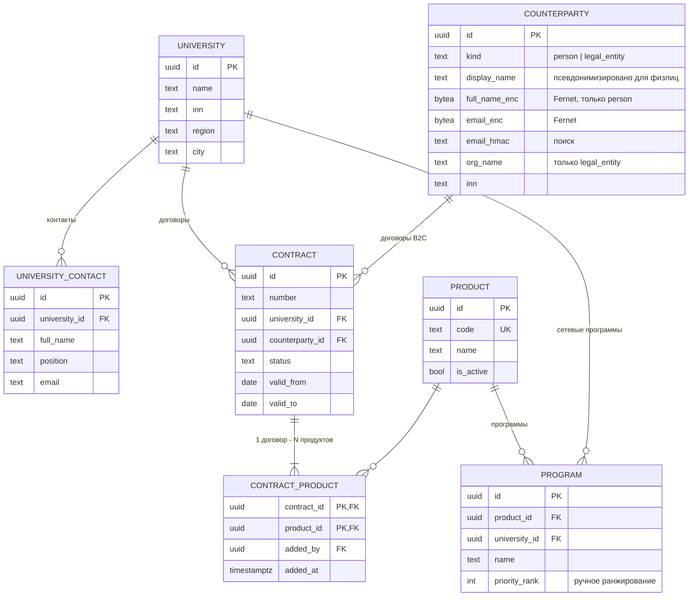
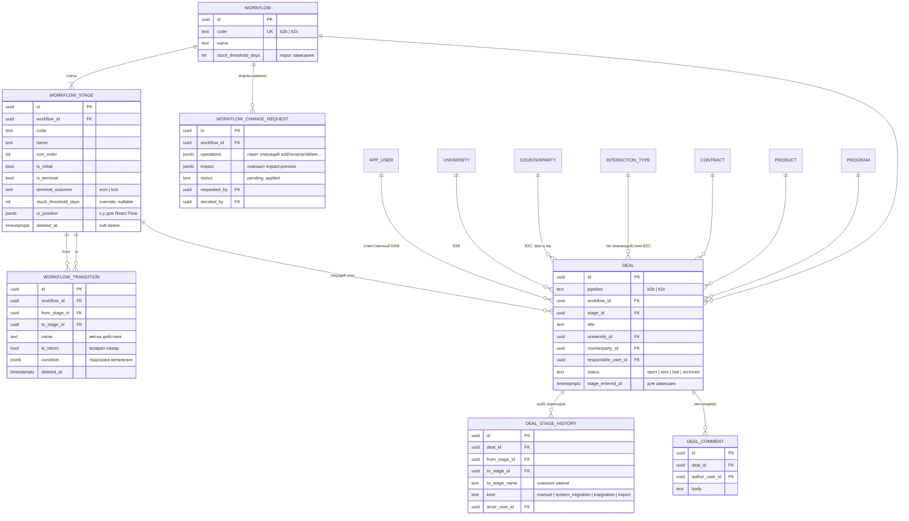
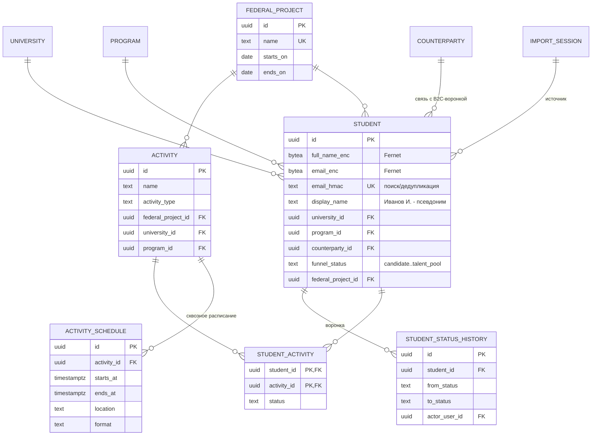
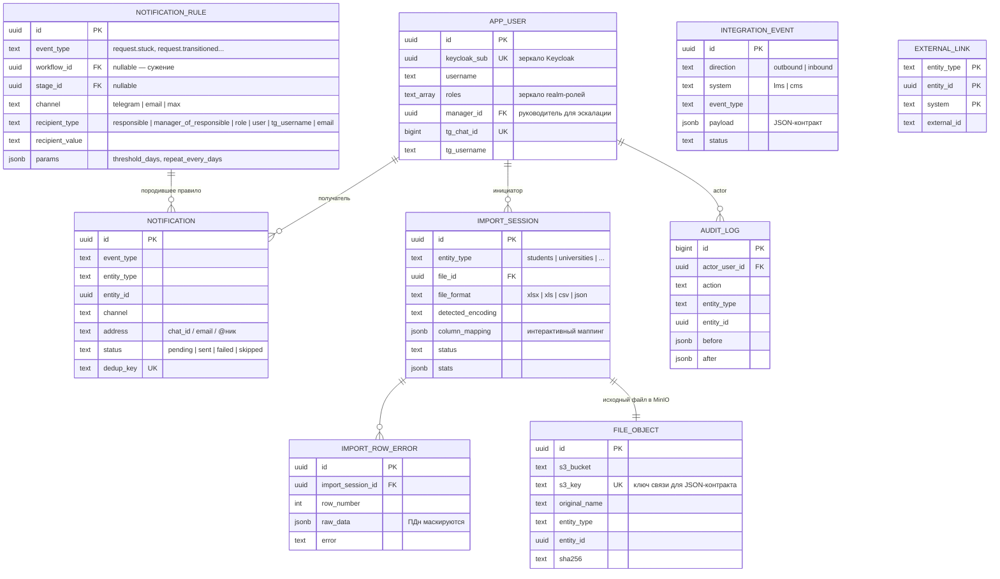
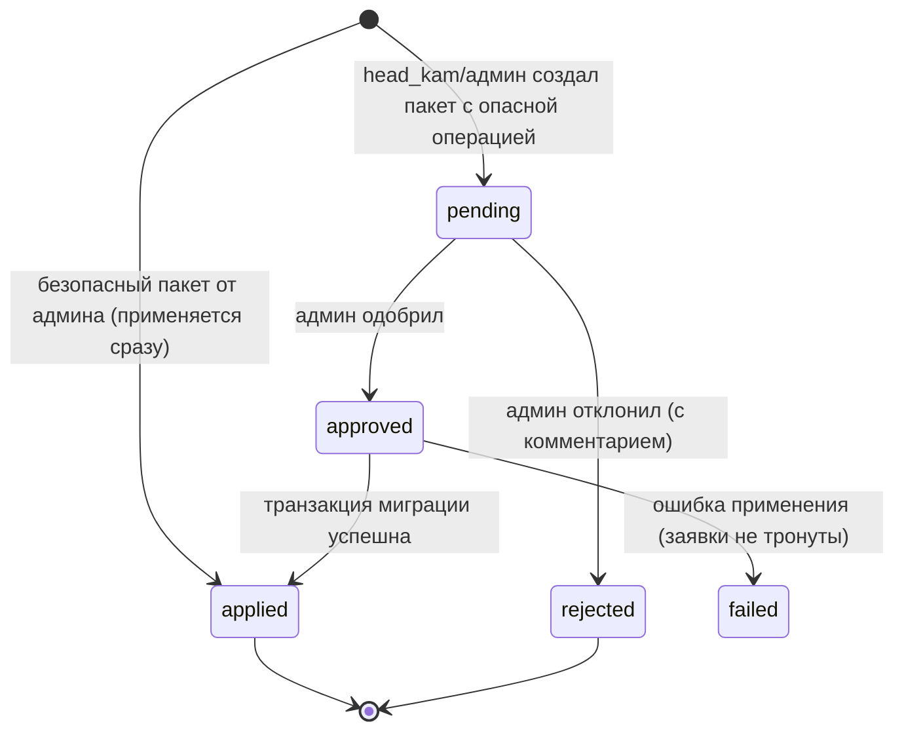
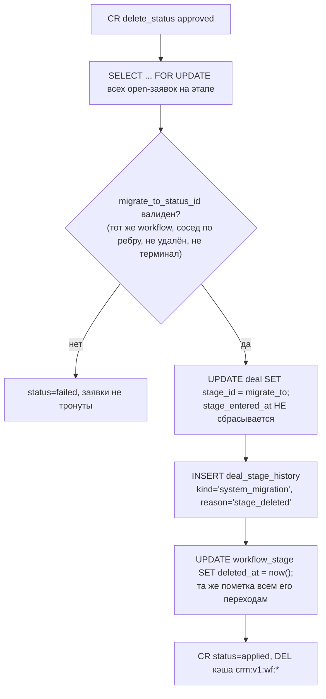
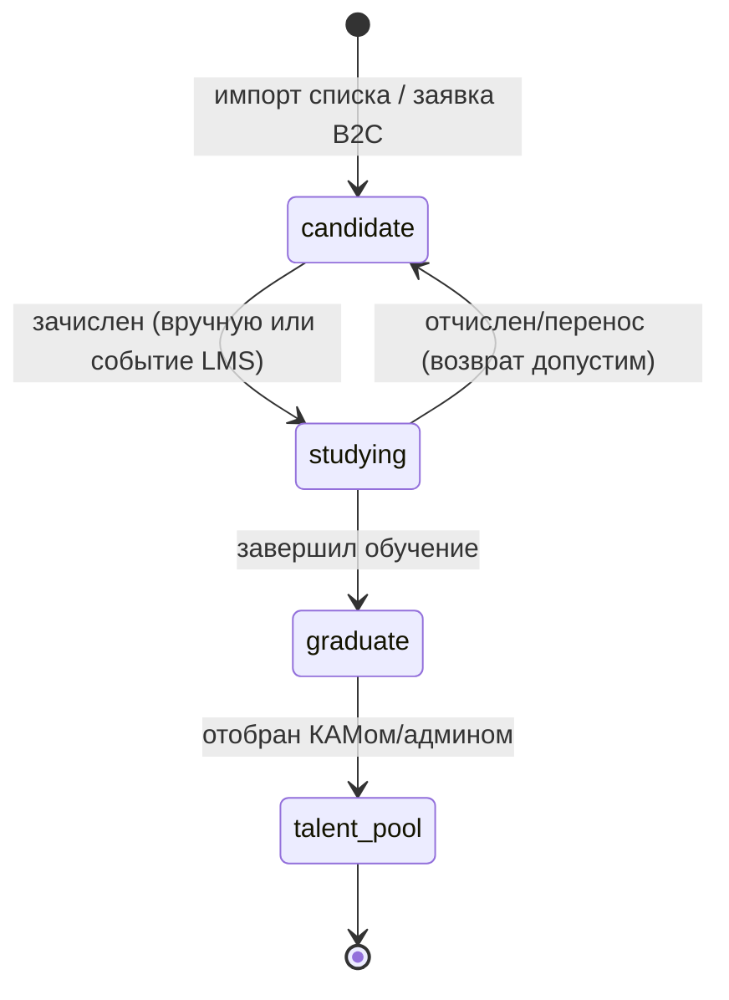

# Модель данных и схема БД

CRM для работы с вузами (ЛЦТ 2026). Документ — источник правды по схеме PostgreSQL 16,
шифрованию ПДн (152-ФЗ) и кэшированию в KeyDB. По нему пишутся модели SQLAlchemy 2 (async)
и миграции Alembic без дополнительных вопросов.

Связанные документы: `docs/design/OVERVIEW.md` (сводная архитектура, терминологический мост),
`docs/design/deployment.md` (деплой), `docs/design/api-contract.md` (REST-контракты),
`docs/design/workflow-engine.md` (движок), `PLAN.md` (решения кейсодержателя — раздел 12 ниже даёт построчную трассировку).

---

## 1. Принципы и соглашения

1. **СУБД** — PostgreSQL 16, одна база `crm`, схема `public`. Отдельные сервисы
   (notification, lms-stub, cms-stub) собственных таблиц в этой БД не имеют: notification-service
   работает через API backend'а, заглушки держат состояние в памяти/файлах.
2. **PK** — `uuid DEFAULT gen_random_uuid()` у всех таблиц (кроме `audit_log` — `bigint identity`,
   монотонный append-only). UUID безопасны для внешних JSON-контрактов LMS/CMS (нет перебора id)
   и для ключей S3.
3. **Время** — везде `timestamptz`, хранение в UTC. Колонки `created_at timestamptz NOT NULL DEFAULT now()`
   и `updated_at timestamptz NOT NULL DEFAULT now()` (обновляется приложением через SQLAlchemy `onupdate`).
   В DDL ниже они сокращены до комментария `-- + created_at, updated_at`.
4. **Enum'ы** — `text` + `CHECK`-constraint (не нативные PG enum): дешёвые миграции Alembic,
   а расширяемые справочники (типы взаимодействия B2C) — отдельные таблицы.
5. **Удаление** — этапы/переходы workflow удаляются **мягко** (`deleted_at`), чтобы история переходов
   оставалась ссылочно целостной. Остальное — физически с `ON DELETE RESTRICT` по умолчанию;
   `CASCADE` только у «детей» (история, комментарии, строки импорта).
6. **Именование** — `snake_case`, единственное число. Alembic `naming_convention`:
   `pk_%(table_name)s`, `fk_%(table_name)s_%(column_0_name)s`, `uq_...`, `ck_...`, `ix_...`.
7. **Расширения**: `CREATE EXTENSION IF NOT EXISTS pg_trgm;` (поиск по подстроке в названиях вузов).
   `gen_random_uuid()` встроен в PG 13+, pgcrypto не нужен.
8. **ПДн никогда не хранятся в БД открыто** (раздел 7): шифрование Fernet на уровне приложения,
   поиск по HMAC-хэшу, в списках — псевдонимизированный `display_name`.

---

## 2. ERD (Mermaid)

### 2.1 Организации, клиенты, продукты, договоры



### 2.2 Workflow и заявки (сделки)



### 2.3 Talent Pool (студенты, федпроекты, расписание)



### 2.4 Сервисные сущности (пользователи, нотификации, импорт, файлы, интеграции, аудит)



---

## 3. Пользователи и роли (зеркало Keycloak)

Источник правды по аутентификации и ролям — **Keycloak** (realm `crm`, JWT в каждом запросе).
Таблица `app_user` — зеркало, необходимое для: FK «ответственный», адресации нотификаций
(`tg_chat_id`), эскалации руководителю (`manager_id`), отображения ФИО в UI.
Синхронизация — **upsert по `keycloak_sub` при каждом логине** (данные из access-токена:
`sub`, `preferred_username`, `email`, `name`, `realm_access.roles`). Отдельный синк-джоб не нужен.

Роли realm (seed в Keycloak-JSON, зеркалируются в `roles[]`) — канонический список для всего проекта:
`admin`, `head_kam` (руководитель КАМов), `kam`, `observer` (read-only, ПДн маскируются);
сервисные роли confidential-клиентов (не люди): `svc_notification` (клиент `crm-notification`, Telegram-бот),
`svc_integration` (клиент `crm-integration`, заглушки LMS/CMS при bearer-варианте webhook'ов).

```sql
CREATE TABLE app_user (
    id            uuid PRIMARY KEY DEFAULT gen_random_uuid(),
    keycloak_sub  uuid NOT NULL,
    username      text NOT NULL,
    email         text,
    full_name     text,
    roles         text[] NOT NULL DEFAULT '{}',
    manager_id    uuid REFERENCES app_user(id) ON DELETE SET NULL,
    tg_chat_id    bigint,
    tg_username   text,              -- @ник, заполняется при привязке бота
    tg_linked_at  timestamptz,
    is_active     boolean NOT NULL DEFAULT true,
    created_at    timestamptz NOT NULL DEFAULT now(),
    updated_at    timestamptz NOT NULL DEFAULT now()
);
CREATE UNIQUE INDEX uq_app_user_keycloak_sub ON app_user (keycloak_sub);
CREATE UNIQUE INDEX uq_app_user_username     ON app_user (lower(username));
CREATE UNIQUE INDEX uq_app_user_tg_chat_id   ON app_user (tg_chat_id) WHERE tg_chat_id IS NOT NULL;
CREATE INDEX ix_app_user_roles ON app_user USING gin (roles);
```

**Привязка Telegram**: one-time code (6 цифр) живёт **только в KeyDB** (`crm:v1:tg:link:{code}` → `user_id`,
TTL 10 минут, чтение через `GETDEL` — одноразовость атомарна; см. раздел 10). Таблица не нужна.
Бот через сервисный аккаунт (клиент `crm-notification`, роль `svc_notification`, client credentials) вызывает
`POST /api/v1/internal/bot/bind {code, chat_id, tg_username}` → backend пишет `tg_chat_id`,
`tg_username`, `tg_linked_at` в `app_user` и запись в `audit_log`. Команды бота получают данные
строго по `roles` связанного пользователя.

---

## 4. Организации, клиенты, продукты, договоры

### 4.1 `university` — вузы

```sql
CREATE TABLE university (
    id         uuid PRIMARY KEY DEFAULT gen_random_uuid(),
    name       text NOT NULL,
    short_name text,
    inn        text,                -- опционально; у филиалов может совпадать — не unique
    kpp        text,
    region     text,
    city       text,
    website    text,
    kam_user_id uuid REFERENCES app_user(id),   -- ответственный КАМ (колонка реестра, фильтр kam_user_id)
    notes      text,
    is_active  boolean NOT NULL DEFAULT true,
    created_at timestamptz NOT NULL DEFAULT now(),
    updated_at timestamptz NOT NULL DEFAULT now()
);
CREATE UNIQUE INDEX uq_university_name ON university (lower(name));
CREATE INDEX ix_university_name_trgm ON university USING gin (name gin_trgm_ops);  -- поиск по подстроке
CREATE INDEX ix_university_region ON university (region);
```

Разовая предзагрузка из открытых источников (решение кейсодержателя: без runtime-интернета) —
через `import_session` с `entity_type='universities'` (JSON/таблицы в диалоговом окне админки).

### 4.2 `university_contact` — контактные лица вуза

Деловые контакты представителей юрлица; храним открыто (обоснование в 7.1, при необходимости
переводятся на тот же механизм шифрования).

```sql
CREATE TABLE university_contact (
    id            uuid PRIMARY KEY DEFAULT gen_random_uuid(),
    university_id uuid NOT NULL REFERENCES university(id) ON DELETE CASCADE,
    full_name     text NOT NULL,
    position      text,
    email         text,
    phone         text,
    is_primary    boolean NOT NULL DEFAULT false,
    notes         text,
    created_at    timestamptz NOT NULL DEFAULT now()
);
CREATE INDEX ix_university_contact_university ON university_contact (university_id);
```

### 4.3 `counterparty` — клиенты B2C (физлица И юрлица)

Решение кейсодержателя: B2C — «физлица + юрлица». Одна таблица с дискриминатором `kind`.
ПДн физлиц шифруются так же, как у студентов (раздел 7).

```sql
CREATE TABLE counterparty (
    id             uuid PRIMARY KEY DEFAULT gen_random_uuid(),
    kind           text NOT NULL CHECK (kind IN ('person', 'legal_entity')),
    display_name   text NOT NULL,        -- юрлицо: org_name; физлицо: псевдоним «Иванов И.» (7.3)
    -- физлицо (шифруется приложением, Fernet):
    full_name_enc  bytea,
    email_enc      bytea,
    phone_enc      bytea,
    email_hmac     char(64),             -- hex(HMAC-SHA256), поиск по точному email
    full_name_hmac char(64),             -- поиск по точному нормализованному ФИО
    -- юрлицо (открытые реквизиты организации):
    org_name       text,
    inn            text,
    kpp            text,
    org_email      text,
    org_phone      text,
    notes          text,
    is_active      boolean NOT NULL DEFAULT true,
    created_at     timestamptz NOT NULL DEFAULT now(),
    updated_at     timestamptz NOT NULL DEFAULT now(),
    CONSTRAINT ck_counterparty_kind_fields CHECK (
        (kind = 'person'       AND full_name_enc IS NOT NULL AND org_name IS NULL)
     OR (kind = 'legal_entity' AND org_name IS NOT NULL      AND full_name_enc IS NULL)
    )
);
CREATE INDEX ix_counterparty_kind ON counterparty (kind);
CREATE INDEX ix_counterparty_email_hmac ON counterparty (email_hmac) WHERE email_hmac IS NOT NULL;
CREATE INDEX ix_counterparty_inn ON counterparty (inn) WHERE inn IS NOT NULL;
CREATE INDEX ix_counterparty_display_trgm ON counterparty USING gin (display_name gin_trgm_ops);
```

### 4.4 `interaction_type` — типы взаимодействия B2C (добавляемые)

Решение кейсодержателя: «в B2C должна быть возможность добавлять новые варианты взаимодействия».
Редактируемый справочник (создание — `admin`/`head_kam`), а не enum.

```sql
CREATE TABLE interaction_type (
    id          uuid PRIMARY KEY DEFAULT gen_random_uuid(),
    pipeline    text NOT NULL DEFAULT 'b2c' CHECK (pipeline IN ('b2b', 'b2c')),
    code        text NOT NULL,
    name        text NOT NULL,
    description text,
    sort_order  int  NOT NULL DEFAULT 100,
    is_active   boolean NOT NULL DEFAULT true,
    created_by  uuid REFERENCES app_user(id),
    created_at  timestamptz NOT NULL DEFAULT now()
);
CREATE UNIQUE INDEX uq_interaction_type_code ON interaction_type (pipeline, lower(code));
```

Seed B2C: `dpo_course` «Обучение на курсе ДПО», `internship` «Стажировка», `corporate_training`
«Корпоративное обучение» (юрлица), `event` «Участие в мероприятии».

### 4.5 `product` и `program`

`product` — коммерческая единица каталога (то, что фигурирует в договоре и JSON-контракте
интеграций). `program` — образовательная программа/курс; привязана к продукту, опционально
к вузу (сетевые программы). **Приоритет курсов** — ручное ранжирование (`priority_rank`,
меньше = выше) КАМом/админом; изменения пишутся в `audit_log` (`action='program.priority_changed'`,
`before/after` — старый/новый rank). Автоформула — бонус, в модель не входит (достаточно колонки).

```sql
CREATE TABLE product (
    id           uuid PRIMARY KEY DEFAULT gen_random_uuid(),
    code         text NOT NULL,
    name         text NOT NULL,
    product_type text NOT NULL DEFAULT 'course'
                 CHECK (product_type IN ('course', 'dpo_program', 'network_program', 'service', 'other')),
    description  text,
    is_active    boolean NOT NULL DEFAULT true,
    created_at   timestamptz NOT NULL DEFAULT now(),
    updated_at   timestamptz NOT NULL DEFAULT now()
);
CREATE UNIQUE INDEX uq_product_code ON product (lower(code));

CREATE TABLE program (
    id                  uuid PRIMARY KEY DEFAULT gen_random_uuid(),
    product_id          uuid REFERENCES product(id) ON DELETE RESTRICT,
    university_id       uuid REFERENCES university(id) ON DELETE SET NULL,
    name                text NOT NULL,
    description         text,
    duration_hours      int CHECK (duration_hours IS NULL OR duration_hours > 0),
    seats               int CHECK (seats IS NULL OR seats > 0),
    starts_on           date,
    published_to_cms    boolean NOT NULL DEFAULT false,  -- флаг публикации каталога в CMS;
                                                         -- внешние id (cms_external_id, lms_course_id) — в external_link
    priority_rank       int NOT NULL DEFAULT 1000,   -- ручное ранжирование, меньше = выше
    priority_updated_by uuid REFERENCES app_user(id),
    priority_updated_at timestamptz,
    is_active           boolean NOT NULL DEFAULT true,
    created_at          timestamptz NOT NULL DEFAULT now(),
    updated_at          timestamptz NOT NULL DEFAULT now()
);
CREATE INDEX ix_program_product  ON program (product_id);
CREATE INDEX ix_program_priority ON program (priority_rank) WHERE is_active;
```

### 4.6 `contract` и `contract_product` — «1 договор — N продуктов, продукты расширяются»

Решение кейсодержателя: «Один вуз: договор как правило один, продуктов несколько (могут
расширяться)». Модель: договор принадлежит либо вузу (B2B), либо контрагенту (B2C-юрлицо);
состав продуктов — M:N-таблица `contract_product`, расширение = добавление строки
(`added_by`/`added_at` дают историю расширения, дубль запрещён PK). Количество договоров
на вуз схемой **не ограничиваем** («как правило» ≠ constraint) — UI подсвечивает второй
активный договор.

```sql
CREATE TABLE contract (
    id                  uuid PRIMARY KEY DEFAULT gen_random_uuid(),
    number              text NOT NULL,
    university_id       uuid REFERENCES university(id)   ON DELETE RESTRICT,
    counterparty_id     uuid REFERENCES counterparty(id) ON DELETE RESTRICT,
    status              text NOT NULL DEFAULT 'draft'
                        CHECK (status IN ('draft', 'negotiation', 'active', 'completed', 'terminated')),
    signed_at           date,
    valid_from          date,
    valid_to            date,
    amount              numeric(14, 2),
    currency            char(3) NOT NULL DEFAULT 'RUB',
    responsible_user_id uuid REFERENCES app_user(id),
    notes               text,
    created_at          timestamptz NOT NULL DEFAULT now(),
    updated_at          timestamptz NOT NULL DEFAULT now(),
    CONSTRAINT ck_contract_one_owner CHECK (num_nonnulls(university_id, counterparty_id) = 1),
    CONSTRAINT ck_contract_dates CHECK (valid_to IS NULL OR valid_from IS NULL OR valid_to >= valid_from)
);
CREATE INDEX ix_contract_university   ON contract (university_id) WHERE university_id IS NOT NULL;
CREATE INDEX ix_contract_counterparty ON contract (counterparty_id) WHERE counterparty_id IS NOT NULL;
CREATE UNIQUE INDEX uq_contract_number ON contract (lower(number));

CREATE TABLE contract_product (
    contract_id uuid NOT NULL REFERENCES contract(id) ON DELETE CASCADE,
    product_id  uuid NOT NULL REFERENCES product(id)  ON DELETE RESTRICT,
    note        text,
    added_by    uuid REFERENCES app_user(id),
    added_at    timestamptz NOT NULL DEFAULT now(),
    PRIMARY KEY (contract_id, product_id)
);
CREATE INDEX ix_contract_product_product ON contract_product (product_id);
```

Скан договора — файл в MinIO: `file_object` c `entity_type='contract'`, `entity_id=contract.id`.

---

## 5. Workflow как данные

### 5.1 Модель

Ровно **две воронки** — строки таблицы `workflow`: `b2b` (вузы) и `b2c` (физлица + юрлица).
**Версионирования нет** (прямое решение кейсодержателя): всегда одна актуальная схема,
изменения применяются сразу для всех заявок. Никаких `version`-колонок. Мягкое удаление
этапов/переходов — не версионирование, а сохранение ссылочной целостности истории.

- **Ветвление** = несколько активных переходов из одного этапа.
- **Возврат** (бюрократия) = переход с `is_return = true` на любой предыдущий этап.
- Выбор перехода всегда делает пользователь; `condition` (jsonb) — декларативная подсказка/валидация
  для UI (например `{"field": "amount", "op": ">=", "value": 1000000}` подсвечивает ветку
  «Согласование с руководством»), движок её не форсирует.
- `ui_position` — координаты узла для конструктора на React Flow, сохраняются как данные.

```sql
CREATE TABLE workflow (
    id                   uuid PRIMARY KEY DEFAULT gen_random_uuid(),
    code                 text NOT NULL,          -- 'b2b' | 'b2c' (seed; unique)
    name                 text NOT NULL,
    description          text,
    stuck_threshold_days int NOT NULL DEFAULT 14 CHECK (stuck_threshold_days BETWEEN 1 AND 60),
    updated_by           uuid REFERENCES app_user(id),
    created_at           timestamptz NOT NULL DEFAULT now(),
    updated_at           timestamptz NOT NULL DEFAULT now()
);
CREATE UNIQUE INDEX uq_workflow_code ON workflow (code);

CREATE TABLE workflow_stage (
    id                   uuid PRIMARY KEY DEFAULT gen_random_uuid(),
    workflow_id          uuid NOT NULL REFERENCES workflow(id) ON DELETE CASCADE,
    code                 text NOT NULL,
    name                 text NOT NULL,
    description          text,
    sort_order           int  NOT NULL DEFAULT 0,
    is_initial           boolean NOT NULL DEFAULT false,
    is_terminal          boolean NOT NULL DEFAULT false,
    terminal_outcome     text CHECK (terminal_outcome IN ('won', 'lost')),
    stuck_threshold_days int CHECK (stuck_threshold_days IS NULL OR stuck_threshold_days BETWEEN 1 AND 60),
    triggers_lms_handover boolean NOT NULL DEFAULT false, -- вход в этап шлёт crm.request.handed_over в LMS
    color                text,                    -- hex для канбана/конструктора
    ui_position          jsonb,                   -- {"x": 120, "y": 240}
    deleted_at           timestamptz,             -- soft delete (после миграции заявок)
    created_at           timestamptz NOT NULL DEFAULT now(),
    updated_at           timestamptz NOT NULL DEFAULT now(),
    CONSTRAINT ck_stage_terminal_outcome CHECK (is_terminal OR terminal_outcome IS NULL)
);
CREATE UNIQUE INDEX uq_stage_workflow_code ON workflow_stage (workflow_id, lower(code))
    WHERE deleted_at IS NULL;
CREATE UNIQUE INDEX uq_stage_single_initial ON workflow_stage (workflow_id)
    WHERE is_initial AND deleted_at IS NULL;      -- ровно один начальный этап на воронку
CREATE INDEX ix_stage_workflow ON workflow_stage (workflow_id, sort_order) WHERE deleted_at IS NULL;

CREATE TABLE workflow_transition (
    id            uuid PRIMARY KEY DEFAULT gen_random_uuid(),
    workflow_id   uuid NOT NULL REFERENCES workflow(id) ON DELETE CASCADE,
    from_stage_id uuid NOT NULL REFERENCES workflow_stage(id),
    to_stage_id   uuid NOT NULL REFERENCES workflow_stage(id),
    name          text NOT NULL,                  -- метка действия: «Отправить на согласование»
    is_return     boolean NOT NULL DEFAULT false, -- возврат на предыдущий шаг (API kind='return')
    requires_comment boolean NOT NULL DEFAULT false, -- комментарий обязателен (для возвратов — всегда)
    allowed_roles jsonb NOT NULL DEFAULT '[]',    -- [] = любая роль с доступом к заявке
    condition     jsonb,                          -- подсказка ветвления (JSON-DSL, workflow-engine.md §3.3), не форсируется
    sort_order    int NOT NULL DEFAULT 0,
    deleted_at    timestamptz,
    created_at    timestamptz NOT NULL DEFAULT now(),
    CONSTRAINT ck_transition_not_loop CHECK (from_stage_id <> to_stage_id),
    CONSTRAINT ck_transition_return_comment CHECK (NOT is_return OR requires_comment)
);
CREATE UNIQUE INDEX uq_transition_pair ON workflow_transition (from_stage_id, to_stage_id)
    WHERE deleted_at IS NULL;
CREATE INDEX ix_transition_from ON workflow_transition (from_stage_id) WHERE deleted_at IS NULL;
```

Инварианты уровня приложения (жёсткая валидация при любом изменении схемы, иначе
`400 workflow_invalid_schema` — полный список V-1..V-8 в `workflow-engine.md` §6.7):

- ровно один `is_initial` (дублирует partial unique) и ≥1 терминальный этап;
- каждый неудалённый этап достижим из начального;
- у каждого нетерминального этапа есть хотя бы один исходящий переход (тупики запрещены);
- у терминального этапа исходящих переходов нет.

### 5.2 `workflow_change_request` — admin-approve («защита от дурака»)

Решение кейсодержателя: **переименование и удаление** статуса — только с апрувом администратора.
Изменение схемы всегда приходит **пакетом операций** (`POST /workflows/{id}/changes`,
api-contract.md §5.3): `add_status`, `rename_status`, `delete_status`, `add/update/delete_transition`,
`update_status`. Классификация: пакет **только из безопасных операций** от `admin` применяется сразу
(`status='applied'`, запись в `audit_log`); от `head_kam` — уходит на апрув; пакет с хотя бы одной
**опасной** операцией (`rename_status`/`delete_status`) целиком уходит в `pending` даже от админа —
двухшаговое подтверждение («защита от дурака»). Применяет — только `admin`; свой пакет админ может
одобрить сам (approve и есть второй шаг; аудит-след остаётся). Опасные операции несут `confirm_name` —
посимвольно введённое текущее название этапа, сверяется на бэке.

```sql
CREATE TABLE workflow_change_request (
    id               uuid PRIMARY KEY DEFAULT gen_random_uuid(),
    workflow_id      uuid NOT NULL REFERENCES workflow(id) ON DELETE CASCADE,
    operations       jsonb NOT NULL,
        -- пакет операций контракта POST /workflows/{id}/changes (api-contract.md §5.3):
        -- [{"op":"rename_status","status_id":"…","new_name":"…","confirm_name":"…"},
        --  {"op":"delete_status","status_id":"…","migrate_to_status_id":"…","confirm_name":"…"}, …]
    impact           jsonb,
        -- снапшот impact-preview на момент создания:
        -- {"affected_requests_total": 12, "by_status": [{"status_id":"…","count":12,"migrate_to":{…}}]}
    status           text NOT NULL DEFAULT 'pending'
                     CHECK (status IN ('pending', 'approved', 'rejected', 'applied', 'failed')),
    requested_by     uuid NOT NULL REFERENCES app_user(id),
    requested_at     timestamptz NOT NULL DEFAULT now(),
    decided_by       uuid REFERENCES app_user(id),
    decided_at       timestamptz,
    decision_comment text,
    applied_at       timestamptz
);
CREATE INDEX ix_wcr_status ON workflow_change_request (status, requested_at) WHERE status = 'pending';
CREATE INDEX ix_wcr_workflow ON workflow_change_request (workflow_id, requested_at DESC);
```



Важно: `approved` существует только внутри транзакции применения — окна «одобрено, но не
применено» нет. `POST /workflows/changes/{id}/approve` в одной транзакции: повторная валидация →
применение операций → миграция заявок → `applied`; ошибка → `failed`, заявки не тронуты
(механика — `workflow-engine.md` §6.4).

### 5.3 Правила миграции заявок при изменении схемы

Решение кейсодержателя: «При изменении workflow "на лету" существующие заявки сопоставляются
на новую схему, работа не встаёт» и «при удалении статуса все заявки в нём переносятся на
соседний (лучше предыдущий) статус».

| Изменение | Апрув | Что с заявками | Аудит |
|---|---|---|---|
| Добавление этапа/перехода | admin — нет (сразу); head_kam — да (CR) | ничего | `audit_log` |
| Правка перехода, `condition`, `ui_position`, порог зависания, цвет | admin — нет; head_kam — да (CR) | ничего | `audit_log` |
| Переименование этапа | **да** (CR, `confirm_name`) | ничего; история хранит снапшоты имён на момент перехода | CR + `audit_log` |
| Удаление перехода | admin — нет; head_kam — да (CR) | ничего; операция, оставляющая нетерминальный этап без исходящих, **отклоняется валидацией** (тупики запрещены) | `audit_log` |
| Удаление этапа | **да** (CR, `confirm_name`) | алгоритм ниже | CR + `deal_stage_history` + `audit_log` |

Алгоритм удаления этапа (одна транзакция, применяет backend при `approved`):



Зафиксированные детали:

1. **`migrate_to_status_id` по умолчанию — предыдущий этап**: неудалённый **соседний** (связанный
   ребром со старым этапом) этап с максимальным `sort_order`, меньшим, чем у удаляемого («лучше
   предыдущий» — прямо из решения кейсодержателя). Админ может выбрать другой соседний нетерминальный
   этап той же воронки в UI — выбор сохраняется в операции пакета (`operations`).
2. **`stage_entered_at` при миграции сохраняется** — административная перестройка схемы не должна
   «омолаживать» заявку и маскировать зависание от эскалаций.
3. Ссылочная целостность гарантирована на уровне БД: `deal.stage_id` → FK без каскада,
   этап удаляется только мягко и только после переноса заявок в той же транзакции.
4. История не переписывается никогда: старые записи ссылаются на soft-deleted этапы,
   имена этапов в истории — снапшоты.
5. Начальный этап и последний терминальный этап удалить нельзя (валидация приложения при
   создании CR).

---

## 6. Заявки (deal), история, комментарии

### 6.1 `deal`

Заявка/сделка — единица работы КАМа. Привязана к воронке и **текущему этапу** workflow.
`pipeline` денормализован из `workflow.code` ради CHECK-инварианта клиента:
B2B — обязателен вуз; B2C — обязателен контрагент (физ/юрлицо), тип взаимодействия из
редактируемого справочника. «Параллельные взаимодействия с вузом» (обычно ≤ 2, разные
направления) — это просто несколько открытых заявок с разными `product_id`/`responsible_user_id`;
схемой не ограничиваем (решение: «не переусложнять»), UI показывает счётчик открытых заявок вуза.

```sql
CREATE TABLE deal (
    id                  uuid PRIMARY KEY DEFAULT gen_random_uuid(),
    pipeline            text NOT NULL CHECK (pipeline IN ('b2b', 'b2c')),
    workflow_id         uuid NOT NULL REFERENCES workflow(id),
    stage_id            uuid NOT NULL REFERENCES workflow_stage(id),   -- ON DELETE RESTRICT по умолчанию
    title               text NOT NULL,
    university_id       uuid REFERENCES university(id),
    counterparty_id     uuid REFERENCES counterparty(id),
    interaction_type_id uuid REFERENCES interaction_type(id),
    contract_id         uuid REFERENCES contract(id),
    product_id          uuid REFERENCES product(id),
    program_id          uuid REFERENCES program(id),
    responsible_user_id uuid NOT NULL REFERENCES app_user(id),
    amount              numeric(14, 2),
    currency            char(3) NOT NULL DEFAULT 'RUB',
    status              text NOT NULL DEFAULT 'open'
                        CHECK (status IN ('open', 'won', 'lost', 'archived')),
    stage_entered_at    timestamptz NOT NULL DEFAULT now(),  -- база расчёта «зависших»
    last_activity_at    timestamptz NOT NULL DEFAULT now(),  -- любое действие: комментарий, правка
    source              text NOT NULL DEFAULT 'manual'
                        CHECK (source IN ('manual', 'import', 'cms', 'lms')),
    description         text,
    created_by          uuid REFERENCES app_user(id),
    created_at          timestamptz NOT NULL DEFAULT now(),
    updated_at          timestamptz NOT NULL DEFAULT now(),
    CONSTRAINT ck_deal_client CHECK (
        (pipeline = 'b2b' AND university_id   IS NOT NULL)
     OR (pipeline = 'b2c' AND counterparty_id IS NOT NULL)
    )
);
CREATE INDEX ix_deal_board       ON deal (workflow_id, stage_id) WHERE status = 'open';  -- канбан
CREATE INDEX ix_deal_responsible ON deal (responsible_user_id)   WHERE status = 'open';
CREATE INDEX ix_deal_university  ON deal (university_id)  WHERE university_id  IS NOT NULL;
CREATE INDEX ix_deal_counterparty ON deal (counterparty_id) WHERE counterparty_id IS NOT NULL;
CREATE INDEX ix_deal_stuck       ON deal (stage_entered_at)      WHERE status = 'open';  -- CronJob зависших
CREATE INDEX ix_deal_created     ON deal (created_at DESC);
```

Правила движка (приложение, транзакционно):

- смена этапа разрешена только по активному переходу `from = deal.stage_id`
  (единственное исключение — `POST /requests/{id}/reopen` админом из терминального этапа
  в указанный нетерминальный: `kind='manual'`, `reason='reopen'`, комментарий обязателен);
- при смене этапа: `stage_id`, `stage_entered_at = now()`, `last_activity_at = now()`,
  запись в `deal_stage_history`, событие в `integration_event` (outbound) и в Notification Service;
- вход в терминальный этап проставляет `status = terminal_outcome` (`won`/`lost`);
  выход возвратом — обратно `open`.

**«Зависшие» заявки**: k8s CronJob (ежечасно) дергает `POST /api/v1/internal/jobs/check-stuck-requests`
(заголовок `X-Internal-Token`). Запрос: `status = 'open' AND stage_entered_at < now() - make_interval(days => threshold)`,
где `threshold` = `COALESCE(stage.stuck_threshold_days, workflow.stuck_threshold_days)`
(диапазон настройки 1–60 дней, дефолт 14 — «1–2 недели» из ТЗ). Эскалация двухступенчатая:
при пороге — ответственному; при 1.5×порога — его руководителю (`manager_id`).
Индекс `ix_deal_stuck` делает выборку дешёвой. Дедупликация повторных алертов — `notification.dedup_key`
(раздел 8).

### 6.2 `deal_stage_history` — audit переходов

Полная история движения каждой заявки, включая системные миграции при изменении схемы,
переходы от интеграций и импорта. Не редактируется и не удаляется (кроме каскада при физическом
удалении заявки админом). Имена этапов — снапшоты на момент события (переименования не
переписывают историю).

```sql
CREATE TABLE deal_stage_history (
    id              uuid PRIMARY KEY DEFAULT gen_random_uuid(),
    deal_id         uuid NOT NULL REFERENCES deal(id) ON DELETE CASCADE,
    from_stage_id   uuid REFERENCES workflow_stage(id),   -- NULL = создание заявки
    to_stage_id     uuid NOT NULL REFERENCES workflow_stage(id),
    from_stage_name text,
    to_stage_name   text NOT NULL,
    transition_id   uuid REFERENCES workflow_transition(id),
    is_return       boolean NOT NULL DEFAULT false,       -- снапшот флага перехода
    actor_user_id   uuid REFERENCES app_user(id),         -- NULL = система
    kind            text NOT NULL DEFAULT 'manual'
                    CHECK (kind IN ('manual', 'system_migration', 'integration', 'import')),
    reason          text,        -- 'stage_deleted', 'reopen', 'lms_status_sync', ...
    comment         text,        -- комментарий пользователя при переходе
    created_at      timestamptz NOT NULL DEFAULT now()
);
CREATE INDEX ix_dsh_deal      ON deal_stage_history (deal_id, created_at);
CREATE INDEX ix_dsh_to_stage  ON deal_stage_history (to_stage_id, created_at);  -- конверсия/дашборды
CREATE INDEX ix_dsh_created   ON deal_stage_history (created_at);
```

### 6.3 `deal_comment` — встроенный мессенджер (заглушка)

Лента комментариев в карточке заявки (решение: «встроенный мессенджер: в идеале да, заглушки
допустимы»). Вложения — через `file_object` (`entity_type='deal_comment'`). Realtime — SSE-канал
`GET /api/v1/events/stream` (топик `request.comment_added`), фолбэк — поллинг раз в 15 с.
Удаление — автор или admin, мягкое (`deleted_at`, текст в выдаче заменяется на «(удалено)»).

```sql
CREATE TABLE deal_comment (
    id             uuid PRIMARY KEY DEFAULT gen_random_uuid(),
    deal_id        uuid NOT NULL REFERENCES deal(id) ON DELETE CASCADE,
    author_user_id uuid NOT NULL REFERENCES app_user(id),
    body           text NOT NULL,
    created_at     timestamptz NOT NULL DEFAULT now(),
    edited_at      timestamptz,
    deleted_at     timestamptz          -- мягкое удаление (автор/admin)
);
CREATE INDEX ix_deal_comment_deal ON deal_comment (deal_id, created_at);
```

---

## 7. Talent Pool: студенты, воронка, федпроекты, расписание

### 7.1 `student`

ПДн минимальны (решение кейсодержателя: ФИО + email), **шифруются приложением** (раздел 8 —
стратегия). `display_name` — псевдоним для списков/сортировки. Связь с B2C-воронкой — через
`counterparty_id` (физлицо-контрагент): заявка B2C физлица и карточка студента указывают на
одного контрагента. Дедупликация при импорте — upsert по `email_hmac`.

```sql
CREATE TABLE student (
    id                 uuid PRIMARY KEY DEFAULT gen_random_uuid(),
    full_name_enc      bytea NOT NULL,          -- Fernet(ФИО)
    email_enc          bytea NOT NULL,          -- Fernet(email)
    phone_enc          bytea,                   -- Fernet(телефон), опционально
    email_hmac         char(64) NOT NULL,       -- hex(HMAC-SHA256(normalize(email)))
    full_name_hmac     char(64),                -- hex(HMAC-SHA256(normalize(ФИО)))
    display_name       text NOT NULL,           -- «Иванов И.А.» — псевдоним (7.3)
    university_id      uuid REFERENCES university(id),
    product_id         uuid REFERENCES product(id),
    program_id         uuid REFERENCES program(id),
    counterparty_id    uuid REFERENCES counterparty(id),     -- связь с B2C (kind='person')
    federal_project_id uuid REFERENCES federal_project(id),
    funnel_status      text NOT NULL DEFAULT 'candidate'
                       CHECK (funnel_status IN ('candidate', 'studying', 'graduate', 'talent_pool')),
    status_changed_at  timestamptz NOT NULL DEFAULT now(),
    source             text NOT NULL DEFAULT 'manual' CHECK (source IN ('manual', 'import', 'lms')),
    import_session_id  uuid REFERENCES import_session(id) ON DELETE SET NULL,
    notes              text,
    created_by         uuid REFERENCES app_user(id),
    created_at         timestamptz NOT NULL DEFAULT now(),
    updated_at         timestamptz NOT NULL DEFAULT now()
);
CREATE UNIQUE INDEX uq_student_email_hmac ON student (email_hmac);
CREATE INDEX ix_student_funnel     ON student (funnel_status);
CREATE INDEX ix_student_university ON student (university_id) WHERE university_id IS NOT NULL;
CREATE INDEX ix_student_fedproject ON student (federal_project_id) WHERE federal_project_id IS NOT NULL;
CREATE INDEX ix_student_name_hmac  ON student (full_name_hmac) WHERE full_name_hmac IS NOT NULL;
CREATE INDEX ix_student_display_trgm ON student USING gin (display_name gin_trgm_ops);
```

Файлы студента (резюме, сертификаты) — `file_object` с `entity_type='student'` (MinIO).
Событие «студент попал в talent pool» → `notification_rule` c `event_type='student.talent_pool_added'`.

### 7.2 Воронка студента и её история



Переходы свободные (валидация не жёсткая — допускаем возвраты), каждый фиксируется:

```sql
CREATE TABLE student_status_history (
    id            uuid PRIMARY KEY DEFAULT gen_random_uuid(),
    student_id    uuid NOT NULL REFERENCES student(id) ON DELETE CASCADE,
    from_status   text,
    to_status     text NOT NULL,
    actor_user_id uuid REFERENCES app_user(id),   -- NULL = система (LMS-событие, импорт)
    reason        text,
    created_at    timestamptz NOT NULL DEFAULT now()
);
CREATE INDEX ix_ssh_student ON student_status_history (student_id, created_at);
```

### 7.3 Федпроекты, активности, сквозное расписание

Сквозное расписание = единый календарь всех `activity_schedule` (индекс по `starts_at`),
фильтруемый по федпроекту/вузу/программе/студенту.

```sql
CREATE TABLE federal_project (
    id          uuid PRIMARY KEY DEFAULT gen_random_uuid(),
    name        text NOT NULL,
    code        text,
    description text,
    starts_on   date,
    ends_on     date,
    is_active   boolean NOT NULL DEFAULT true,
    created_at  timestamptz NOT NULL DEFAULT now()
);
CREATE UNIQUE INDEX uq_federal_project_name ON federal_project (lower(name));

CREATE TABLE activity (
    id                  uuid PRIMARY KEY DEFAULT gen_random_uuid(),
    name                text NOT NULL,
    activity_type       text NOT NULL DEFAULT 'other'
                        CHECK (activity_type IN ('course', 'event', 'internship', 'hackathon', 'other')),
    federal_project_id  uuid REFERENCES federal_project(id) ON DELETE SET NULL,
    university_id       uuid REFERENCES university(id) ON DELETE SET NULL,
    program_id          uuid REFERENCES program(id)    ON DELETE SET NULL,
    responsible_user_id uuid REFERENCES app_user(id),
    description         text,
    is_active           boolean NOT NULL DEFAULT true,
    created_at          timestamptz NOT NULL DEFAULT now(),
    updated_at          timestamptz NOT NULL DEFAULT now()
);
CREATE INDEX ix_activity_fedproject ON activity (federal_project_id);

CREATE TABLE activity_schedule (
    id          uuid PRIMARY KEY DEFAULT gen_random_uuid(),
    activity_id uuid NOT NULL REFERENCES activity(id) ON DELETE CASCADE,
    starts_at   timestamptz NOT NULL,
    ends_at     timestamptz,
    location    text,
    format      text CHECK (format IN ('online', 'offline', 'hybrid')),
    note        text,
    created_at  timestamptz NOT NULL DEFAULT now(),
    CONSTRAINT ck_schedule_interval CHECK (ends_at IS NULL OR ends_at > starts_at)
);
CREATE INDEX ix_schedule_activity ON activity_schedule (activity_id, starts_at);
CREATE INDEX ix_schedule_starts   ON activity_schedule (starts_at);   -- сквозной календарь

CREATE TABLE student_activity (
    student_id   uuid NOT NULL REFERENCES student(id)  ON DELETE CASCADE,
    activity_id  uuid NOT NULL REFERENCES activity(id) ON DELETE CASCADE,
    status       text NOT NULL DEFAULT 'registered'
                 CHECK (status IN ('registered', 'in_progress', 'completed', 'dropped')),
    enrolled_at  timestamptz NOT NULL DEFAULT now(),
    completed_at timestamptz,
    PRIMARY KEY (student_id, activity_id)
);
CREATE INDEX ix_student_activity_activity ON student_activity (activity_id);
```

---

## 8. Шифрование ПДн (152-ФЗ)

### 8.1 Что шифруем

| Таблица.поле | Открытая пара для поиска | Комментарий |
|---|---|---|
| `student.full_name_enc` | `full_name_hmac`, `display_name` | ФИО студента |
| `student.email_enc` | `email_hmac` (UNIQUE — дедупликация импорта) | email студента |
| `student.phone_enc` | — | опционально |
| `counterparty.full_name_enc` (kind='person') | `full_name_hmac`, `display_name` | физлицо B2C |
| `counterparty.email_enc` | `email_hmac` | физлицо B2C |
| `counterparty.phone_enc` | — | физлицо B2C |
| `import_row_error.raw_data` | — | значения ПДн-колонок **маскируются** до записи (8.5) |

Не шифруем (обоснование): `app_user` — сотрудники, их учётки живут в Keycloak (собственная БД
Keycloak в том же закрытом контуре), в CRM — рабочие контакты; `university_contact` — деловые
контакты представителей юрлиц в рамках договорной работы. Оба случая проговариваются на защите;
механизм расширяем — перевод любого поля на `*_enc` не меняет архитектуру.

### 8.2 Механизм

- **Алгоритм**: Fernet из пакета `cryptography` (AES-128-CBC + HMAC-SHA256, версионированный
  токен, IV внутри) — аудитированная библиотека, работает офлайн в закрытом контуре.
- **Ключи** — из Kubernetes Secret `crm-pii-keys` (env-переменные backend'а):
  - `PII_FERNET_KEYS` — список ключей через запятую, **первый — активный** для шифрования,
    остальные — для чтения старых данных (`MultiFernet`);
  - `PII_HMAC_KEY` — отдельный ключ ≥ 32 байт для поисковых хэшей (никогда не совпадает
    с Fernet-ключами).
  В docker-compose — те же переменные из `.env` (dev-ключи в репозиторий не коммитим,
  в `.env.example` — placeholder + команда генерации `python -c "from cryptography.fernet import Fernet; print(Fernet.generate_key().decode())"`).
- **Слой реализации** — SQLAlchemy `TypeDecorator`:
  - `EncryptedStr` → `LargeBinary` (bytea): `process_bind_param` = encrypt,
    `process_result_value` = decrypt;
  - HMAC-колонки заполняет доменный сервис (не тип), т.к. хэш строится от нормализованного значения.
- **Нормализация перед HMAC** (иначе поиск развалится):
  email → `strip().lower()`; ФИО → `strip()`, схлопнуть повторные пробелы, `lower()`, `ё → е`,
  Unicode NFC. Хэш: `hmac.new(PII_HMAC_KEY, normalized.encode(), hashlib.sha256).hexdigest()`.

### 8.3 Как ищем и показываем

| Сценарий | Механизм |
|---|---|
| Точный поиск по email (дедупликация импорта, поиск карточки) | `WHERE email_hmac = :h` — B-tree, O(log n) |
| Точный поиск по ФИО | `WHERE full_name_hmac = :h` |
| Поиск по подстроке имени в списках | `display_name ILIKE` / trigram-индекс — по **псевдониму**, не по ПДн |
| Карточка студента/физлица | по умолчанию — маскированные значения (`И***в И.И.`, `i***@example.com`); раскрытие — явный `POST /students/{id}/reveal` (роли admin, head_kam, kam; запись в `audit_log`, UI прячет через 60 с); observer раскрытия не имеет |
| Списки, канбан, дашборды | только `display_name` — расшифровка не нужна, кэшируется безопасно |
| Экспорт XLSX для КАМа/админа | расшифровка на лету в момент генерации файла; факт экспорта — в `audit_log` (`action='student.exported'`) |

Компромисс задокументирован: детерминированный HMAC раскрывает **факт равенства** двух значений —
приемлемо (это и есть цель дедупликации), подбор по словарю невозможен без `PII_HMAC_KEY`
из Secret. Сортировка по настоящему ФИО в SQL невозможна — сортируем по `display_name`.

`display_name` — псевдонимизация по правилу «Фамилия И.О.» (генерируется при создании/импорте
из полного ФИО, до шифрования). Однозначная реидентификация по нему невозможна без шифртекста
и ключа; это прямой ответ на формулировку кейсодержателя «шифрование/обезличивание
(псевдонимизация)».

### 8.4 Ротация ключей

- Fernet: добавить новый ключ первым в `PII_FERNET_KEYS`, перекатить Secret и pod'ы; фоновая
  команда `python -m app.tools.rekey` батчами (по 500 строк, `SELECT ... FOR UPDATE SKIP LOCKED`)
  перечитывает и перешифровывает `*_enc`. Старый ключ удаляется из списка после полного прогона.
- HMAC: ротация = пересчёт всех хэшей тем же батч-процессом (расшифровка → normalize → новый HMAC).
  На хакатоне достаточно наличия команды; прогон демонстрируется на защите при вопросе.

### 8.5 Гигиена ПДн вне таблиц

- **Логи** приложения не содержат расшифрованных значений (фильтр логгера маскирует
  `full_name`/`email` в структурированных логах).
- **`audit_log.before/after`** и **`import_row_error.raw_data`**: значения полей, замапленных на
  ПДн-колонки, маскируются до записи: `i***@example.com`, `И*** И.И.`.
- **Бэкапы БД** содержат только шифртекст — восстановление без Secret не раскрывает ПДн.
- **KeyDB** никогда не содержит расшифрованных ПДн (раздел 9): кэшируются только
  `display_name`-представления.
- **Telegram-нотификации** по студентам содержат `display_name`, не полные ФИО/email.
- **MinIO** (резюме/сертификаты — тоже ПДн): bucket закрыт, доступ только через backend
  по presigned URL с TTL 10 минут; ключи объектов не содержат ФИО (только UUID).

---

## 9. Импорт, файлы, интеграции, нотификации, настройки, аудит

### 9.1 `import_session` — диалоговый импорт с интерактивным маппингом

Решения кейсодержателя: XLSX **и XLS**, устойчивость к битым кодировкам, маппинг задаёт
пользователь в диалоге, загрузка списков студентов, разовая предзагрузка обогащения через
диалоговое окно админки (JSON/таблицы). Все сценарии — одна машина состояний.

```sql
CREATE TABLE import_session (
    id                uuid PRIMARY KEY DEFAULT gen_random_uuid(),
    entity_type       text NOT NULL CHECK (entity_type IN
                      ('students', 'universities', 'university_contacts', 'counterparties',
                       'requests_b2b', 'requests_b2c', 'contracts', 'products', 'programs')
                      OR entity_type LIKE 'dictionary:%'),   -- справочники админки (разовая предзагрузка)
    file_id           uuid REFERENCES file_object(id),   -- исходный файл в MinIO
    original_filename text,
    file_format       text CHECK (file_format IN ('xlsx', 'xls', 'csv', 'json')),
    detected_encoding text,                              -- charset-normalizer: 'utf-8', 'cp1251', ...
    detected_columns  jsonb,      -- ["ФИО", "Почта", "ВУЗ", ...] как распарсили
    sample_rows       jsonb,      -- первые 5 строк для предпросмотра маппинга (ПДн маскируются)
    column_mapping    jsonb,      -- см. пример ниже; NULL пока пользователь не задал
    options           jsonb NOT NULL DEFAULT '{}',
    status            text NOT NULL DEFAULT 'created' CHECK (status IN
                      ('created', 'uploaded', 'parsed', 'mapping', 'preview',
                       'applying', 'completed', 'failed', 'cancelled')),
    stats             jsonb,      -- {"total": 120, "created": 100, "updated": 12, "skipped": 5, "errors": 3}
    error_message     text,
    created_by        uuid NOT NULL REFERENCES app_user(id),
    created_at        timestamptz NOT NULL DEFAULT now(),
    updated_at        timestamptz NOT NULL DEFAULT now(),
    finished_at       timestamptz
);
CREATE INDEX ix_import_session_author ON import_session (created_by, created_at DESC);
CREATE INDEX ix_import_session_status ON import_session (status) WHERE status NOT IN ('completed', 'cancelled', 'failed');

CREATE TABLE import_row_error (
    id                uuid PRIMARY KEY DEFAULT gen_random_uuid(),
    import_session_id uuid NOT NULL REFERENCES import_session(id) ON DELETE CASCADE,
    row_number        int NOT NULL,
    raw_data          jsonb,       -- значения ПДн-колонок маскированы (8.5)
    error             text NOT NULL,
    created_at        timestamptz NOT NULL DEFAULT now()
);
CREATE INDEX ix_import_row_error_session ON import_row_error (import_session_id, row_number);
```

Машина состояний: `created → uploaded` (файл в MinIO) `→ parsed` (колонки и кодировка определены)
`→ mapping` (ждём маппинг пользователя) `→ preview` (dry-run: показываем stats и ошибки)
`→ applying → completed | failed`; `cancelled` — из любого нефинального.

Пример `column_mapping` + `options` (entity_type='students'):

```json
{
  "column_mapping": {
    "ФИО":            {"target": "full_name", "required": true},
    "Почта":          {"target": "email", "required": true},
    "ВУЗ":            {"target": "university_name", "lookup": "university.name", "create_missing": false},
    "Программа":      {"target": "program_name", "lookup": "program.name"},
    "Федпроект":      {"target": "federal_project_name", "lookup": "federal_project.name", "create_missing": true},
    "Статус":         {"target": "funnel_status", "value_map": {"учится": "studying", "выпускник": "graduate"}},
    "Комментарий":    {"target": null}
  },
  "options": {
    "sheet": "Лист1",
    "header_row": 1,
    "dedup_by": "email",
    "on_duplicate": "update",
    "default_funnel_status": "candidate"
  }
}
```

Устойчивость к кодировкам: XLS — `xlrd 2.x`, XLSX — `openpyxl` (формат — по magic bytes, не по
расширению), CSV — `charset-normalizer` + перебор `utf-8-sig → utf-8 → cp1251 → koi8-r → cp866`;
определённая кодировка пишется в `detected_encoding` и показывается пользователю с возможностью
переопределить в `options.encoding` (детали конвейера — api-contract.md §6.2).

### 9.2 `file_object` — файлы в MinIO

Все бинарные объекты (сканы договоров, вложения комментариев, резюме студентов, исходники
импорта, экспортированные отчёты) — в MinIO, в БД — метаданные и **ключи связи** (требование
JSON-контракта интеграций: «ключи связи с БД и S3»).

```sql
CREATE TABLE file_object (
    id            uuid PRIMARY KEY DEFAULT gen_random_uuid(),
    s3_bucket     text NOT NULL DEFAULT 'crm-files',  -- бакеты: crm-files / crm-imports / crm-exports (deployment.md §3.8)
    s3_key        text NOT NULL,     -- '{entity_type}/{entity_id}/{file_id}/{safe_name}'
    original_name text NOT NULL,
    content_type  text,
    size_bytes    bigint,
    sha256        char(64),
    entity_type   text CHECK (entity_type IN
                  ('deal', 'deal_comment', 'student', 'contract', 'university',
                   'import_session', 'report', 'other')),
    entity_id     uuid,
    uploaded_by   uuid REFERENCES app_user(id),
    created_at    timestamptz NOT NULL DEFAULT now(),
    deleted_at    timestamptz            -- soft delete; объект в MinIO чистит фоновая задача
);
CREATE UNIQUE INDEX uq_file_object_s3_key ON file_object (s3_bucket, s3_key);
CREATE INDEX ix_file_object_entity ON file_object (entity_type, entity_id) WHERE deleted_at IS NULL;
```

Доступ к файлам — только через backend: проверка роли/владения сущностью → presigned URL
(TTL 10 минут). Прямого анонимного доступа к MinIO нет (закрытый контур).

### 9.3 `integration_event` и `external_link` — двусторонние интеграции LMS/CMS

Outbox/inbox-паттерн: backend пишет исходящие события в `integration_event` в той же транзакции,
что и доменное изменение; фоновый воркер доставляет их в заглушки (**outbound**); заглушки
и вебхуки пишут входящие (**inbound**), обработчик применяет их к домену. Это делает
двусторонность **демонстрируемой**: таблица — живой журнал обмена, виден в админке.

```sql
CREATE TABLE integration_event (
    id             uuid PRIMARY KEY DEFAULT gen_random_uuid(),
    event_id       uuid NOT NULL DEFAULT gen_random_uuid(), -- ключ идемпотентности конверта (api-contract.md §13.1)
    direction      text NOT NULL CHECK (direction IN ('outbound', 'inbound')),
    system         text NOT NULL CHECK (system IN ('lms', 'cms')),
    event_type     text NOT NULL,   -- 'crm.request.handed_over', 'crm.program.upserted',
                                    -- 'crm.program.published', 'crm.program.unpublished',
                                    -- 'lms.learning.started|progress|completed', 'cms.lead.created'
    entity_type    text,
    entity_id      uuid,
    payload        jsonb NOT NULL,  -- полный конверт IntegrationEvent
    correlation_id uuid NOT NULL DEFAULT gen_random_uuid(),
    status         text NOT NULL DEFAULT 'pending'
                   CHECK (status IN ('pending', 'retrying', 'delivered', 'processed', 'dead', 'skipped')),
                   -- outbound: pending → retrying* → delivered | dead (DLQ, ручной retry в админке)
                   -- inbound:  pending → processed | dead
    attempts       int NOT NULL DEFAULT 0,
    next_retry_at  timestamptz,     -- backoff 1м → 5м → 30м → 2ч → 6ч (только сеть/5xx)
    last_error     text,
    created_at     timestamptz NOT NULL DEFAULT now(),
    processed_at   timestamptz
);
CREATE UNIQUE INDEX uq_integration_event_event_id ON integration_event (event_id);
CREATE INDEX ix_integration_event_pending ON integration_event (next_retry_at, created_at)
    WHERE status IN ('pending', 'retrying');
CREATE INDEX ix_integration_event_entity  ON integration_event (entity_type, entity_id, created_at);

CREATE TABLE external_link (
    entity_type text NOT NULL,     -- 'deal', 'program', 'student', 'university'
    entity_id   uuid NOT NULL,
    system      text NOT NULL CHECK (system IN ('lms', 'cms')),
    external_id text NOT NULL,
    created_at  timestamptz NOT NULL DEFAULT now(),
    PRIMARY KEY (entity_type, entity_id, system)
);
CREATE UNIQUE INDEX uq_external_link_reverse ON external_link (system, entity_type, external_id);
```

`payload` — всегда полный конверт `IntegrationEvent` (канон — api-contract.md §13.1): `event_id`,
`event_type`, `occurred_at`, `source`, `correlation {crm_request_id, lms_enrollment_id, cms_lead_id}` и
`payload` с ровно тем составом, который зафиксировал кейсодержатель («статус, ответственный, вуз,
программа, продукт + ключи связи с БД и S3»):

```json
{
  "event_id": "e7a1b3c5-…",
  "event_type": "crm.request.handed_over",
  "occurred_at": "2026-09-16T12:00:00Z",
  "source": "crm",
  "correlation": {"crm_request_id": "5f0e6d20-…", "lms_enrollment_id": null, "cms_lead_id": null},
  "payload": {
    "status":      {"code": "in_learning", "name": "Передано в обучение"},
    "responsible": {"crm_user_id": "0d9f8a10-…", "full_name": "Петров К.А.", "email": "kam.petrov@corp.local"},
    "university":  {"crm_university_id": "7c1b2e30-…", "name": "МГТУ им. Н.Э. Баумана", "inn": "7707082662"},
    "program":     {"crm_program_id": "b4429810-…", "name": "ИИ-инженер, 256 ч.", "lms_course_id": null, "cms_external_id": null},
    "product":     {"crm_product_id": "91aa4c00-…", "code": "dpo-ai", "name": "ДПО «Искусственный интеллект»"},
    "links": {
      "db_keys": {"request_id": "5f0e6d20-…", "contract_id": "aa310c70-…",
                  "university_id": "7c1b2e30-…", "product_id": "91aa4c00-…", "program_id": "b4429810-…"},
      "s3_keys": ["contract/aa310c70-…/3c5d…/dogovor_mgtu_2026.pdf"]
    }
  }
}
```

### 9.4 `notification_rule`, `notification`, `app_setting`

Решения кейсодержателя: события переходов, «зависшие» заявки с настраиваемым порогом 1–2 недели,
эскалация ответственному и руководителю КАМа, адресация «по нику ТГ, по email или по роли —
настраиваемо», каналы Telegram (реальный бот) / Max / Email (подключаемые, допустимы заглушки).

```sql
CREATE TABLE notification_rule (
    id              uuid PRIMARY KEY DEFAULT gen_random_uuid(),
    event_type      text NOT NULL CHECK (event_type IN
                    ('request.created', 'request.transitioned', 'request.assigned',
                     'request.stuck', 'request.comment_added',
                     'workflow.change_requested', 'workflow.changed',
                     'student.talent_pool_added', 'import.finished',
                     'integration.lead_received', 'integration.delivery_failed')),
                    -- единый реестр событий (совпадает с api-contract.md §9)
    workflow_id     uuid REFERENCES workflow(id)       ON DELETE CASCADE,  -- NULL = все воронки
    stage_id        uuid REFERENCES workflow_stage(id) ON DELETE CASCADE,  -- NULL = все этапы
    channel         text NOT NULL CHECK (channel IN ('telegram', 'email', 'max')),
    recipient_type  text NOT NULL CHECK (recipient_type IN
                    ('responsible',             -- ответственный по заявке
                     'manager_of_responsible',  -- руководитель КАМа (app_user.manager_id)
                     'role',                    -- все пользователи с realm-ролью
                     'user',                    -- конкретный app_user.id
                     'tg_username',             -- прямой @ник
                     'email')),                 -- прямой адрес
    recipient_value text,      -- код роли / uuid пользователя / '@nick' / 'a@b.ru'; NULL для responsible/manager
    params          jsonb NOT NULL DEFAULT '{}',
        -- для request.stuck: {"threshold_days": 10, "repeat_every_days": 3}
        --   threshold_days переопределяет workflow/stage-порог только для этого правила (опционально)
    is_active       boolean NOT NULL DEFAULT true,
    created_by      uuid REFERENCES app_user(id),
    created_at      timestamptz NOT NULL DEFAULT now(),
    updated_at      timestamptz NOT NULL DEFAULT now(),
    CONSTRAINT ck_rule_recipient_value CHECK (
        recipient_type IN ('responsible', 'manager_of_responsible') OR recipient_value IS NOT NULL)
);
CREATE INDEX ix_notification_rule_event ON notification_rule (event_type) WHERE is_active;

CREATE TABLE notification (
    id                uuid PRIMARY KEY DEFAULT gen_random_uuid(),
    rule_id           uuid REFERENCES notification_rule(id) ON DELETE SET NULL,
    event_type        text NOT NULL,
    entity_type       text,          -- 'deal' | 'student' | 'import_session' | ...
    entity_id         uuid,
    recipient_user_id uuid REFERENCES app_user(id),
    channel           text NOT NULL CHECK (channel IN ('telegram', 'email', 'max')),
    address           text NOT NULL, -- вычисленный адрес: chat_id / email / @ник
    subject           text,
    body              text NOT NULL,
    payload           jsonb,
    dedup_key         text,          -- 'stuck:{deal_id}:{stage_id}:{bucket}' — см. ниже
    status            text NOT NULL DEFAULT 'pending'
                      CHECK (status IN ('pending', 'sent', 'failed', 'skipped')),
    attempts          int NOT NULL DEFAULT 0,
    last_error        text,
    created_at        timestamptz NOT NULL DEFAULT now(),
    sent_at           timestamptz
);
CREATE UNIQUE INDEX uq_notification_dedup ON notification (dedup_key) WHERE dedup_key IS NOT NULL;
CREATE INDEX ix_notification_pending ON notification (created_at) WHERE status = 'pending';
CREATE INDEX ix_notification_entity  ON notification (entity_type, entity_id, created_at);

CREATE TABLE app_setting (
    key         text PRIMARY KEY,
    value       jsonb NOT NULL,
    description text,
    updated_by  uuid REFERENCES app_user(id),
    updated_at  timestamptz NOT NULL DEFAULT now()
);
```

Механика:

- Backend — единственный писатель `notification` (outbox, в транзакции с бизнес-изменением;
  получатели вычисляются backend'ом). Фоновый relay backend'а доставляет pending-записи в
  notification-service: `POST http://notification:8010/api/v1/send` (заголовок `X-Internal-Token`,
  идемпотентность по `notification_id`), по ответу проставляет `sent/failed` и ретраит.
  KeyDB pub/sub `crm:v1:notify` — необязательный сигнал релею «есть новое» (ускоряет доставку).
  Каналы Max и Email — адаптеры-заглушки с теми же настройками (показываем подключаемость).
- **Дедупликация «зависших»**: `dedup_key = 'stuck:{deal_id}:{stage_id}:{n}'`, где
  `n = floor(days_on_stage / repeat_every_days)` — повторная эскалация не чаще, чем раз в
  `repeat_every_days` (дефолт 3), уникальный индекс отбрасывает дубли на любом числе реплик
  CronJob-вызова.
- Порог зависания разрешается каскадом: `notification_rule.params.threshold_days`
  → `workflow_stage.stuck_threshold_days` → `workflow.stuck_threshold_days`
  → `app_setting['stuck_threshold_days_default']`.

Seed `app_setting`:

```json
{"stuck_threshold_days_default": {"value": 14},
 "stuck_check_enabled": {"value": true},
 "integration_mode": {"value": "http"},
 "file_delivery": {"value": "proxy"},
 "notification_quiet_hours": {"value": {"from": "21:00", "to": "09:00", "tz": "Europe/Moscow"}}}
```

(`notification_quiet_hours` — зарезервированная настройка, в MVP не применяется; на вопрос жюри
показывается как задел канала.)

Seed `notification_rule` (дефолтные правила из решения кейсодержателя):

| event_type | recipient_type | channel | params |
|---|---|---|---|
| `request.stuck` | `responsible` | telegram | `{"repeat_every_days": 3}` — ступень 1 (порог) |
| `request.stuck` | `manager_of_responsible` | telegram | `{"repeat_every_days": 3}` — ступень 2 (1.5×порога), эскалация руководителю КАМа |
| `request.transitioned` | `responsible` | telegram | `{}` |
| `request.comment_added` | `responsible` | telegram | `{}` (включая @упоминания) |
| `workflow.change_requested` | `role`: `admin` | telegram | `{}` |
| `integration.lead_received` | `role`: `head_kam` | telegram | `{}` |
| `student.talent_pool_added` | `role`: `head_kam` | email | `{}` |

### 9.5 `audit_log` — сквозной журнал действий

Append-only журнал административных и значимых доменных действий (изменения схемы workflow,
приоритетов программ, привязка Telegram, экспорты ПДн, ручные overrides). Не заменяет
`deal_stage_history` (тот — доменная история заявки), а дополняет.

```sql
CREATE TABLE audit_log (
    id            bigint GENERATED ALWAYS AS IDENTITY PRIMARY KEY,
    actor_user_id uuid REFERENCES app_user(id),   -- NULL = система
    action        text NOT NULL,     -- 'workflow.stage.renamed', 'program.priority_changed',
                                     -- 'user.tg_linked', 'student.exported', 'import.applied', ...
    entity_type   text NOT NULL,
    entity_id     uuid,
    before        jsonb,             -- ПДн маскируются (8.5)
    after         jsonb,
    ip            inet,
    created_at    timestamptz NOT NULL DEFAULT now()
);
CREATE INDEX ix_audit_entity ON audit_log (entity_type, entity_id, created_at);
CREATE INDEX ix_audit_actor  ON audit_log (actor_user_id, created_at);
CREATE INDEX ix_audit_action ON audit_log (action, created_at);
```

---

## 10. Кэширование в KeyDB

Паттерн — **cache-aside** поверх redis-протокола (`redis-py` async, KeyDB совместим).
Сериализация — JSON (`orjson`). Все ключи с префиксом версии `crm:v1:` — смена префикса
при несовместимом деплое мгновенно сбрасывает весь кэш. **Расшифрованные ПДн в KeyDB не
попадают никогда** (кэшируются только представления с `display_name`).

| Ключ | Содержимое | TTL | Инвалидация |
|---|---|---|---|
| `crm:v1:wf:{workflow_id}` | полный граф воронки (этапы + переходы + ui_position) для конструктора и канбана | 24 ч | `DEL` при любом изменении схемы / применении CR |
| `crm:v1:dict:universities` | список вузов (id, name, region) для селектов | 10 мин | `DEL` при CRUD вуза и после импорта |
| `crm:v1:dict:products`, `crm:v1:dict:programs`, `crm:v1:dict:interaction_types`, `crm:v1:dict:federal_projects` | справочники для селектов; программы — с `priority_rank` (порядок в выдаче) | 10 мин | `DEL` при CRUD, смене приоритета |
| `crm:v1:deal:{id}` | карточка заявки (JSON API-ответа; клиент — `display_name`) | 5 мин | `DEL` при любой записи в заявку: переход, правка, комментарий |
| `crm:v1:deal:list:{hash}` | страница списка/канбана (hash = sha1 канонизированных фильтров + роль-скоуп) | 60 с | по TTL (списки волатильны, точечная инвалидация не окупается) |
| `crm:v1:dash:{scope}:{hash}` | агрегаты дашбордов ECharts (конверсия, воронка, зависшие) | 60 с | по TTL |
| `crm:v1:tg:link:{code}` | one-time код привязки бота → `user_id` (код — 6 цифр) | 10 мин | `GETDEL` при использовании (атомарная одноразовость) |
| `crm:v1:rl:tg:{chat_id}` | rate-limit команд бота (`INCR` + `EXPIRE`) | 60 с | по TTL |
| `crm:v1:idem:{key}` | Idempotency-Key мутирующих POST → hash тела + сохранённый ответ | 24 ч | по TTL |
| `crm:v1:intg:seen:{event_id}` | быстрая дедупликация интеграционных событий (`SET NX`) | 7 сут | по TTL (истина — `uq_integration_event_event_id` в PG) |
| `crm:v1:events` (pub/sub) | fan-out UI-событий на SSE-хабы всех реплик backend (`GET /api/v1/events/stream`) | — | — |
| `crm:v1:jwks:crm` | JWKS realm'а Keycloak для локальной валидации JWT | 10 мин | по TTL; форс-`DEL` при 401 с неизвестным `kid` |
| `crm:v1:stuck:guard:{deal_id}` | быстрый guard от гонки повторной эскалации между репликами | = `repeat_every_days` | по TTL (истина — `uq_notification_dedup` в PG) |
| `crm:v1:notify` (pub/sub) | сигнал notification-service «есть pending» | — | — |
| `crm:v1:export:{session_id}` | статус долгого экспорта отчёта для polling'а UI | 30 мин | по TTL |

Правила:

1. Инвалидация — `DEL` **после коммита** транзакции (SQLAlchemy `after_commit`-hook), не до:
   иначе конкурентный читатель успеет положить в кэш старую версию.
2. Кэш — необязательный уровень: любой `GET`-промах или недоступность KeyDB деградирует в чтение
   из PostgreSQL (обёртка с try/except и коротким connect-timeout 50 мс). Падение KeyDB не
   роняет CRM — важный аргумент отказоустойчивости на защите.
3. Горизонтальное масштабирование (план на 300+ пользователей): все реплики backend'а делят
   один KeyDB — согласованность инвалидации автоматическая, локальных in-memory кэшей нет.
4. Что кейсодержатель называл «кэширование карточек, документов, страниц»: карточки —
   `deal:{id}`, документы — presigned URL не кэшируем (короткий TTL сам по себе), страницы —
   `deal:list:{hash}` и `dash:{hash}`.

---

## 11. Seed-данные (Alembic data-migration / фикстуры)

1. **Воронки** (обязательный seed, без него система пуста; канонический полный JSON —
   api-contract.md §5.1, файлы `backend/app/modules/workflow/seeds/{b2b,b2c}.json`):
   - `b2b` «Взаимодействие с вузами»: `new` Новая → `first_contact` Первичный контакт →
     `negotiation` Переговоры → `contract_prep` Подготовка договора →
     `contract_signed` Договор подписан → `in_learning` Передано в обучение
     (`triggers_lms_handover=true`) → `completed` Завершена (terminal, won);
     `rejected` Отказ (terminal, lost).
     Ветвления: из `first_contact`, `negotiation`, `contract_prep` — в `rejected`
     (`requires_comment`). Возврат: `contract_prep → negotiation` (`is_return`, «Вернуть в переговоры»).
   - `b2c` «Физлица и юрлица»: `new` Новая заявка → `consultation` Консультация →
     `proposal` Предложение → `payment_pending` Ожидание оплаты → `paid` Оплачено →
     `in_learning` Обучение → `completed` Завершена (terminal, won);
     `rejected` Отказ (terminal, lost); возврат `payment_pending → proposal` (`is_return`).
2. **`interaction_type`** — 4 строки B2C (см. 4.4).
3. **`app_setting`** и **`notification_rule`** — из 9.4.
4. **Пользователи** приходят из Keycloak realm-JSON (admin, head_kam, 2×kam, observer) —
   зеркалируются при первом логине; для демо-данных фикстура создаёт их же
   в `app_user` с проставленными `manager_id` (kam → head_kam).
5. **Демо-домен**: 5–10 вузов, 3 продукта, 6 программ (с приоритетами), 2 договора
   (один — с 3 продуктами: демонстрация «1 договор — N продуктов»), 15–20 заявок по обеим
   воронкам с историей переходов (включая одну «зависшую» старше порога — для демо эскалации),
   20 студентов по всем статусам воронки, 2 федпроекта, 4 активности с расписанием.

---

## 12. Трассировка на решения кейсодержателя (PLAN.md, раздел 2–4)

| Решение кейсодержателя | Где покрыто в модели |
|---|---|
| Два workflow: B2B и B2C; B2C — физлица + юрлица | `workflow` (2 строки), `deal.pipeline` + `ck_deal_client`, `counterparty.kind` (4.3, 5.1, 6.1) |
| В B2C добавляемые варианты взаимодействия | справочник `interaction_type` + `deal.interaction_type_id` (4.4) |
| Workflow един, версионирование запрещено | нет version-колонок; одна актуальная схема; soft-delete — только целостность истории (5.1) |
| Ветвления и возвраты | несколько `workflow_transition` из этапа; `is_return` (5.1) |
| Изменение «на лету», заявки сопоставляются, работа не встаёт | правила миграции 5.3: одна транзакция, `FOR UPDATE`, `kind='system_migration'` |
| Переименование/удаление статуса — только с апрувом админа | `workflow_change_request` + state-машина (5.2) |
| При удалении статуса заявки → соседний (лучше предыдущий) | `migrate_to_status_id` в операции пакета, дефолт — предыдущий сосед по `sort_order` (5.3 п.1) |
| Один вуз — обычно один договор, продуктов несколько, расширяются | `contract` + `contract_product` (M:N, `added_at/added_by`); число договоров не ограничено схемой (4.6) |
| Параллельных взаимодействий ≤ 2, не переусложнять | несколько открытых `deal` на вуз, без constraint, UI-счётчик (6.1) |
| Keycloak self-hosted, RBAC по ролям | `app_user` — зеркало (sub, roles[], upsert при логине), роли realm (3) |
| UI строго по ролям | `roles[]` + скоупы доступа к ПДн (8.3); сама отрисовка — фронт |
| Интеграции двусторонние, JSON: статус, ответственный, вуз, программа, продукт + ключи БД и S3 | `integration_event` (outbox/inbox), `external_link`, пример payload (9.3) |
| Обогащение — разовая предзагрузка через диалог (JSON/таблицы) | `import_session.entity_type IN ('universities', 'dictionary:*')` (9.1) |
| XLSX и XLS, битые кодировки, интерактивный маппинг | `import_session`: `file_format` c 'xls', `detected_encoding`, `column_mapping`, машина состояний (9.1) |
| Дашборды с фильтрами и экспортом | индексы аналитики (`ix_dsh_to_stage`, `ix_deal_board`), кэш `dash:{hash}`, `file_object.entity_type='report'` |
| PostgreSQL + MinIO | вся схема; `file_object` с ключами S3 (9.2) |
| Студенты ФИО+email, шифрование/обезличивание | `student.*_enc`, HMAC-поиск, `display_name`-псевдонимизация (7.1, 8) |
| Безопасность библиотек, закрытый контур | `cryptography`/Fernet офлайн; ключи из k8s Secret; presigned MinIO (8.2, 8.5) |
| ЭЦП не тестируем | в модели отсутствует |
| Кэш KeyDB: карточки, документы, страницы | раздел 10, п.4 |
| План на 300+ пользователей | stateless-реплики + общий KeyDB, партиционирования не требуется на объёмах хакатона (10 п.3) |
| Ранжирование программ — ручные приоритеты КАМ/админ | `program.priority_rank`, `priority_updated_by/at`, audit (4.5) |
| Встроенный мессенджер (заглушка допустима) | `deal_comment` + вложения через `file_object` (6.3) |
| Telegram-бот, авторизация через Keycloak, привязка chat_id | `app_user.tg_chat_id/tg_username`, one-time код в KeyDB `GETDEL` (3, 10) |
| «Зависшие» заявки, порог 1–2 недели, эскалация руководителю, адресация ник/email/роль | `stage_entered_at` + каскад порогов, `manager_of_responsible`, `recipient_type` (6.1, 9.4) |
| Каналы TG/Max/Email подключаемые | `notification_rule.channel`, `notification.channel` (9.4) |
| Talent pool: воронка кандидат→обучается→выпускник→talent pool | `student.funnel_status` + `student_status_history` (7.1, 7.2) |
| Федпроекты, активности, сквозное расписание | `federal_project`, `activity`, `activity_schedule` (`ix_schedule_starts`), `student_activity` (7.3) |
| Загрузка списков студентов через тот же импорт | `import_session.entity_type='students'`, upsert по `email_hmac` (9.1) |
| Файлы студентов (резюме, сертификаты) в MinIO | `file_object.entity_type='student'` (9.2) |
| Уведомления по talent pool | `event_type='student.talent_pool_added'` (9.4) |

---

## 13. Сводка объектов

35 таблиц + 2 расширения (`pg_trgm`; `gen_random_uuid` встроен). Домены:

| Домен | Таблицы |
|---|---|
| Пользователи | `app_user` |
| Организации/клиенты | `university`, `university_contact`, `counterparty`, `interaction_type` |
| Каталог/договоры | `product`, `program`, `contract`, `contract_product` |
| Workflow | `workflow`, `workflow_stage`, `workflow_transition`, `workflow_change_request` |
| Заявки | `deal`, `deal_stage_history`, `deal_comment` |
| Talent pool | `student`, `student_status_history`, `federal_project`, `activity`, `activity_schedule`, `student_activity` |
| Импорт | `import_session`, `import_row_error` |
| Файлы | `file_object` |
| Интеграции | `integration_event`, `external_link` |
| Нотификации/настройки | `notification_rule`, `notification`, `app_setting` |
| Аудит | `audit_log` |

Порядок миграций Alembic (границы FK): `app_user` → справочники (`university`, `counterparty`,
`interaction_type`, `product`, `program`, `federal_project`) → `contract`/`contract_product` →
workflow-блок → `deal`-блок → talent-pool-блок → сервисные (`file_object` до `import_session`;
`import_session` до `student.import_session_id` — этот FK добавляется отдельным `ALTER` после
создания обеих таблиц, либо `use_alter=True` в SQLAlchemy).
