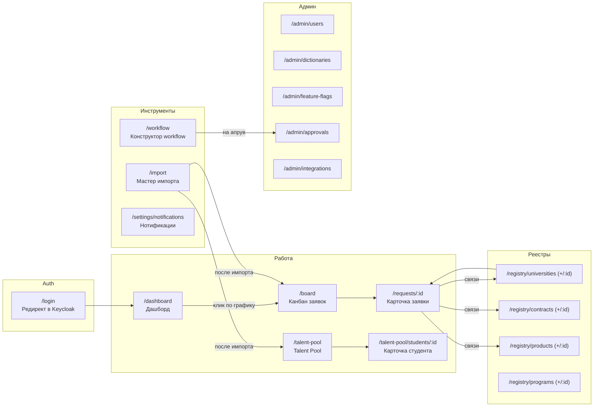
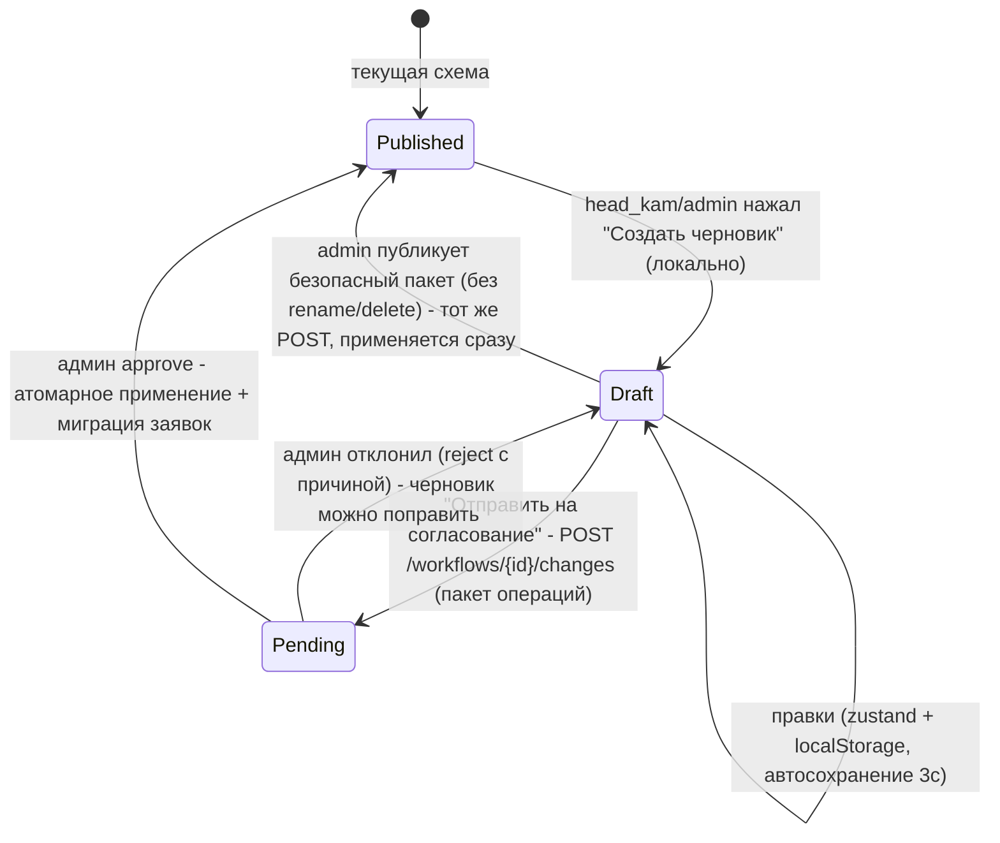
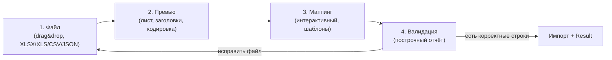
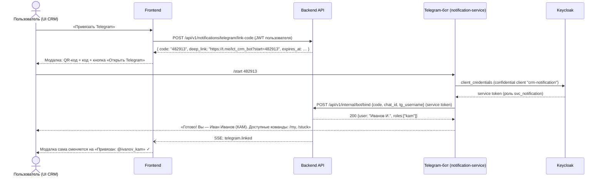

# UX-блюпринт фронтенда CRM «Вузы» — ЛЦТ 2026

> Статус: проектный документ, источник правды по UI/UX. Соответствует PLAN.md (решения кейсодержателя, раздел 2).
> Стек фронтенда зафиксирован: **React 18 + TypeScript + Vite, Ant Design 5, @xyflow/react (React Flow), Apache ECharts, keycloak-js (OIDC + PKCE)**.
> Главный критерий кейсодержателя: **«юзерфрендли и гибкость»** — брендбук и «рюшечки» вторичны (PLAN §2, «Дизайн»).

Связанные документы: `docs/design/OVERVIEW.md` (сводная архитектура), `docs/design/api-contract.md` (канон API — все пути в этом документе сверены с ним), `docs/design/data-model.md` (модель данных), `docs/design/workflow-engine.md` (движок workflow).

---

## 0. Оглавление

1. [Принципы UX и обоснование стека](#1-принципы-ux-и-обоснование-стека)
2. [Визуальный язык: тема AntD, токены, типографика](#2-визуальный-язык)
3. [Роли, карта экранов и навигация](#3-роли-карта-экранов-и-навигация)
4. [Общие паттерны: состояния, таблицы, пресеты, адаптивность](#4-общие-паттерны)
5. [Экран: вход (Keycloak)](#5-экран-входа)
6. [Экран: дашборд](#6-дашборд)
7. [Экран: канбан-доска заявок](#7-канбан-доска-заявок)
8. [Экран: карточка заявки](#8-карточка-заявки)
9. [Экраны: реестры (вузы, договоры, продукты, программы)](#9-реестры)
10. [Экран: конструктор workflow (React Flow)](#10-конструктор-workflow)
11. [Экран: мастер импорта](#11-мастер-импорта)
12. [Экран: talent pool](#12-talent-pool)
13. [Экран: настройки нотификаций + привязка Telegram](#13-настройки-нотификаций)
14. [Admin-зона](#14-admin-зона)
15. [Демо-сценарий защиты («wow-путь» за 5 минут)](#15-демо-сценарий-защиты)
16. [Трассируемость к решениям кейсодержателя](#16-трассируемость)

---

## 1. Принципы UX и обоснование стека

### 1.1 Принципы (в порядке приоритета)

1. **Ролевая честность.** Пользователь никогда не видит кнопку, которую не может нажать: интерфейс собирается из ролевой модели Keycloak (реалм `crm`), а не «прячет» запрещённое через disabled. Единственное исключение — read-only-режим observer, где данные видны, а действия скрыты (см. §3.4).
2. **Гибкость без страха.** Всё, что можно настроить (workflow, маппинг импорта, пресеты таблиц, каналы нотификаций, приоритеты программ) — настраивается интерактивно из UI, с превью и возможностью отката. Опасные действия (удаление статуса workflow) идут через «красный сценарий» с защитой от дурака и апрувом администратора.
3. **Ноль тупиков.** У каждого экрана спроектированы состояния «пусто / загрузка / ошибка», и каждое из них содержит следующий шаг (CTA): пустой канбан предлагает создать заявку или импортировать, ошибка — повторить или написать админу.
4. **Скорость восприятия.** Скелетоны вместо спиннеров на первичной загрузке, optimistic UI на действиях с мгновенной обратной связью (drag на канбане, комментарии), кэш KeyDB на бэкенде + React Query `staleTime` на фронте.
5. **Закрытый контур.** Никаких CDN, внешних шрифтов, карт-тайлов и аналитики. Все ассеты (шрифты, иконки, JS) собираются Vite в бандл и раздаются nginx из образа. Это требование 152-ФЗ/закрытого контура, отражено в сборке фронтенда.

### 1.2 Обоснование стека (для защиты)

| Выбор | Почему |
|---|---|
| React 18 + TS + Vite | React — в списке разрешённых стеков организаторов; TS даёт типобезопасные контракты с Pydantic-схемами (генерация типов из OpenAPI); Vite — быстрая сборка, статический бандл под nginx в закрытом контуре. |
| Ant Design 5 | Готовая дизайн-система энтерпрайз-класса: таблицы с фильтрами/сортировками, формы, Drawer/Modal, Steps, Transfer — ровно те паттерны, что нужны CRM. Темизация через Design Tokens (`ConfigProvider`) — «сдержанный корпоративный синий» задаётся одним объектом. Русская локаль `ru_RU` из коробки. |
| @xyflow/react (React Flow) | Стандарт де-факто для визуальных редакторов графов: кастомные узлы, drag, зум, minimap, валидация соединений — конструктор workflow (кор-функционал №1) без велосипедов. |
| Apache ECharts | Интерактивные дашборды (фильтры-легенды, тултипы, dataZoom) + **экспорт PNG встроенный** (`getDataURL`) — прямое требование «интерактивные дашборды с экспортом в растровые форматы». Работает офлайн, без внешних зависимостей. |
| keycloak-js (OIDC + PKCE) | Официальный адаптер под self-hosted Keycloak; PKCE — безопасный флоу для SPA без client secret; роли берём из access token (`realm_access.roles`). |

Библиотеки поддержки (фиксируем, чтобы код писался без вопросов): `@tanstack/react-query` (серверное состояние, кэш, ретраи), `react-router-dom` v6 (маршрутизация, guards), `dayjs` (даты, локаль ru), `zustand` (лёгкое клиентское состояние: UI-настройки, черновик конструктора). Drag&drop канбана — `@dnd-kit/core` (доступность, тач-события для планшета).

---

## 2. Визуальный язык

### 2.1 Палитра и токены AntD

Сдержанный корпоративный синий. Тёмная тема **не делается** (решение зафиксировано). Токены задаются один раз в `ConfigProvider`:

```json
{
  "token": {
    "colorPrimary": "#1E56A0",
    "colorInfo": "#1E56A0",
    "colorSuccess": "#2E9E5B",
    "colorWarning": "#D97E00",
    "colorError": "#C5372B",
    "colorTextBase": "#1F2733",
    "colorTextSecondary": "#5A6B80",
    "colorBgLayout": "#F4F6FA",
    "colorBgContainer": "#FFFFFF",
    "colorBorder": "#DDE4EE",
    "borderRadius": 8,
    "borderRadiusLG": 12,
    "fontFamily": "'Inter', 'Segoe UI', system-ui, sans-serif",
    "fontSize": 14,
    "boxShadow": "0 1px 2px rgba(16,35,61,0.06), 0 4px 12px rgba(16,35,61,0.08)",
    "boxShadowSecondary": "0 6px 20px rgba(16,35,61,0.12)"
  },
  "components": {
    "Layout": { "siderBg": "#0F2547", "headerBg": "#FFFFFF", "headerHeight": 56 },
    "Menu": { "darkItemBg": "#0F2547", "darkItemSelectedBg": "#1E56A0" },
    "Table": { "headerBg": "#F4F6FA", "rowHoverBg": "#EEF3FB" },
    "Card": { "paddingLG": 20 }
  }
}
```

Производные оттенки primary (hover `#2E68B8`, active `#174682`, светлый фон выделения `#EEF3FB`) AntD генерирует сам из `colorPrimary`.

**Семантические цвета статусов** (единые по всему приложению — канбан, теги, таймлайн, дашборд):

| Смысл | Цвет | Где |
|---|---|---|
| Начальный этап / draft | `#5A6B80` (серый) | тег «Новая», draft workflow |
| В работе | `#1E56A0` (primary) | активные этапы |
| Успех / завершено | `#2E9E5B` | «Договор подписан», импорт ок |
| Ожидание / зависшая заявка | `#D97E00` | бейдж «🔥 N дней без движения» |
| Отклонено / ошибка / красный сценарий | `#C5372B` | возвраты, удаление статуса |
| Talent pool | `#7A4FBF` (фиолетовый акцент) | воронка студентов |

Цвет этапа workflow задаётся в конструкторе (панель свойств, пресет из 8 цветов) и хранится в конфиге этапа — канбан и дашборд раскрашиваются из одного источника.

### 2.2 Типографика и сетка

- Шрифт **Inter** (self-hosted, woff2 в бандле; лицензия OFL — безопасно для закрытого контура). Фолбэк — системный.
- Размеры: H1 экрана 20/28 semibold, H2 секции 16/24 semibold, тело 14/22, вторичный текст 12/20, цифры KPI на дашборде 28/36 semibold tabular-nums.
- Сетка: `Layout` AntD — сайдбар 240px (свёрнутый 64px), контент `max-width: 1440px`, отступ контента 24px (16px на планшете), карточки на 8px-сетке.
- Тени только двух уровней (`boxShadow` для карточек, `boxShadowSecondary` для поповеров/drag-превью). Никаких градиентов, кроме заливки area-графиков.
- Иконки — `@ant-design/icons` (в бандле). Эмодзи в UI не используем (только в сообщениях Telegram-бота).

### 2.3 Микро-анимации

- Переходы drag&drop на канбане и в конструкторе — 150ms ease-out; появление Drawer/Modal — стандарт AntD.
- Число на KPI-карточке дашборда анимируется count-up при первой загрузке (это дёшево и «дорого выглядит» на защите).
- `prefers-reduced-motion` отключает count-up и transition канбана.

---

## 3. Роли, карта экранов и навигация

### 3.1 Роли (реалм `crm` в Keycloak)

| Роль | Кто это | Сводно |
|---|---|---|
| `admin` | Администратор системы | Всё: admin-зона, апрув изменений workflow, справочники, фичефлаги, пользователи, интеграции |
| `head_kam` | Руководитель КАМов | Все данные всех КАМов, редактирование workflow (черновики → на апрув), дашборды по команде, talent pool, назначение ответственных |
| `kam` | Key Account Manager | Свои вузы/заявки (+ чужие read-only), ведение заявок по workflow, импорт, talent pool, свои нотификации |
| `observer` | Наблюдатель (эксперт, аудитор) | Только чтение: дашборды, канбан, реестры, карточки; ПДн студентов — только маскированные; экспорт разрешён |

Preseeded-пользователи (`admin@demo`, `head@demo`, `kam1@demo`, `kam2@demo`, `observer@demo`) импортируются в Keycloak из JSON реалма и публикуются в README — требование кейсодержателя о проверке ролей.

### 3.2 Карта экранов и маршруты



Полная таблица маршрутов:

| Маршрут | Экран | admin | head_kam | kam | observer |
|---|---|:-:|:-:|:-:|:-:|
| `/dashboard` | Дашборд | ✔ | ✔ | ✔ (свой скоуп по умолчанию) | ✔ (read-only фильтры доступны) |
| `/board` | Канбан заявок | ✔ | ✔ | ✔ (drag только своих) | 👁 (без drag) |
| `/requests/:id` | Карточка заявки | ✔ | ✔ | ✔ (редактирование своих) | 👁 |
| `/registry/universities`(`/:id`) | Вузы | ✔ | ✔ | ✔ | 👁 |
| `/registry/contracts`(`/:id`) | Договоры | ✔ | ✔ | ✔ | 👁 |
| `/registry/products`(`/:id`) | Продукты | ✔ | ✔ | ✔ | 👁 |
| `/registry/programs`(`/:id`) | Программы (+приоритеты) | ✔ | ✔ | ✔ (менять приоритет — да) | 👁 |
| `/workflow` | Конструктор workflow | ✔ (правка+публикация) | ✔ (правка → на апрув) | 👁 (просмотр схемы) | 👁 |
| `/import` | Мастер импорта | ✔ | ✔ | ✔ | ✖ (пункт меню скрыт) |
| `/talent-pool`(`+/:id`) | Talent pool | ✔ | ✔ | ✔ | 👁 (ПДн всегда маскированы) |
| `/settings/notifications` | Нотификации | ✔ | ✔ | ✔ | ✔ (только привязка TG и личные каналы) |
| `/admin/*` | Admin-зона | ✔ | ✖ | ✖ | ✖ |

Легенда: ✔ — полный доступ, 👁 — read-only, ✖ — скрыт из меню и защищён guard'ом (редирект на `/403`).

### 3.3 Каркас приложения

- **Сайдбар слева** (тёмно-синий `#0F2547`): логотип, пункты меню по ролям (см. таблицу), внизу — сворачивание. Меню генерируется из единого конфига `menuConfig: Array<{path, icon, label, roles[]}>` — одна точка правды для навигации и guard'ов.
- **Хедер**: хлебные крошки (`Breadcrumb`), глобальный поиск (`Cmd+K`, ищет по вузам/заявкам/студентам через `/api/v1/search?q=`), колокольчик нотификаций (поповер с последними 10 событиями, счётчик непрочитанных), аватар с именем, ролью (тег) и пунктами «Настройки нотификаций», «Выйти».
- **Контент**: `PageHeader`-паттерн — заголовок H1 + действия справа (primary-кнопка экрана) + фильтры под заголовком.
- Наблюдателю (`observer`) в хедере показывается постоянный тег «Режим просмотра» — чтобы на защите ролевое ограничение читалось мгновенно.

### 3.4 Реализация RBAC на фронте

- Guard маршрутов: `<RequireRole roles={[...]}>` поверх `react-router`; роли — из `keycloak.tokenParsed.realm_access.roles`.
- Компонент `<Can roles={[...]} fallback={null}>` для точечных элементов (кнопка «Опубликовать», drag-handle).
- Фронтовый RBAC — только UX-слой; сервер дублирует все проверки (401/403 API → глобальный интерсептор → экран `/403` или toast). На `401` — тихий `keycloak.updateToken()`, при неудаче — редирект на логин.

---

## 4. Общие паттерны

### 4.1 Состояния экрана (обязательны для каждого экрана)

| Состояние | Паттерн | Пример |
|---|---|---|
| Загрузка (первая) | Скелетон, повторяющий каркас экрана (`Skeleton` на карточках KPI, строках таблиц, колонках канбана). Не спиннер. | Канбан: 4 серые колонки с 3 карточками-скелетонами |
| Загрузка (обновление) | Данные остаются, тонкий progress сверху таблицы/`isFetching`-индикатор; никаких «миганий» | Смена фильтра дашборда |
| Пусто | `Empty` AntD + человеческий текст + CTA следующего шага | «Заявок пока нет. Создайте первую или импортируйте из Excel» → 2 кнопки |
| Пусто из-за фильтров | Отдельный текст «Ничего не найдено по текущим фильтрам» + кнопка «Сбросить фильтры» | Реестры |
| Ошибка загрузки | `Result status="error"` + текст без стектрейса + «Повторить»; requestId для обращения к админу | Любой экран |
| Ошибка действия | `message.error` (toast, 5с) с конкретикой из `detail` ответа API; форма подсвечивает поля из 422 | Сохранение карточки |
| 403 / 404 | Полноэкранные `Result` с кнопкой «На дашборд» | Прямой URL не по роли |
| Offline/API down | Глобальный баннер «Нет связи с сервером, повторяем...» (react-query авторетрай) | Демо-подстраховка |

### 4.2 Единый шаблон таблиц (реестры, talent pool, admin)

Все таблицы — `Table` AntD с общим компонентом-обёрткой `RegistryTable`:

- Серверная пагинация (20/50/100), сортировка и фильтры — параметры уходят в API (`?page=&sort=&filters=`).
- Панель над таблицей: поиск по тексту, быстрые фильтры (селекты/даты), справа — «Колонки» (чекбокс-меню видимости), «Экспорт» (XLSX/CSV, уважает текущие фильтры), «Пресеты».
- **Сохранённые пресеты** — требование гибкости. Пресет = именованный снапшот состояния таблицы, хранится на сервере per-user (`/api/v1/ui/presets`), чтобы переживал смену браузера:

```json
{
  "id": "b9c1...",
  "owner": "kam1@demo",
  "screen": "registry.universities",
  "name": "Мои вузы ЦФО",
  "is_default": true,
  "state": {
    "filters": { "region": ["ЦФО"], "kam_id": ["me"] },
    "sort": { "field": "updated_at", "order": "desc" },
    "columns": ["name", "region", "contracts_count", "active_requests", "kam"],
    "page_size": 50
  }
}
```

UI пресетов: селект слева от фильтров + «Сохранить как пресет…» (модалка с именем и чекбоксом «по умолчанию»), пункт «Управлять…» (переименовать/удалить). Пресеты одного экрана независимы у разных пользователей.

### 4.3 Адаптивность (до планшета)

Мобильная версия не нужна (решение кейсодержателя), но адаптив до планшета обязателен:

| Breakpoint | Ширина | Поведение |
|---|---|---|
| Desktop | ≥1200px | Полный layout |
| Laptop | 992–1199px | Сайдбар сворачивается в иконки по умолчанию; дашборд 2 графика в ряд → 1–2 |
| Tablet | 768–991px | Сайдбар — иконки + Drawer по бургеру; канбан — горизонтальный скролл колонок (колонка фикс. 300px) со scroll-snap; таблицы прячут вторичные колонки (конфиг `responsive: ['lg']` у колонок); карточка заявки — табы вместо двухколоночного layout; конструктор workflow — read-only-предупреждение «Редактируйте на десктопе» (просмотр графа работает, тач-пан/зум включён) |

Drag&drop канбана работает на таче (`@dnd-kit` + `TouchSensor`, long-press 250ms) — можно показать с планшета на защите.

### 4.4 Форматы и локаль

- Локаль AntD `ru_RU`, dayjs `ru`. Даты: `16 сен 2026`, с временем — `16 сен 2026, 14:05`. Относительное время в таймлайнах/комментариях: «5 мин назад» (до 24 ч), далее дата.
- Деньги: `1 250 000 ₽` (неразрывные пробелы-разряды). Пустые значения — «—», не «null».
- Все тексты интерфейса — по-русски; словарь терминов един: «заявка» (не «сделка»), «этап» (не «статус» в UI, хотя в API — `status`), «вуз», «КАМ».

---

## 5. Экран входа

**Маршрут:** `/login` (и корень `/` для неаутентифицированных).
**Роли:** все.

Состав: центрированная карточка (логотип, название «CRM Вузы», кнопка «Войти через Keycloak» — primary, на всю ширину карточки), под ней мелкий текст «Единый вход организации». Клик → `keycloak.login()` (redirect на self-hosted Keycloak, тема логина Keycloak перекрашена в ту же палитру). После логина — redirect на исходный deep-link (сохранённый `redirect_uri`) или `/dashboard`.

Состояния: «загрузка» — полноэкранный сплеш с логотипом на время `keycloak.init({onLoad:'check-sso', pkceMethod:'S256'})`; «ошибка» — карточка «Сервис авторизации недоступен» + «Повторить». Разлогин по истечении refresh — модалка «Сессия истекла» → кнопка входа (не молчаливый редирект, чтобы не потерять несохранённый черновик конструктора — черновик дополнительно бэкапится в `localStorage`).

---

## 6. Дашборд

**Маршрут:** `/dashboard`. **Роли:** все (kam — по умолчанию свой скоуп, переключатель «Все» доступен read-only; observer — read-only, экспорт доступен).
**Требование:** интерактивные дашборды (фильтры, теги) с экспортом в растровые/файловые форматы — «плюс» по PLAN, делаем как витрину защиты.

### 6.1 Состав

Сверху — **панель фильтров**, общая для всех виджетов (изменение фильтра перерисовывает всё):

- Период (`RangePicker` + быстрые пресеты «Месяц/Квартал/Год»),
- Тип workflow: `B2B | B2C | Все` (Segmented),
- КАМ (мультиселект; для kam предвыбран он сам),
- Вуз, Продукт (мультиселекты с поиском),
- Кнопки справа: «Сбросить», «Экспорт ▾» (пункты: «PNG всего дашборда», «XLSX данные», «PDF отчёт»).

Ниже — сетка виджетов (`Row/Col` AntD, 24-колоночная):

| # | Виджет | Тип ECharts | Интерактив |
|---|---|---|---|
| 1 | KPI-строка: «Заявок активных», «Завершено за период», «Конверсия», «🔥 Зависших» | 4 карточки-числа (count-up), дельта к прошлому периоду стрелкой | клик по «Зависших» → канбан с фильтром `stuck=true` |
| 2 | Воронка по этапам workflow | `funnel` (цвета этапов — из конфига workflow) | клик по этапу → канбан, отфильтрованный по этапу |
| 3 | Динамика заявок | `line` (создано/завершено по неделям), area-заливка | dataZoom-слайдер, тултип-кроссхэр |
| 4 | Нагрузка по КАМам | горизонтальный stacked `bar` (заявки по этапам на каждого КАМа) | клик по КАМу → фильтр дашборда по нему |
| 5 | Топ программ по востребованности | `bar` с сортировкой, тег «приоритет» из ручного ранжирования | тумблер «по заявкам / по приоритету» |
| 6 | Talent pool: воронка студентов | `funnel` (кандидат → обучается → выпускник → talent pool), фиолетовая гамма | клик → `/talent-pool` с фильтром |

Клик по любому сегменту — **drill-down** в соответствующий экран с проставленными фильтрами (URL-параметры, см. §7.3) — это «интерактивность», которую жюри щупает руками.

### 6.2 Экспорт

- **PNG виджета**: иконка камеры в правом верхнем углу каждого графика (ECharts toolbox `saveAsImage`, pixelRatio 2, белый фон).
- **PNG всего дашборда**: кнопка в панели фильтров — `html2canvas`-подобный снимок не используем (тяжело, шрифты); вместо этого бэкенд-роут `/api/v1/reports/dashboard.png` не делаем тоже. Реализация: собираем композит из `getDataURL()` каждого инстанса ECharts на canvas + подпись «CRM Вузы · период · фильтры» → скачивание одним PNG. Только клиент, работает офлайн.
- **XLSX**: `POST /api/v1/export/jobs {entity_type: "report:dashboard", format: "xlsx", filters: …текущие фильтры}` — файл с листами по виджетам (данные, не картинки).
- **PDF отчёт**: тот же механизм с `format: "pdf"` (weasyprint на бэке). **Вне MVP**: фичефлаг `report_pdf` выключен по умолчанию, пункт меню скрыт; требование «растровые/файловые форматы» закрывают PNG (клиент) + XLSX/CSV (сервер).

### 6.3 Состояния

- Загрузка: KPI — 4 скелетон-карточки; графики — серые панели с центрированным `Skeleton.Node`.
- Пусто (нет данных за период): внутри виджета `Empty` «Нет данных за выбранный период» + кнопка «Весь период».
- Ошибка одного виджета не роняет дашборд: у каждого виджета свой error-boundary с «Повторить».
- Данные дашборда — один агрегирующий запрос `/api/v1/reports/dashboard?filters...` (bекенд кэширует в KeyDB 60с) — фильтры применяются < 1с.

---

## 7. Канбан-доска заявок

**Маршрут:** `/board`. **Роли:** admin/head_kam — drag всех заявок; kam — drag только своих (чужие карточки видны, drag-handle отсутствует, тултип «Заявка КАМа Иванова»); observer — просмотр.
**Требования:** доска по этапам workflow, drag&drop переходов **включая возвраты**, два workflow B2B/B2C.

### 7.1 Состав

- Под заголовком — переключатель **`B2B (вузы) | B2C (физлица и юрлица)`** (Segmented, состояние в URL `?wf=b2b`). Доска всегда показывает **актуальную опубликованную** схему соответствующего workflow (един для всех, версий нет).
- Панель фильтров: поиск, КАМ, вуз, продукт, чекбокс «Только зависшие 🔥», пресеты (как в §4.2, `screen: "board"`).
- **Колонки = этапы workflow** в порядке из конфига схемы; заголовок колонки: цветной маркер этапа, имя, счётчик заявок, сумма (если у этапа включён показ суммы). Ветвления схемы на доске «сплющиваются» в линейный порядок колонок (порядок задаётся в конструкторе полем `board_order`); сама логика допустимых переходов — по графу, не по соседству колонок.
- Терминальные этапы («Завершено», «Отказ») по умолчанию свёрнуты в узкие колонки-«стопки» (ширина 48px, вертикальная надпись, счётчик), разворачиваются кликом — доска не захламляется.
- **Карточка заявки на доске**: название вуза/контрагента (bold), продукт (тег), ответственный КАМ (аватар-инициалы), N дней на этапе; бейдж «🔥 N дн.» оранжевый, если превышен порог зависания (порог — из настроек нотификаций); иконка 🔗, если есть несинхронизированные изменения LMS/CMS (см. §14.5). Клик → карточка заявки (Drawer поверх доски, см. §8 — доска не теряет скролл-позицию).

### 7.2 Drag&drop и правила переходов

- Библиотека `@dnd-kit`. При захвате карточки:
  - колонки, в которые переход **разрешён графом workflow** (включая **возвраты назад** — «бюрократия»), подсвечиваются рамкой primary;
  - запрещённые колонки затемняются (opacity 0.5); дроп в них отбивается анимацией возврата + toast «Переход "Согласование" → "Договор подписан" не предусмотрен схемой. Разрешены: …».
- Дроп в разрешённую колонку:
  - если у перехода в схеме `requires_comment: true` (типично для возвратов) — модалка «Причина возврата» (textarea, обязательное) → подтверждение;
  - optimistic: карточка сразу встаёт в колонку, отправляется `POST /api/v1/requests/{id}/transitions {to_status_id, comment, version}`; при 409/400 карточка анимированно возвращается + toast с причиной от сервера (например, права или смена схемы).
- Возврат назад дополнительно маркируется в таймлайне карточки красной стрелкой «↩ Возврат» (см. §8).
- После смены схемы workflow админом открытая доска получает событие (SSE `/api/v1/events/stream`, топик `workflow.changed`) → тихий рефетч колонок + баннер «Схема процесса обновлена администратором» — «работа не встаёт».

### 7.3 URL-контракт фильтров (для drill-down с дашборда)

`/board?wf=b2b&status=negotiation&kam=uuid&stuck=true&university=uuid` — все фильтры сериализуются в query, ссылку можно переслать коллеге.

### 7.4 Состояния

- Загрузка: колонки-скелетоны по актуальной схеме (схема грузится первой и кэшируется).
- Пусто: колонки на месте, в первой — `Empty` «Заявок нет» + кнопки «Создать заявку» (Drawer-форма: контрагент, продукт, ответственный; создаётся в начальном этапе схемы) и «Импортировать».
- Ошибка перехода — см. выше (optimistic rollback). Ошибка загрузки — `Result` c «Повторить».
- Конфликт: заявку одновременно перетащили двое — второй получает 409 → rollback + toast «Заявку уже перевёл Иванов И. на этап "Договор"».

---

## 8. Карточка заявки

**Маршрут:** `/requests/:id` (полная страница) и Drawer 720px поверх канбана (тот же компонент; в Drawer есть кнопка «Открыть отдельно»).
**Роли:** admin/head_kam — всё; kam — редактирование своих, чужие read-only; observer — read-only.

### 8.1 Состав

**Шапка:** контрагент (вуз или физ/юрлицо B2C) — ссылкой в реестр, продукт, тег текущего этапа (цвет этапа), ответственный (смена — только head_kam/admin, `Select` с поиском), даты создания/обновления, бейдж «🔥 зависла», кнопка «Перевести на этап ▾» (дублирует канбан для тех, кто в карточке; выпадашка показывает только разрешённые переходы, возвраты — в подсекции «↩ Возврат на…»).

**Тело — две колонки (на планшете — табы):**

Левая (основная), табы:
1. **Таймлайн** (`Timeline` AntD) — история: переходы этапов (кто, когда, откуда→куда, возвраты красным «↩»), смена ответственного, прикрепление файлов, события интеграций («Отправлено в LMS», «Получен статус из CMS» — с иконкой обмена и ссылкой «показать JSON» для демо двусторонности), эскалации нотификаций («Уведомление руководителю: заявка зависла»). Фильтр-чипы над таймлайном: «Все / Этапы / Файлы / Интеграции / Комментарии».
2. **Комментарии** — встроенный мессенджер (PLAN: «в идеале да»): лента сообщений (аватар, имя, роль-тег, время), ввод снизу (`Mentions` AntD — @упоминание подставляет имя пользователя в текст; адресная нотификация упомянутому — roadmap, уведомления идут по правилам события `request.comment_added`), прикрепление файла к сообщению. Не редактируются; удаление — автор или admin, мягкое (текст заменяется на «(удалено)», аудит-след сохраняется). Realtime — тот же SSE-канал (топик `request.comment_added`, в data — `request_id`); фолбэк — поллинг 15с.
3. **Файлы** — список из MinIO: имя, размер, кто и когда загрузил, тип (договор/протокол/прочее). Загрузка — `Upload.Dragger` (drag&drop, до 50 МБ, whitelist расширений pdf/docx/xlsx/png/jpg — безопасность закрытого контура). Скачивание — `GET /api/v1/files/{id}/download` (режим proxy по умолчанию; presigned URL TTL 10 мин; сам MinIO наружу не торчит). Превью PDF/изображений — модалка.

Правая (сайдбар-карточки):
- **Связи**: вуз (карточка-мини: название, регион, КАМ) → `/registry/universities/:id`; договор (номер, срок, статус; «как правило один» — списком, если больше) → `/registry/contracts/:id`; продукты (теги, кликабельны). Кнопка «Привязать договор/продукт» (модалка-селект) — для kam-владельца и выше.
- **Атрибуты**: произвольные поля этапа (сумма, ожидаемая дата подписания, примечание) — инлайн-редактирование (клик → input → blur сохраняет, optimistic).
- **Интеграции**: статус синка LMS/CMS (значки: ✓ синхронизировано / ⟳ в очереди / ⚠ ошибка + «Повторить» для admin).

### 8.2 Состояния

- Загрузка: скелетон шапки + таймлайна. Ошибка 404 — `Result` «Заявка не найдена или удалена» → «К доске». 403 — «Нет доступа» (не должен случаться из UI: чужие заявки kam видит read-only, скрываются только действия).
- Пустой таймлайн невозможен (создание — всегда первое событие). Пустые комментарии: «Обсуждения пока нет — напишите первым». Пустые файлы: `Dragger` с текстом «Перетащите файлы сюда».
- Отправка комментария — optimistic (серый до подтверждения), ошибка — пометка «не отправлено, повторить».

---

## 9. Реестры

**Маршруты:** `/registry/{universities|contracts|products|programs}` + карточки `/:id`.
**Роли:** admin/head_kam/kam — создание/редактирование (kam — в своём скоупе), observer — просмотр.
Все — на общем `RegistryTable` (§4.2: фильтры, сортировки, пресеты, экспорт, колонки). Ниже — состав колонок и особенности.

### 9.1 Вузы (`/registry/universities`)

Колонки: Название (ссылка), Регион, ИНН/КПП, Ответственный КАМ, Кол-во договоров, Активные заявки (бейдж), Обновлён. Фильтры: регион, КАМ, «есть активный договор».
Карточка вуза (страница, 2 колонки): реквизиты и контактные лица (таблица-инлайн: ФИО, должность, email, телефон); справа — договоры вуза, активные заявки (мини-канбан-список по этапам), продукты, студенты вуза (счётчик → talent pool с фильтром). Правило кейсодержателя «один вуз — обычно один договор, продуктов несколько, параллельных взаимодействий ≤2» отражено UX-ом: договор в карточке — акцентная одиночная карточка (список раскрывается, только если их >1), продукты — теги, заявки — плоский список без группировок (не переусложняем).
Кнопка «Создать вуз» — Drawer-форма (название, регион, ИНН, КАМ). Дубликаты по ИНН — предупреждение инлайн.

### 9.2 Договоры (`/registry/contracts`)

Колонки: Номер (ссылка), Вуз/Контрагент, Статус (черновик/переговоры/действует/завершён/расторгнут — теги), Дата начала/окончания, Сумма, Продукты (теги), Файл (иконка-скачивание из MinIO). Фильтры: статус, вуз, период действия; строка подсвечивается жёлтым, если истекает < 30 дней (и это же событие идёт в нотификации).
Карточка: реквизиты, файлы версий договора (MinIO), связанные заявки и продукты.

### 9.3 Продукты (`/registry/products`)

Колонки: Название, Тип (ДПО/базовая кафедра/стажировка/…), Активен (switch — admin/head_kam), Вузов подключено, Заявок. Карточка: описание, привязанные программы, вузы.

### 9.4 Программы (`/registry/programs`) — с ручным ранжированием

Требование кейсодержателя: «ранжирование программ по востребованности: ручное изменение приоритетов КАМами/админами; автоформула — бонус».

- Колонки: **Приоритет** (первая колонка: число + ручки ▲▼ и drag-handle строки), Название, Продукт, Вузов, Заявок за период, «Расчётный спрос» (если включён фичефлаг `auto_ranking` — серым, справочно).
- Режим сортировки по умолчанию — по приоритету (`priority_rank`, **меньше = выше**); drag строки или ▲▼ меняет приоритет (`PATCH /api/v1/programs/{id}/priority {priority_rank, version}`, массово — `POST /api/v1/programs/priorities/reorder`) — доступно kam/head_kam/admin, optimistic, событие в аудит.
- Тумблер над таблицей «Ручной приоритет / По заявкам» — второй режим просто сортирует по метрике (read-only, это и есть «упрощённая автоформула» как бонус).

### 9.5 Состояния реестров

Единые по §4.1. Пустой реестр — `Empty` + «Создать» + «Импортировать из Excel» (ведёт в мастер импорта с предвыбранной целевой сущностью). Ошибки валидации форм — под полями (из 422 Pydantic, маппинг `loc→field`).

---

## 10. Конструктор workflow

**Маршрут:** `/workflow`. **Роли:** admin (правка + публикация + апрув), head_kam (правка → отправка на апрув), kam/observer (просмотр схемы read-only — полезно для онбординга).
**Требования (кор №1):** два workflow B2B/B2C (B2C — расширяемый), ветвления, возвраты, изменения «на лету» с миграцией заявок, переименование/удаление статуса только через апрув админа, при удалении — перенос заявок на соседний (лучше предыдущий) этап.

### 10.1 Layout

Три зоны:
- **Слева-сверху**: переключатель `B2B | B2C`, статус схемы (тег: «Опубликована», «Черновик (ваш)», «На согласовании»), кнопки «Создать черновик» / «Отправить на согласование» / «Опубликовать» (admin) / «Отменить черновик».
- **Центр**: канва React Flow — узлы-этапы, рёбра-переходы; пан/зум, minimap (правый нижний угол), кнопки zoom-to-fit; сетка точками. Панель инструментов слева на канве: «+ Этап» (или drag с палитры), «Автораскладка» (dagre, слева направо).
- **Справа**: **панель свойств** выбранного узла/ребра (см. 10.3). Ничего не выбрано — сводка схемы: этапов N, переходов M, заявок в работе по этапам (мини-таблица), ошибки валидации схемы списком (клик → фокус на узле).

### 10.2 Узлы и рёбра

Кастомный узел React Flow «Этап»:
- скруглённая карточка 200×72: цветная полоса слева (цвет этапа), имя, снизу — счётчик «заявок сейчас: N» (живые данные — важно для красного сценария), иконки-маркеры: 🏁 начальный, 🎯 терминальный, 💬 «переход требует комментария».
- Хэндлы: вход слева, выход справа (для возвратов ребро рисуется дугой снизу, красноватого цвета `#C5372B` с меткой «возврат»).

Ребро-переход: стрелка; лейбл — название действия («Согласовать», «Вернуть на доработку»); стиль: обычный переход — сплошной primary, возврат (`is_return: true`) — красный пунктир. Создание — протяжкой от хэндла к хэндлу; валидация при соединении: нельзя дублировать ребро, нельзя в сам себя; циклы **разрешены** (возвраты — легитимны), но валидатор проверяет достижимость терминала.

Правила валидации схемы (панель ошибок, блокируют отправку на апрув): ровно один начальный этап; ≥1 терминальный; все этапы достижимы из начального; из каждого этапа достижим терминальный; имена уникальны; у B2C — разрешено добавлять новые «варианты взаимодействия» = просто новые ветви/этапы (никаких спец-ограничений).

### 10.3 Панель свойств этапа

Поля: Имя (⚠ переименование опубликованного этапа помечает изменение как требующее апрува — бейдж «требует согласования» на узле), Цвет (пресет 8 цветов), Ответственная роль по умолчанию (kam/head_kam), Порог зависания, дней (перекрывает глобальный, пусто = глобальный), Чекбоксы: «Начальный», «Терминальный», «Показывать сумму на доске», Порядок колонки на доске (`board_order`, число). Для ребра: название действия, `is_return`, `requires_comment`.

### 10.4 Жизненный цикл изменений: черновик → пакет операций → апрув



- **Черновик — клиентский** (zustand + localStorage, F5 не теряет; на сервер не пишется). У канвы в режиме черновика — жёлтая рамка и водяной заголовок «ЧЕРНОВИК». При отправке конструктор вычисляет **пакет операций** (`add_status`, `rename_status`, `delete_status`, `add/update/delete_transition`) относительно опубликованной схемы; если у workflow уже есть pending-пакет — баннер «Пакет Петрова ждёт согласования» (данные из `GET /api/v1/workflows/{id}/changes?status=pending`), отправка второго блокируется до решения.
- **Impact-preview**: перед отправкой конструктор зовёт `POST /api/v1/workflows/{id}/impact-preview` с теми же операциями и показывает модалку-сводку диффа («Добавлен этап X; Переименован Y→Y′; Удалён Z — **4 заявки будут перенесены**») + комментарий для админа.
- **Отправка**: `POST /api/v1/workflows/{id}/changes {comment, operations}`. Безопасный пакет от admin применяется сразу; пакет с опасной операцией (rename/delete статуса) целиком уходит в `pending` — даже от admin («защита от дурака», двухшаговость). Админ получает нотификацию (колокольчик + TG).
- **Апрув (admin)** — в `/admin/approvals` или из конструктора: `POST /api/v1/workflows/changes/{change_id}/approve` → сервер атомарно применяет схему и переносит заявки; все открытые доски получают SSE `workflow.changed`. `.../reject {reason}` возвращает автору. Версий нет — новая схема сразу для всех (решение кейсодержателя).
- Ввод имени этапа для опасных операций (см. 10.5) уходит в операцию полем `confirm_name` и сверяется на бэке посимвольно.

### 10.5 Красный сценарий: удаление этапа

1. Выделен узел → кнопка «Удалить этап» в панели свойств — **красная, второстепенная по размеру**. На узле с заявками — сразу предупреждающий бейдж «в этапе 4 заявки».
2. Модалка «защиты от дурака» (danger):
   - заголовок: «Удаление этапа "Согласование договора"»;
   - блок фактов: «Сейчас в этапе **4 заявки**. Входящих переходов: 2, исходящих: 3 — они будут удалены вместе с этапом»;
   - **выбор, куда мигрируют заявки**: radio-список **соседних** (связанных ребром) нетерминальных этапов, **по умолчанию выбран предыдущий** (решение кейсодержателя «лучше предыдущий»); рядом с каждым вариантом — направление («← предыдущий», «→ следующий»);
   - подтверждение вводом: поле «Введите название этапа для подтверждения» (точное совпадение активирует кнопку; значение уходит в операцию как `confirm_name`);
   - кнопка `danger` «Удалить и отправить на согласование» (опасный пакет всегда уходит в pending, даже от admin — админ подтверждает вторым шагом approve).
3. В черновике удалённый узел остаётся на канве призраком (штриховка, серый, зачёркнутое имя) до отправки — можно передумать (кнопка «Восстановить»). Approve показывает финальную сводку миграции ещё раз.
4. В таймлайнах перенесённых заявок появляется событие «Статус "Согласование договора" удалён администратором, заявка перенесена в "Переговоры"».

Payload отправки (канонический контракт — api-contract.md §5.3):

```json
POST /api/v1/workflows/wf-b2b/changes
{
  "comment": "Убрали лишний шаг согласования по решению руководства",
  "operations": [
    { "op": "delete_status",
      "status_id": "st-contract-approval",
      "confirm_name": "Согласование договора",
      "migrate_to_status_id": "st-negotiation" }
  ]
}
```

### 10.6 Состояния

Загрузка — скелетон-канва (серые прямоугольники). Обе схемы всегда существуют (seed), поэтому «пустого» состояния нет; после отката всех правок — кнопка «Отменить черновик». Ошибка сохранения черновика — тост + значок «не сохранено» у заголовка, ретрай; черновик не теряется (localStorage-бэкап). Конфликт применения (за время ревью схема/заявки изменились) — сервер возвращает 409 со свежими счётчиками → модалка миграции перерисовывается: «Данные обновились, проверьте ещё раз».

---

## 11. Мастер импорта

**Маршрут:** `/import` (и вызов с предвыбранной целью из реестров/talent pool). **Роли:** admin, head_kam, kam. Observer — скрыт.
**Требования:** XLSX и **XLS** (старый Excel), JSON; устойчивость к битым кодировкам; **интерактивный диалоговый маппинг**; отчёт об ошибках построчно.

`Steps` AntD, 4 шага. Состояние мастера живёт на сервере (сессия импорта `import_session_id`) — F5 не убивает прогресс.

### 11.1 Шаг 1 — Файл

- `Upload.Dragger` на весь экран: «Перетащите файл XLSX, XLS, CSV или JSON» (лимит 20 МБ). Ниже — селект «Что импортируем»: Вузы / Договоры / Заявки / Студенты (talent pool) / Программы (предзаполнен при вызове из реестра).
- После загрузки `POST /api/v1/import/sessions` парсит файл на сервере и возвращает превью. Прогресс-бар на время парсинга.
- Ошибки шага: не тот формат («Поддерживаются .xlsx, .xls, .csv, .json»), файл пуст, файл битый — карточка ошибки с человеческим текстом + «Загрузить другой».

### 11.2 Шаг 2 — Превью и кодировка

- Таблица-превью первых 20 строк «как распарсили». Сверху: селект «Лист» (для многостраничного Excel), «Первая строка — заголовки» (checkbox, по умолчанию on), для CSV — селект **кодировки** (авто-детект charset-normalizer; варианты UTF-8 / Windows-1251 / KOI8-R / CP866) — при смене превью мгновенно перерисовывается. Если детектор не уверен (кракозябры) — жёлтый alert «Похоже, кодировка определена неверно — выберите вручную» (эвристика: доля не-кириллических символов в текстовых колонках).
- Это прямой ответ на «устойчивость к битым кодировкам» — и эффектная демонстрация: грузим CP1251-файл — кодировка определилась сама; переключаем селект на KOI8-R — кракозябры, возвращаем CP1251 — текст «чинится» одним селектом.

### 11.3 Шаг 3 — Маппинг колонок (интерактивный)

- Двухпанельный маппер, по строке на **целевое поле** сущности: слева — поле CRM (имя, обязательность звёздочкой, тип), по центру — `Select` с колонками файла (с примером значения из первой строки прямо в опции), справа — живой пример «как ляжет».
- **Автопредложение**: сервер предлагает маппинг по похожести заголовков (`"Наименование ВУЗа" → university.name`, fuzzy + словарь синонимов); авто-смапленные строки помечены «авто», их можно перекинуть.
- Несмапленные колонки файла лежат внизу в секции «Не используются» — прозрачность, ничего не потеряли молча.
- Для полей-справочников (регион, продукт, этап) — третий селект «правило»: «искать по названию / создавать отсутствующие / ошибка, если нет». Для студентов — обязательные ФИО и email подсвечены, рядом бейдж «ПДн: будет зашифровано» (шифрование на бэкенде, UX только сообщает).
- Кнопка «Сохранить шаблон маппинга» — именованные шаблоны per-user+сущность (повторные импорты в один клик: селект «Шаблон» сверху шага).
- «Далее» активна, когда смаплены все обязательные поля; иначе — подпись «Не смаплено: Название, ИНН».

Контракт маппинга:

```json
PUT /api/v1/import/sessions/{id}/mapping
{
  "mapping": [
    { "source_column": 0, "target_field": "name" },
    { "source_column": 1, "target_field": "inn" },
    { "source_column": 2, "target_field": "region", "lookup": "match_or_create" }
  ],
  "options": {
    "sheet": 0, "header_row": 0, "encoding": "cp1251",
    "update_strategy": "upsert", "match_by": ["inn"], "skip_empty_rows": true
  }
}
```

(канонический контракт — api-contract.md §6.3; «Сохранить шаблон маппинга» хранит этот же JSON
через `/api/v1/ui/presets` со `screen: "import:universities"`)

### 11.4 Шаг 4 — Валидация и отчёт построчно

- `POST .../validate` — прогон без записи. Результат-сводка: карточки «Всего строк 120 / ✓ пройдут 112 / ⚠ с предупреждениями 5 / ✕ с ошибками 3».
- **Таблица ошибок построчно**: № строки файла, колонка, значение, проблема («ИНН не 10/12 цифр», «email невалиден», «дубликат: вуз с таким ИНН уже существует — строка будет пропущена/обновлена»), уровень (ошибка/предупреждение). Фильтр «только ошибки». Кнопка «Скачать отчёт XLSX» (те же строки + колонка с текстом ошибки — можно поправить в Excel и перезалить).
- Политика дублей — radio: «Пропускать / Обновлять существующие».
- Кнопка «Импортировать N корректных строк» (danger-нет, primary) → прогресс → финальный экран `Result success`: «Импортировано 112, пропущено 8» + кнопки «Открыть реестр», «Скачать отчёт», «Новый импорт». Строки с ошибками **никогда не блокируют** импорт корректных.

### 11.5 Диаграмма шагов



---

## 12. Talent Pool

**Маршрут:** `/talent-pool`, карточка `/talent-pool/students/:id`. **Роли:** admin/head_kam/kam — работа с воронкой и раскрытие ПДн; observer — только маскированные данные, без раскрытия.
**Требования (PLAN §4):** воронка кандидат → обучается → выпускник → talent pool; ФИО+email — минимальная персуха, шифрование/псевдонимизация; импорт списков; файлы (резюме, сертификаты) в MinIO.

### 12.1 Состав

- Сверху — **воронка-переключатель** (4 крупных кликабельных сегмента с счётчиками, фиолетовая гамма): `Кандидаты (231) → Обучаются (118) → Выпускники (64) → Talent pool (27)`. Клик фильтрует таблицу ниже; «Все» — сброс.
- Панель фильтров: вуз, программа/продукт, федпроект/активность, поиск. Пресеты и экспорт — как в §4.2 (экспорт для observer отдаёт маскированные данные — маскирование серверное).
- Таблица: ФИО (маскированное, см. 12.2), email (маскированный), Вуз, Программа, Федпроект, Статус воронки (тег), Обновлён. Кнопки: «Импортировать список» (мастер §11 с целью «Студенты»), «Добавить студента» (Drawer-форма).
- Смена статуса воронки — из карточки студента или массово: чекбоксы строк → панель «Выбрано 12 → Перевести в ▾» (вперёд — соседний статус, назад — любой; контракт api-contract.md §8.2).

### 12.2 Маскирование ПДн и раскрытие по праву роли

- По умолчанию **везде** (таблица, карточка, экспорт, поиск) ПДн приходят с сервера уже маскированными: `Иванов И***** И.`, `i***v@m**.ru`. Сервер не отдаёт открытые ПДн без явного запроса — маскирование не является CSS-трюком (это проговаривается на защите).
- У ролей kam/head_kam/admin в карточке студента и в строке таблицы есть иконка 👁 «Показать данные»: `POST /api/v1/students/{id}/reveal` → сервер пишет **аудит-событие** (кто, когда, кого раскрыл) и возвращает открытые значения; UI показывает их 60 секунд (таймер-точка рядом), потом снова маскирует. Тултип на иконке: «Просмотр будет зафиксирован в журнале аудита».
- У observer иконки нет вовсе; в карточке — постоянная плашка «ПДн скрыты согласно роли».
- В admin-зоне журнал раскрытий доступен как фильтр аудита (§14.6) — красивый ответ на 152-ФЗ.

### 12.3 Карточка студента

Шапка: маскированное ФИО + 👁, статус воронки (тег + кнопка «Перевести»), вуз, программа. Табы:
1. **Профиль**: email 👁, вуз, программа/продукт, федпроект/активность (теги), связь с B2C-заявкой (если студент = физлицо в B2C-workflow — ссылка на заявку).
2. **Расписание**: список активностей студента из сквозного расписания (название, дата, статус посещения) — read-only таблица, источник — модуль расписания.
3. **Файлы**: резюме/сертификаты (MinIO, как §8 Файлы).
4. **История**: таймлайн смен статусов воронки и импортов («добавлен импортом 12.09, файл students.xlsx»).

### 12.4 Состояния

Пусто: «Студентов пока нет — импортируйте список» + CTA на мастер импорта (это ожидаемый первый шаг демо). Загрузка/ошибки — стандарт §4.1. Ошибка раскрытия ПДн (нет права/сервер) — toast «Не удалось получить данные, зафиксировано в журнале».

---

## 13. Настройки нотификаций

**Маршрут:** `/settings/notifications`. **Роли:** все; секция «Правила и пороги» — только head_kam/admin, личные каналы — все.
**Требования:** каналы Telegram (реальный бот) / Max (заглушка) / Email (заглушка), настраиваемый порог «зависания» (1–2 недели), эскалация руководителю, адресация по нику/almail/роли, привязка бота через one-time code.

### 13.1 Секция «Мои каналы»

Карточки трёх каналов в ряд:

- **Telegram** — статус: «Не привязан» → кнопка «Привязать Telegram»; «Привязан: @ivanov_kam» → «Отвязать» + switch «Получать уведомления». Привязка — см. 13.3.
- **Max** — та же карточка, бейдж «заглушка»: поле «Идентификатор Max», switch. Канал реализован как подключаемый провайдер Notification Service — показываем архитектурную расширяемость.
- **Email** — адрес из Keycloak (read-only), switch; бейдж «Exchange — заглушка» (SMTP-мок пишет в лог, письма видны в admin-зоне интеграций).

Ниже — **матрица подписок** (таблица: строки — типы событий, колонки — каналы, ячейки — checkbox): «Переход моей заявки по этапу», «Мне назначили заявку», «Меня упомянули в комментарии», «Заявка зависла», «Изменения в talent pool», «Workflow изменён» (последнее — только head_kam/admin).

### 13.2 Секция «Правила и пороги» (head_kam/admin)

- **Порог зависания**: `InputNumber` дней (по умолчанию 14, диапазон 1–60, «зависшая = N дней без смены этапа»), подпись «можно переопределить на конкретном этапе в конструкторе workflow».
- **Эскалация**: «Если заявка висит дольше порога — уведомить ответственного; при 1.5×порога — руководителя КАМа»; повтор напоминаний — не чаще N дней (InputNumber, дефолт 3). Схема-иллюстрация рядом (`KAM → 🔥 → head_kam`).
- **Адресация**: для каждого правила селект «Кому»: конкретный пользователь (по email из Keycloak), по нику TG, по роли (все head_kam) — требование «настраиваемая адресация».
- Тех-справка (collapse): «Проверку зависших запускает планировщик Kubernetes CronJob каждый час» — прямой мостик к k8s-стори на защите.

### 13.3 Флоу привязки Telegram (one-time code)



UX-детали модалки: крупный QR (генерация на клиенте, `qrcode` в бандле), код (6 цифр) продублирован текстом с кнопкой «Скопировать», таймер TTL «Код действителен 9:59» (TTL 10 минут); по истечении — «Получить новый код». Модалка слушает SSE и закрывается сама с зелёной галкой — не надо жать «Проверить». Команды бота (`/my` — мои заявки по этапам, `/stuck` — зависшие, `/mute 2h`) отвечают строго по ролям привязанного пользователя; головной сценарий — пуш «🔥 Заявка МГТУ им. Баумана висит на "Согласование" 8 дней» с deep-link в карточку.

### 13.4 Состояния

Загрузка — скелетон карточек. Ошибка привязки (код истёк/уже использован) — бот отвечает текстом, UI по TTL показывает «Получить новый код». Notification-service недоступен — карточка TG с `⚠ Сервис уведомлений недоступен` (статус из `GET /api/v1/notifications/channels`), остальная страница работает.

---

## 14. Admin-зона

**Маршруты:** `/admin/*`. **Роль:** только admin (guard + скрытое меню). Разделы — вкладки-подстраницы левого подменю.

### 14.1 `/admin/users` — Пользователи и роли

- Таблица пользователей из Keycloak (через Admin API бэкендом, кэш 60с): Имя, Email, Роли (теги), Активен, TG привязан (✓/—), Последний вход.
- Действия: «Назначить роли» (модалка с чекбоксами realm-ролей → бэкенд пишет в Keycloak Admin API), «Деактивировать». Создание пользователей и пароли — **не дублируем** UI Keycloak: кнопка-ссылка «Открыть консоль Keycloak» (в новой вкладке). Плашка сверху: «Источник истины — Keycloak (realm `crm`); тестовые пользователи описаны в README».

### 14.2 `/admin/dictionaries` — Справочники и предзагрузка данных

Требование: «обогащение из открытых источников — только разовая предзагрузка, загрузка через диалоговое окно в админке (JSON/таблицы)».

- Список справочников (Регионы, Федпроекты, Типы продуктов, Вузы-эталон из открытых данных): имя, записей, обновлён, кнопка «Загрузить данные…» — открывает **тот же мастер импорта** (§11) в модальном режиме с целевой сущностью-справочником (переиспользование — один код, одна демонстрация).
- Плашка: «Разовая предзагрузка. Приложение не обращается в интернет в рантайме» — проговариваем закрытый контур прямо в UI.

### 14.3 `/admin/feature-flags` — Фичефлаги

- Таблица: флаг, описание, switch, «изменён кем/когда». Флаги MVP: `auto_ranking` (расчётный спрос программ), `report_pdf`, `messenger_attachments`, `max_channel`, `llm_features` (выкл; строка-заглушка с подписью «в закрытом контуре — выключено»).
- Изменение — мгновенно (SSE `flags.updated` → фронт перечитывает `/api/v1/flags`); UI-элементы под флагом монтируются/скрываются без перезагрузки — эффектно на защите.

### 14.4 `/admin/approvals` — Согласования workflow

- Входящие заявки на изменение схем: карточка = автор, дата, workflow (B2B/B2C), **дифф изменений** списком (добавлено — зелёным, переименовано — жёлтым, удалено — красным с числом мигрируемых заявок), комментарий автора.
- Действия: «Согласовать и опубликовать» (`POST /workflows/changes/{id}/approve` → экран миграции §10.4–10.5) / «Вернуть с комментарием» (`.../reject`, textarea обязателен). «Открыть в конструкторе» — read-only-рендер пакета операций поверх текущей схемы на канве. Бейдж-счётчик на пункте меню и нотификация в TG админу.

### 14.5 `/admin/integrations` — Монитор интеграций LMS/CMS

Витрина «двусторонности» (её будут проверять):

- Две карточки-коннектора: LMS, CMS — статус (healthcheck заглушек), адрес, счётчики за сутки: «→ отправлено N / ← принято M».
- **Журнал обмена**: таблица сообщений (время, направление →/←, система, тип события, заявка-ссылка, статус доставки, кнопка `{}` — модалка с телом JSON с подсветкой). Фильтры: направление, система, статус.
- Кнопка «Отправить тестовое событие» (селект типа) и — на стороне заглушек — их мини-UI умеет послать событие в CRM (см. документ архитектуры): на защите показываем путь туда-обратно за 30 секунд.
- Здесь же — лог Email-заглушки («письма», которые ушли бы в Exchange).

### 14.6 `/admin/audit` — Журнал аудита (входит в admin-зону, пункт меню «Аудит»)

Таблица событий: время, пользователь, действие (словарь: вход, переход заявки, публикация workflow, **раскрытие ПДн студента**, изменение флага, импорт), объект-ссылка, IP. Фильтры по типу/пользователю/дате; быстрый фильтр-чип «Раскрытия ПДн» — козырь по 152-ФЗ.

### 14.7 Состояния admin-зоны

Keycloak Admin API недоступен — таблица пользователей показывает кэш с жёлтым баннером «Данные могли устареть». Заглушка LMS упала — красный статус коннектора + журнал работает. Всё остальное — стандарт §4.1.

---

## 15. Демо-сценарий защиты

Хронометраж «wow-пути» — 5 минут, три окна браузера (kam / head_kam / admin залогинены заранее), Telegram открыт на телефоне/втором экране. Каждый шаг бьёт в конкретный критерий оценки.

| # | Время | Экран/действие | Что доказываем |
|---|---|---|---|
| 1 | 0:00–0:30 | Логин `kam1@demo` через Keycloak → дашборд: KPI count-up, воронка, клик по этапу воронки → канбан с фильтром. Экспорт PNG графика в один клик. | Keycloak self-hosted, интерактивные дашборды + экспорт |
| 2 | 0:30–1:15 | Канбан B2B: тащим заявку вперёд («Переговоры»→«Согласование»), затем **возврат назад** с обязательным комментарием — подсветка разрешённых колонок, запрещённая колонка отбила дроп. | Workflow: ветвления/возвраты, валидация переходов |
| 3 | 1:15–1:45 | Карточка заявки (Drawer): таймлайн с красным «↩ Возврат», комментарий с @упоминанием, файл договора из MinIO, событие интеграции «→ LMS» с JSON. | История, мессенджер, MinIO, двусторонние интеграции |
| 4 | 1:45–2:30 | Мастер импорта: грузим настоящий BIFF-XLS (формат по magic bytes, xlrd) → интерактивный маппинг (авто + ручной) → отчёт: «10 ок, 3 ошибки построчно» → импорт; кодировки — на CSV в cp1251: автодетект, переключение селекта на koi8-r даёт кракозябры, возврат на cp1251 «чинит». | XLS/кодировки, диалоговый маппинг, отчёт об ошибках |
| 5 | 2:30–3:00 | Talent pool: воронка студентов пополнилась импортом; ПДн маскированы; 👁 раскрытие → упоминание «записано в аудит». Переключаемся на observer — у него 👁 нет. | 152-ФЗ, ролевая модель на живом примере |
| 6 | 3:00–4:00 | Окно `head_kam`: конструктор workflow → черновик → **удаляем этап с 4 заявками** → красная модалка: миграция «на предыдущий», ввод имени этапа → «на согласование». Окно `admin`: `/admin/approvals` → дифф → «Согласовать и опубликовать». В окне kam канбан сам перестроился (SSE), заявки переехали, в таймлайне — событие миграции. | Кор №1 целиком: draft→апрув, защита от дурака, миграция «на лету», версий нет |
| 7 | 4:00–4:40 | `/settings/notifications`: «Привязать Telegram» → QR → `/start код` на телефоне → модалка сама закрылась ✓. Запускаем «проверку зависших» (в демо — кнопка «Выполнить сейчас» у CronJob-правила; в проде — k8s CronJob) → на телефон приходит «🔥 заявка висит 8 дней» с deep-link, и эскалация руководителю. Команда `/my` — бот отвечает по роли. | TG-бот через Keycloak, one-time code, эскалации, k8s CronJob |
| 8 | 4:40–5:00 | Финальный кадр: `/admin/integrations` — журнал ← и → сообщений; вкладка терминала: `kubectl get pods,cronjobs -n crm` — всё в Kubernetes. | Двусторонность, деплой в кубере |

Подготовка демо-данных — сидер (`make seed`): 2 вуза с историей, 30 заявок по этапам обоих workflow, 1 заведомо зависшая, студенты. Файлы для демо импорта лежат в репозитории (`docs/defense/demo-files/`): настоящий BIFF `demo_import_students.xls` и CSV в cp1251 `demo_import_cp1251.csv` — в каждом по 3 битые строки для отчёта об ошибках. Прогон репетируется по этому сценарию.

---

## 16. Трассируемость

Каждое решение кейсодержателя (PLAN §2–4) → где закрыто в UX:

| Решение кейсодержателя | Раздел UX |
|---|---|
| Два workflow B2B/B2C, B2C расширяем | §7.1 переключатель доски; §10.1–10.2 (новые ветви B2C без ограничений) |
| Workflow един, версионирование запрещено | §10.4 — публикация сразу для всех, версий в UI нет |
| Ветвления и возвраты | §10.2 (рёбра-возвраты), §7.2 (drag назад + комментарий) |
| Миграция заявок при изменении схемы «на лету» | §10.4–10.5, SSE-перестройка доски §7.2, шаг 6 демо |
| Переименование/удаление статуса — апрув админа; перенос на соседний (лучше предыдущий) | §10.3 (переименование → апрув), §10.5 (красный сценарий, дефолт «предыдущий»), §14.4 |
| Один вуз: договор один, продуктов несколько; не переусложнять | §9.1 карточка вуза (акцент-одиночный договор, продукты-теги) |
| Keycloak self-hosted + RBAC, интерфейс строго по ролям | §3 (роли, guard'ы, меню из конфига), §5, таблица маршрутов |
| README с тестовыми пользователями | §3.1 (preseeded из JSON-реалма) |
| Интеграции LMS/CMS двусторонние, JSON | §8.1 (события в таймлайне + JSON), §14.5 (журнал ←/→, тестовые события) |
| Обогащение — разовая предзагрузка через диалог в админке | §14.2 |
| XLSX и XLS, битые кодировки | §11.1–11.2 |
| Интерактивный диалоговый маппинг | §11.3 (+ шаблоны маппинга) |
| Интерактивные дашборды + экспорт в растровые/файловые форматы | §6 (ECharts, PNG/XLSX/PDF) |
| PostgreSQL + MinIO | §8.1 Файлы (presigned URL), §12.3 |
| Студенты ФИО+email, шифрование/псевдонимизация | §12.2 (серверное маскирование, 👁-раскрытие с аудитом), §14.6 |
| Закрытый контур, безопасность | §1.1 п.5 (без CDN), §8.1 (whitelist файлов), §13 (TG-gateway — оговорка в архитектуре) |
| Монолит/микросервисы + кубер | вне UX; §13.2 и §15 шаг 7–8 — CronJob-стори |
| KeyDB-кэш | §4.1 (мгновенные фильтры), §6.3 |
| 300+ пользователей | серверная пагинация §4.2, агрегаты дашборда §6.3 (детально — deployment.md §8) |
| Адаптивная вёрстка (мобильное приложение не нужно) | §4.3 |
| LLM — не приоритет | §14.3 (флаг выключен, подпись) |
| Ранжирование программ — ручное, автоформула бонус | §9.4 |
| Встроенный мессенджер (заглушка допустима) | §8.1 таб «Комментарии» (@упоминания, realtime) |
| Figma/брендбук — «рюшечки», главное юзерфрендли | §1–2 (система токенов; макеты Figma — по остаточному принципу) |
| Тёмная тема не нужна | §2.1 |
| TG-бот через Keycloak, one-time code, эскалации, порог зависания | §13 целиком, sequence-диаграмма §13.3 |
| Talent pool: воронка, импорт списков, файлы MinIO | §12 |
| Оффлайн-режим, мобильное приложение, ЭЦП — не делаем | отсутствуют в карте экранов намеренно |
