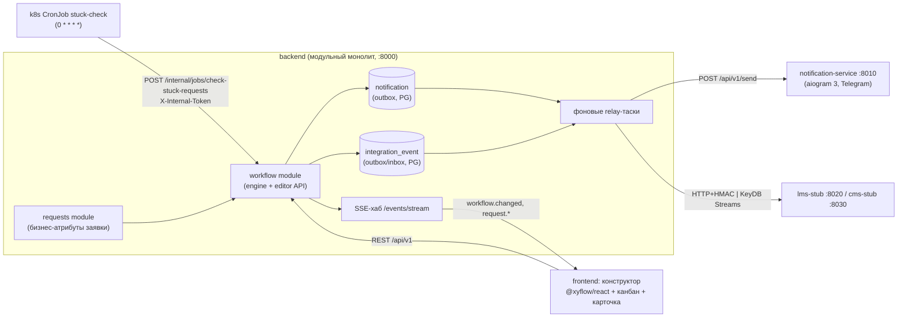
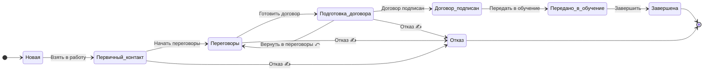
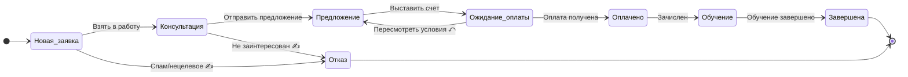

# Workflow Engine — проектная спецификация

> Кор-функционал №1 (PLAN.md, раздел 6). Документ самодостаточен: по нему пишется код
> модуля `backend/app/modules/workflow/` без дополнительных вопросов.
>
> Источники правды: **схема БД — `data-model.md` §5–6** (таблицы `workflow`, `workflow_stage`,
> `workflow_transition`, `workflow_change_request`, `deal`, `deal_stage_history`);
> **REST-контракты — `api-contract.md` §4–5, §11** (ресурс `/requests`, изменения схемы —
> `/workflows/{id}/changes`). Этот документ описывает семантику и алгоритмы движка.
>
> Терминологический мост (зафиксирован в OVERVIEW.md): таблица БД — `deal`, API-ресурс —
> `Request` (`/requests`), в UI — «заявка»; `workflow_stage` в API сериализуется как `status`,
> колонка `sort_order` — как `position`, флаг `is_return` — как `kind: "return"`.
>
> Стек: Python 3.12, FastAPI, SQLAlchemy 2 (async), Alembic, Pydantic v2, PostgreSQL 16.
> Проверка «зависших» заявок — k8s CronJob `stuck-check` (ежечасно), дергающий внутренний
> endpoint бэкенда.

## 0. Трассировка на решения кейсодержателя (раздел 2 PLAN.md)

| Решение кейсодержателя (PLAN.md §2) | Где покрыто |
|---|---|
| Два workflow: B2B (вузы) и B2C (физлица + юрлица), отдельные процессы | §4, §5 |
| В B2C — возможность добавлять новые варианты взаимодействия | §5.2 (конструктор добавляет этапы/ветки без кода + справочник `interaction_type`) |
| Workflow един для всех внутри типа, **версионирование запрещено** | §2.1 (одна живая схема, мутация in-place) |
| Изменения применяются сразу для всех | §6.4 (approve = атомарное применение одной транзакцией) |
| Ветвления — да | §3.3 (несколько исходящих переходов; `condition` — подсказка ветвления) |
| Возвраты на предыдущие шаги — да (бюрократия) | §3.4 (`is_return`, обязательный комментарий-причина — CHECK в БД) |
| При изменении «на лету» заявки сопоставляются на новую схему, работа не встаёт | §6.3–6.5 (миграция, advisory-lock: заявки не блокируются вне окна применения ~секунды) |
| Переименование/удаление статуса — только с апрувом администратора («защита от дурака») | §6.2, §6.6 (пакет операций → pending → approve админом; `confirm_name` посимвольно) |
| При удалении статуса заявки переносятся на соседний (лучше предыдущий) статус | §6.3 (`migrate_to_status_id`, дефолт = предыдущий сосед по `sort_order`) |
| Один вуз: договор один, продуктов несколько; параллельных взаимодействий ≤ 2; не переусложнять | §4.1 (продукты — атрибут заявки, не ветки графа; ≥3-я активная заявка на вуз — warning в UI, не запрет) |
| «Зависшие» заявки: настраиваемый порог 1–2 недели, эскалация ответственному и вышестоящей роли | §8 (каскад порогов в днях, двухступенчатая эскалация через `manager_id`, k8s CronJob) |
| События → Notification Service (Telegram-бот) и интеграции | §7 (outbox-таблицы `notification` и `integration_event`, SSE для UI) |

---

## 1. Место модуля в системе



Workflow-модуль владеет таблицами схем и переходов и является **единственной точкой смены
этапа заявки** (`transition_deal`). Модуль requests хранит бизнес-атрибуты, но менять
`deal.stage_id` напрямую запрещено (инвариант I-4, §10).

---

## 2. Ключевые принципы

### 2.1. Без версионирования — одна живая схема

По прямому решению кейсодержателя версионирование **запрещено**. Следствия:

- В БД ровно одна строка `workflow` на тип (`b2b`, `b2c`) и один актуальный набор
  этапов/переходов. Никаких `version`, `valid_from`, снапшотов схем.
- Изменение схемы — **мутация in-place** внутри одной транзакции (§6.4). Мягкое удаление
  (`deleted_at` у этапов/переходов) — не версионирование, а сохранение ссылочной целостности
  `deal_stage_history` (решение data-model.md §5.1).
- История фиксируется журналами: `audit_log` (кто и что менял в схеме, диф в JSON) и
  `deal_stage_history` (полная история движения каждой заявки со снапшотами имён этапов, §3.5).

### 2.2. Стабильные идентификаторы этапов

Этап идентифицируется UUID, который **не меняется при переименовании** — поэтому переименование
не требует миграции заявок: `deal.stage_id` продолжает указывать на тот же UUID. Миграция нужна
только при удалении этапа. `code` (slug) — человекочитаемый ключ для интеграций и seed-данных,
уникален внутри workflow среди неудалённых (partial unique в data-model.md §5.1).

### 2.3. Переходы — явные рёбра, а не «любой → любой»

Сменить этап можно только по существующему ребру `workflow_transition` (инвариант I-4).
Ветвления и возвраты — свойства схемы, редактируемые в конструкторе, а не ad-hoc действия.
Единственное журналируемое исключение — `POST /requests/{id}/reopen` (admin-only, §3.2).

---

## 3. Модель графа

DDL — **только** в data-model.md §5 (двойного определения нет). Семантика полей:

| Таблица.поле | Семантика в движке |
|---|---|
| `workflow_stage.is_initial` | Ровно один на workflow (partial unique). Новые заявки создаются здесь; входящие рёбра разрешены (возвраты «в начало») |
| `workflow_stage.is_terminal` + `terminal_outcome` | Конец процесса (`won`/`lost`). Исходящих рёбер нет (V-6); вход проставляет `deal.status = terminal_outcome`, выход возвратом — обратно `open` |
| `workflow_stage.stuck_threshold_days` | Порог зависания этапа в днях; NULL → порог workflow (§8) |
| `workflow_stage.triggers_lms_handover` | Вход в этап порождает `crm.request.handed_over` в LMS (api-contract.md §13.2) |
| `workflow_stage.sort_order` / `ui_position` / `color` | Порядок колонок канбана (API `position`), координаты узла React Flow, цвет |
| `workflow_transition.is_return` | Возврат назад (API `kind: "return"`); CHECK: `is_return → requires_comment` |
| `workflow_transition.requires_comment` | Комментарий обязателен (возвраты — всегда; «Отказ» — по seed) |
| `workflow_transition.allowed_roles` | RBAC ребра: `[]` = достаточно доступа к заявке; иначе роль ∈ списку |
| `workflow_transition.condition` | Подсказка ветвления (JSON-DSL, §3.3) — **не форсируется** при POST |

### 3.1. Терминальные этапы и reopen

Заявка в терминальном этапе закрыта: доступных переходов нет, SLA-таймер не считается.
Переоткрытие — осознанно НЕ ребро графа: `POST /api/v1/requests/{id}/reopen` (admin-only)
переводит заявку в указанный нетерминальный этап, `comment` обязателен, история —
`kind='manual'`, `reason='reopen'`. Это единственное исключение из «только по рёбрам»,
ограничено ролью admin и журналируется (data-model.md §6.1).

### 3.2. Ветвления и guard-условия (§3.3 по нумерации ссылок)

Ветвление = несколько исходящих рёбер из одного этапа. Выбор ветки **ручной** (пользователь
нажимает действие в карточке/тащит карточку на канбане), набор доступных действий фильтруется:

1. RBAC: роль пользователя ∈ `allowed_roles` (пустой список = достаточно доступа к заявке) —
   **форсируется** (403);
2. `requires_comment` — **форсируется** (400, если пусто);
3. `condition` — декларативная **подсказка**: `GET /requests/{id}/transitions` вычисляет её на
   бэке и аннотирует каждый переход (`available: true/false` + причина, UI подсвечивает
   подходящую ветку), но `POST /requests/{id}/transitions` по ней **не отказывает** — решение
   всегда за человеком (зафиксировано: data-model.md «condition — подсказка, не форсируется»).

Формат `condition` — минимальный JSON-DSL (вычисляется в `workflow/conditions.py`, никакого eval):

```json
{
  "all": [
    {"field": "client_kind", "op": "eq", "value": "company"},
    {"any": [
      {"field": "amount", "op": "gte", "value": 100000},
      {"field": "interaction_type_code", "op": "eq", "value": "corporate_training"}
    ]}
  ]
}
```

Операторы v1: `eq, neq, gt, gte, lt, lte, in, not_in, is_set`. `field` — точечный путь по
Pydantic-модели `RequestContext` (`workflow_type`, `client_kind`, `university_id`, `amount`,
`interaction_type_code`, `responsible_user_id`). Неизвестное поле / несравнимые типы →
условие ложно + warning в лог. Конструктор генерирует JSON формой «поле-оператор-значение».

### 3.4. Возвраты назад

`is_return = true` — легальное ребро графа (кейсодержатель: «возвраты — да, бюрократия»):

- `requires_comment = true` всегда (CHECK в БД): причина возврата обязательна, попадает в
  `deal_stage_history.comment` и в события;
- в UI рисуется красным пунктиром, в списке действий — отдельная группа «↩ Вернуть на…»;
- при возврате `stage_entered_at = now()` — SLA-таймер стартует заново (этап снова «в работе»);
- выход возвратом из терминального этапа невозможен (у терминала нет исходящих рёбер, V-6).

Циклы `A → B → A` из-за возвратов — норма; ацикличность **не** требуется (требуется только
достижимость терминала, V-4).

### 3.5. История

Каждая смена этапа пишет строку в `deal_stage_history` со **снимками имён** этапов
(`from_stage_name`, `to_stage_name`) — история читаема после переименований и удалений.
`kind`: `manual` (переход/​reopen), `system_migration` (миграция при изменении схемы),
`integration`, `import`. API `GET /requests/{id}/history` сериализует: `system_migration` →
`kind: "migrated"`, первая запись (from NULL) → `"created"`, остальное → `"transition"`;
события `assign`/`field_change` в тот же таймлайн подмешиваются из `audit_log`.

---

## 4. Предустановленный workflow B2B (вузы)

### 4.1. Смысловая модель

Путь КАМа с вузом: лид → контакт → переговоры → договор → передача в обучение → завершение.
Решения кейсодержателя, зашитые в модель:

- **Договор один, продуктов несколько** → продукты/программы — атрибуты заявки и договора
  (`deal.product_id/program_id`, `contract_product` M:N), а НЕ параллельные ветки графа.
  Расширение продуктового набора = добавление строк `contract_product` (data-model.md §4.6).
- **Параллельных взаимодействий ≤ 2** → НЕ ограничение графа: допускается ≥1 заявки на
  `university_id`; при создании 3-й активной — warning в UI («у вуза уже 2 активных
  взаимодействия»), не запрет.
- Отказ возможен на «продажной» части воронки; всегда с комментарием (`requires_comment`).

### 4.2. Диаграмма (канонический seed — api-contract.md §5.1, файл `seeds/b2b.json`)



(⤺ — возврат `is_return`, ✍ — `requires_comment`; «Передано в обучение» несёт
`triggers_lms_handover=true` → событие `crm.request.handed_over` в LMS; переход «Договор
подписан» ограничен `allowed_roles: [head_kam, admin]` — демо RBAC на ребре.)

Пороги seed: `new` — 7 дней, промежуточные — 14, `in_learning` и терминальные — NULL
(наследуют/не проверяются). Договорённость: **«порог выключен» на нетерминальном этапе
моделируется большим значением (60)**, NULL значит ровно одно — «взять порог workflow».

## 5. Предустановленный workflow B2C (физлица + юрлица)

### 5.1. Диаграмма (канонический seed — api-contract.md §5.1, файл `seeds/b2c.json`)



Тип клиента (физлицо/юрлицо) — `counterparty.kind`; тип взаимодействия — редактируемый
справочник `interaction_type` (`deal.interaction_type_id`). Ребро «Выставить счёт» в seed несёт
`condition`-подсказку по `client_kind` — демонстрация ветвления. Этап «Завершена» — точка
интеграции с Talent Pool: доменный хук на переходе двигает связанного студента в `graduate`.

### 5.2. «Возможность добавлять новые варианты взаимодействия»

Это требование к **редактируемости**: новые варианты (например, «Корпоративное обучение»,
«Вебинар-воронка») добавляются двумя штатными средствами без кода:

1. новая запись справочника `interaction_type` (админка) — атрибут заявки, фильтры, отчёты;
2. новые этапы/ветки в конструкторе (пакет операций `add_status`/`add_transition` + при желании
   `condition`-подсказка по `interaction_type_code`) — применяются сразу (безопасные операции).

Демонстрируем на защите именно на B2C.

---

## 6. Редактирование схемы «на лету»

### 6.1. Механика: пакет операций → (для опасных) approve → атомарное применение

Канонический контракт — api-contract.md §5.2–5.4. Черновик конструктора — **клиентский**
(zustand + localStorage): фронт свободно правит копию графа, а при отправке формирует **пакет
операций** относительно живой схемы: `add_status`, `update_status`, `rename_status`,
`delete_status`, `add_transition`, `update_transition`, `delete_transition`.
Пакет сохраняется в `workflow_change_request` (data-model.md §5.2).

| Класс | Операции | Поведение |
|---|---|---|
| безопасные | `add_status`, `add_transition`, `update_status` (цвет/порог/позиция), `update_transition`, `delete_transition` | от admin — применяются сразу (`applied` + `audit_log`); от head_kam — `pending` на апрув |
| **опасные** | `rename_status`, `delete_status` | всегда `pending`, даже от admin (двухшаговое подтверждение); несут `confirm_name` |

Перед отправкой конструктор зовёт `POST /workflows/{id}/impact-preview` (тот же массив
операций) и показывает «будет перенесено N заявок».

### 6.2. Защита от дурака — два рубежа

1. **При формировании пакета** (автор): red-диалог с дифом («Будет удалён этап „Запуск“,
   в нём **7 заявок** — будут перенесены в „Подготовка договора“») + **посимвольный ввод
   текущего названия этапа** → уходит в операцию полем `confirm_name`, backend сверяет строку
   с актуальным `name` этапа (несовпадение → `422 unprocessable`; фронтовой проверке не доверяем).
2. **При апруве** (admin): `POST /workflows/changes/{id}/approve` — отдельное действие с
   повторным показом дифа и счётчиков. Автор-админ может одобрить свой пакет: approve и есть
   второй шаг (решение зафиксировано; аудит-след полный).

### 6.3. Правила сопоставления заявок (миграция)

Реализуют решение кейсодержателя буквально:

1. **Сохранившийся этап** (тот же UUID, пусть и переименованный) — заявки остаются на месте.
2. **Новый этап** — рождается пустым.
3. **Удалённый этап** — все его открытые заявки переносятся на `migrate_to_status_id` операции.
   Требования к цели: существует, не удаляется этим же пакетом, **не терминальна**,
   **сосед** удаляемого (связана с ним ребром в старом графе). Дефолт в UI — **предыдущий**
   сосед (максимальный `sort_order` меньше удаляемого) — «лучше предыдущий».
4. Перенос пишется каждой заявке в историю: `kind='system_migration'`, `reason='stage_deleted'`,
   `actor_user_id=NULL`, `comment='Статус «X» удалён администратором, заявка перенесена в «Y»'` —
   и порождает `request.transitioned`-уведомление ответственному (он узнаёт из Telegram, что
   заявка переехала) + SSE `workflow.changed` всем открытым доскам.
5. **`stage_entered_at` при миграции сохраняется** — административная перестройка схемы не
   «омолаживает» заявку и не маскирует зависание от эскалаций (решение data-model.md §5.3).
6. Начальный этап удалить нельзя; последний терминальный — нельзя (V-2).

### 6.4. Атомарное применение: `apply_workflow_change`

Псевдокод (`db` — async-сессия SQLAlchemy, всё тело — ОДНА транзакция):

```python
async def apply_workflow_change(change_id: UUID, approver: User) -> ApplyResult:
    async with db.begin():                                        # BEGIN
        wcr = await db.get(WorkflowChangeRequest, change_id, with_for_update=True)
        require(wcr.status == "pending", 409, "Пакет уже обработан")
        require(approver.has_role("admin"), 403)

        # 1. Эксклюзивная блокировка workflow: все transition_deal этого workflow
        #    держат SHARED-лок (§6.5) => дождёмся хвоста переходов и заморозим новые.
        await db.execute(select(func.pg_advisory_xact_lock(wf_lock_key(wcr.workflow_id))))

        current = await load_graph(wcr.workflow_id)               # живая схема из БД
        ops     = parse_operations(wcr.operations)                # Pydantic-модели операций

        # 2. confirm_name опасных операций — посимвольная сверка с АКТУАЛЬНЫМ именем
        for op in ops.dangerous():
            require(op.confirm_name == current.stage(op.status_id).name, 422,
                    f'Подтверждение не совпало: введите точное название «{...}»')

        target = current.apply(ops)                               # целевой граф в памяти
        validate_graph(target)                                    # V-1..V-7 (§6.7)
        await validate_migration(current, target, ops)            # V-8: цели переносов

        # 3. Мутация схемы in-place: INSERT новых этапов/рёбер, UPDATE изменённых,
        #    deleted_at ушедшим рёбрам; затем перенос заявок; затем deleted_at этапам.
        await upsert_stages_and_transitions(wcr.workflow_id, target)

        migrated = []
        for op in ops.of("delete_status"):
            deals = await db.scalars(select(Deal)
                    .where(Deal.stage_id == op.status_id, Deal.status == "open")
                    .with_for_update())                           # row-lock переносимых заявок
            for deal in deals:
                deal.stage_id = op.migrate_to_status_id           # stage_entered_at НЕ трогаем
                add_history(deal, kind="system_migration", reason="stage_deleted", ...)
                emit_notification("request.transitioned", deal)   # outbox в этой же транзакции
                migrated.append(deal.id)
            await soft_delete_stage(op.status_id)                 # deleted_at = now()

        wcr.status, wcr.decided_by, wcr.applied_at = "applied", approver.id, now()
        add_audit_log(...); invalidate_cache_after_commit("crm:v1:wf:*")
        publish_sse_after_commit("workflow.changed", ...)
        return ApplyResult(migration_report=..., migrated=migrated)   # COMMIT — всё или ничего
```

Свойства: (а) применение атомарно — упавшая валидация откатывает и мутацию, и переносы, и
outbox-события; (б) «работа не встаёт» — блокировка держится миллисекунды–секунды только на
фазе применения; (в) переход, начавшийся до лока, корректно завершится до применения
(shared→exclusive очередь advisory-локов Postgres); (г) `DEL crm:v1:wf:{id}` и SSE — строго
after_commit (data-model.md §10).

### 6.5. Конкурентность: advisory-locks

| Операция | Лок |
|---|---|
| `transition_deal` | `pg_advisory_xact_lock_shared(wf_lock_key(workflow_id))` + `SELECT … FOR UPDATE` строки deal |
| `apply_workflow_change` | `pg_advisory_xact_lock(wf_lock_key(workflow_id))` (эксклюзивный) |
| `check_stuck_requests` | без wf-лока; `FOR UPDATE SKIP LOCKED` по заявкам |

`wf_lock_key(workflow_id) = hashtextextended('wf:' || workflow_id::text, 0)` (bigint).
Shared-локи совместимы между собой (переходы не мешают друг другу), эксклюзивный ждёт всех и
не пускает новых — ровно семантика «применить сразу для всех, не останавливая работу».

### 6.6. Одновременное редактирование

Серверного черновика нет, поэтому конфликт «двое правят схему» разрешается на применении:
approve пересчитывает операции против **актуальной** схемы; если упомянутый в операции этап уже
изменён/удалён — `409 conflict`, автор пересоздаёт пакет (api-contract.md §5.4 п.1).
`GET /workflows/{id}/changes?status=pending` показывает бейдж «есть пакет на согласовании» в
конструкторе — второй автор видит это до начала правок.

### 6.7. Валидации графа

Прогоняются при создании пакета/impact-preview (мгновенная обратная связь конструктору, все
ошибки списком) и **повторно** внутри транзакции применения. Ошибка API —
`400 workflow_invalid_schema` с `details[]` из кодов:

| № | Правило | code в details |
|---|---|---|
| V-1 | Ровно один этап `is_initial` | `E_INITIAL_COUNT` |
| V-2 | Есть хотя бы один терминальный этап | `E_NO_TERMINAL` |
| V-3 | Связность: каждый этап достижим из initial по рёбрам (BFS) | `E_UNREACHABLE_STAGE` |
| V-4 | Из каждого нетерминального этапа достижим хотя бы один терминал (обратный BFS; циклы-ловушки запрещены) | `E_NO_PATH_TO_TERMINAL` |
| V-5 | Нет петель (`from == to`) и дублей рёбер (уникальность пары from/to) | `E_BAD_TRANSITION` |
| V-6 | У терминальных этапов нет исходящих рёбер | `E_TERMINAL_OUTGOING` |
| V-7 | Уникальность `code`/`name` этапов; `condition` синтаксически валиден (Pydantic-схема DSL); `allowed_roles` ⊆ {admin, head_kam, kam} | `E_STAGE_DUP` / `E_BAD_CONDITION` / `E_UNKNOWN_ROLE` |
| V-8 | Миграция: для каждого удаляемого этапа с заявками задан `migrate_to_status_id`; цель существует, не терминальна, была соседом в старом графе; `confirm_name` совпал | `E_MAPPING_REQUIRED` / `E_MAPPING_INVALID` / `E_CONFIRM_MISMATCH` |

Конструктор подсвечивает проблемные узлы прямо на канве React Flow.

---

## 7. События движка

Два транзакционных outbox'а в PG (никакой отдельной шины событий движок не заводит):

1. **`notification`** (data-model.md §9.4) — переходы, зависания, изменения схемы. Backend
   вычисляет получателей по `notification_rule` и пишет записи в той же транзакции; relay
   доставляет в notification-service (`POST :8010/api/v1/send`, идемпотентность по
   `notification_id`). События: `request.created`, `request.transitioned` (включая миграции и
   reopen — с пометкой в payload), `request.assigned`, `request.stuck`,
   `workflow.change_requested`, `workflow.changed`.
2. **`integration_event`** (data-model.md §9.3) — конверт IntegrationEvent для LMS/CMS
   (api-contract.md §13). Триггеры движка: вход в этап с `triggers_lms_handover` →
   `crm.request.handed_over`.

UI-realtime — SSE `GET /api/v1/events/stream` (топики `workflow.changed`,
`request.transitioned`, `request.comment_added`; fan-out между репликами — KeyDB pub/sub
`crm:v1:events`). Публикация SSE — after_commit.

---

## 8. «Зависшие» заявки и эскалация

### 8.1. Параметры (единица — дни)

- Порог: каскад `notification_rule.params.threshold_days` → `workflow_stage.stuck_threshold_days`
  → `workflow.stuck_threshold_days` (дефолт 14) → `app_setting['stuck_threshold_days_default']`
  (14, диапазон 1–60). «1–2 недели» кейсодержателя = дефолт 14, редактируется в конструкторе
  (на этапе) и в админке (на workflow/глобально).
- Эскалация двухступенчатая: **ступень 1** (порог) — ответственному; **ступень 2**
  (порог × 1.5, округление вверх до дней) — руководителю (`app_user.manager_id`).
- Повторные напоминания — не чаще `repeat_every_days` (дефолт 3): уникальный
  `notification.dedup_key = 'stuck:{deal_id}:{stage_id}:{level}:{bucket}'`,
  `bucket = floor(days_on_stage / repeat_every_days)` — дубли отбрасываются на любом числе
  параллельных вызовов. Отдельных колонок-маркеров на `deal` нет: состояние дедупликации живёт
  в `notification.dedup_key` (истина) + KeyDB-guard `crm:v1:stuck:guard:{deal_id}` (быстрый путь).
- Терминальные этапы и закрытые заявки не проверяются; любой переход начинает отсчёт заново
  (`stage_entered_at = now()`).

### 8.2. Механика: k8s CronJob → internal endpoint

CronJob `deploy/k8s/base/cronjobs/stuck-check-cronjob.yaml` (расписание `0 * * * *`) выполняет
`curl -fsS -X POST http://backend:8000/api/v1/internal/jobs/check-stuck-requests -H "X-Internal-Token: $TOKEN"`.
Токен — из k8s Secret `crm-internal`, endpoint не публикуется через ingress. Паритет для
docker-compose — Makefile-таргет `make stuck-check` (тот же curl на localhost:8000).
Endpoint идемпотентен и безопасен к параллельному запуску (`SKIP LOCKED` + dedup_key) — двойной
запуск не дублирует уведомления. Ответ — api-contract.md §11.1.

```python
async def check_stuck_requests() -> StuckReport:
    report = StuckReport()
    async with db.begin():
        rows = await db.execute(text("""
            SELECT d.id FROM deal d
            JOIN workflow_stage s ON s.id = d.stage_id
            JOIN workflow w ON w.id = d.workflow_id
            WHERE d.status = 'open' AND NOT s.is_terminal
              AND now() - d.stage_entered_at > make_interval(
                    days => COALESCE(s.stuck_threshold_days, w.stuck_threshold_days))
            FOR UPDATE OF d SKIP LOCKED
        """))                                   # ix_deal_stuck делает выборку дешёвой
        for deal in await load(rows):
            days = days_since(deal.stage_entered_at)
            threshold = effective_threshold(deal)                  # каскад §8.1
            emit_stuck(deal, level="responsible", days=days)       # dedup_key гасит повторы
            report.notified += 1
            if days >= ceil(threshold * 1.5):
                emit_stuck(deal, level="manager", days=days,
                           recipient=manager_of(deal.responsible_user_id))
                report.escalated += 1
    return report   # 200 {"checked": N, "stuck_found": M, ...} — виден в логах CronJob
```

---

## 9. REST API модуля

Канонические контракты — api-contract.md (§4.1, §4.3, §5.2–5.4, §11.1); здесь — сводка:

| Метод и путь | Роли | Назначение |
|---|---|---|
| `GET /workflows` | все | Список workflow (type, name, счётчики) |
| `GET /workflows/{id}` | все | Полный граф: statuses[] + transitions[] — источник для React Flow и канбана |
| `POST /workflows/{id}/impact-preview` | admin, head_kam | Предпросмотр влияния пакета операций |
| `POST /workflows/{id}/changes` | admin, head_kam | Пакет операций; безопасный от admin — применяется сразу |
| `GET /workflows/{id}/changes`, `GET /workflows/changes/{id}` | admin, head_kam (observer — read) | Списки/карточка изменений |
| `POST /workflows/changes/{id}/approve` / `.../reject` | **только admin** | Атомарное применение §6.4 / отклонение с причиной |
| `GET /requests/{id}/transitions` | по доступу к заявке | Рёбра из текущего этапа: RBAC-фильтр + аннотация `condition`; элементы `{transition_id, to_status_id, name, kind, requires_comment, available, unavailable_reason}` — карточка и канбан рисуют действия строго из этого списка |
| `POST /requests/{id}/transitions` | по доступу | `{to_status_id, comment?, version}`; 409 `workflow_invalid_transition` (ребра нет / заявка уже не в from-этапе — фронт перечитывает), 400 `validation_error` (нет обязательного comment), 403, 409 `stale_version` |
| `POST /requests/{id}/reopen` | admin | Переоткрытие из терминала (§3.1) |
| `POST /internal/jobs/check-stuck-requests` | X-Internal-Token | §8.2 |

### 9.1. `transition_deal` — псевдокод

```python
async def transition_deal(deal_id: UUID, to_status_id: UUID,
                          actor: User, comment: str | None, version: int) -> Deal:
    async with db.begin():
        deal = await db.get(Deal, deal_id, with_for_update=True)          # row-lock
        require(deal.version == version, 409, "stale_version")
        # Shared-лок workflow: переходы параллельны, но не пересекают применение схемы
        await db.execute(select(func.pg_advisory_xact_lock_shared(wf_lock_key(deal.workflow_id))))
        # ВАЖНО: после захвата локов перечитать ребро из ЖИВОЙ схемы —
        # она могла измениться, пока пользователь смотрел на карточку
        tr = await find_transition(deal.workflow_id, from_=deal.stage_id, to=to_status_id)
        require(tr is not None and tr.deleted_at is None, 409, "workflow_invalid_transition")
        require(actor.can_write(deal), 403, "forbidden")                  # ответственный/выше
        require(not tr.allowed_roles or set(actor.roles) & set(tr.allowed_roles), 403)
        require(not tr.requires_comment or (comment and comment.strip()), 400, "validation_error")

        from_stage, to_stage = deal.stage, await db.get(WorkflowStage, tr.to_stage_id)
        deal.stage_id = to_stage.id
        deal.stage_entered_at = now(); deal.last_activity_at = now()
        if to_stage.is_terminal: deal.status = to_stage.terminal_outcome  # won | lost
        elif deal.status != 'open': deal.status = 'open'                  # возврат из терминала
        add_history(deal, from_=from_stage, to=to_stage, transition=tr,
                    kind="manual", is_return=tr.is_return, actor=actor, comment=comment)
        emit_notification("request.transitioned", deal, actor, comment)   # outbox
        if to_stage.triggers_lms_handover:
            emit_integration("crm.request.handed_over", deal)             # outbox
        invalidate_cache_after_commit(f"crm:v1:deal:{deal.id}")
        publish_sse_after_commit("request.transitioned", deal)
        return deal                                                       # COMMIT
```

---

## 10. Инварианты и их защита

| № | Инвариант | Чем защищён |
|---|---|---|
| I-1 | В каждом workflow ровно один initial и ≥1 терминал; все этапы достижимы; из любого нетерминального достижим терминал | V-1..V-4 на пакете **и** повторно в транзакции применения; seed-графы проходят тот же `validate_graph` в тестах; partial unique `uq_stage_single_initial` |
| I-2 | Нет осиротевших заявок: `deal.stage_id` всегда указывает на неудалённый этап своего workflow | FK без каскада; порядок операций §6.4 (сначала перенос, потом `deleted_at`); V-8 |
| I-3 | Схема одна, версий нет | Нет версионных полей в DDL; UNIQUE `workflow.code`; мутация только через `apply_workflow_change` |
| I-4 | Этап меняется только по существующему ребру живой схемы (искл.: reopen админом, миграция схемы — оба журналируются с отдельным `reason`) | `transition_deal` перечитывает ребро после захвата локов; 409 `workflow_invalid_transition`; прямой UPDATE `stage_id` вне модуля запрещён код-ревью, другого API нет |
| I-5 | Применение схемы атомарно: либо новая схема + все переносы + события, либо ничего | Одна транзакция §6.4; оба outbox'а в той же транзакции |
| I-6 | Переход и применение схемы не гоняются | Advisory-локи shared/exclusive (§6.5) |
| I-7 | Деструктивное изменение невозможно без admin и посимвольного `confirm_name` | Классификация §6.1 (опасные — всегда pending); сверка `confirm_name` на бэке при создании и повторно при применении (V-8) |
| I-8 | Возврат назад всегда содержит причину | CHECK `ck_transition_return_comment` в DDL + 400 на POST |
| I-9 | Каждая смена этапа оставляет строку истории со снимком имён и порождает ровно один набор событий | `add_history` + `emit_*` только внутри трёх точек (transition/reopen/migration), в их транзакциях; идемпотентность потребителей по `notification_id`/`event_id` |
| I-10 | Заявка не «зависает» незамеченной; напоминание каждой ступени — не чаще `repeat_every_days` | CronJob + идемпотентный endpoint (§8.2); уникальный `notification.dedup_key`; частичный индекс `ix_deal_stuck` |
| I-11 | История заявки читаема вечно, даже если этапы удалены/переименованы | Снимки имён в `deal_stage_history` (§3.5); этапы удаляются только мягко |

---

## 11. Что видит жюри (сценарий демо, 3 минуты)

1. Канбан B2B: тащим заявку «Новая → Первичный контакт» — Telegram-уведомление приходит
   ответственному; возврат «Подготовка договора → Переговоры» требует комментарий.
2. Конструктор (React Flow): в B2C добавляем ветку «Корпоративное обучение» (новый этап +
   переходы) под head_kam — пакет уходит на согласование.
3. Под админом: `/admin/approvals` — диф; удаляем этап с заявками — red-диалог «7 заявок →
   предыдущий этап», вводим название этапа руками (`confirm_name`). Approve.
4. Канбан обновился у всех по SSE, заявки переехали, в истории каждой — запись о миграции,
   ответственным пришли уведомления.
5. k8s: `kubectl get cronjob` → `kubectl create job stuck-demo --from=cronjob/stuck-check` →
   в Telegram прилетает «🔥 заявка висит 15 дней» и эскалация руководителю КАМа.

## 12. Файловая раскладка модуля (ориентир для кодогенерации)

```
backend/app/modules/workflow/
├── models.py          # SQLAlchemy: Workflow, WorkflowStage, WorkflowTransition,
│                      #   WorkflowChangeRequest (DDL — data-model.md §5)
├── schemas.py         # Pydantic v2: GraphOut, StatusIn/Out, TransitionIn/Out, OperationIn
│                      #   (discriminated union по "op"), ChangeRequestOut, ImpactOut,
│                      #   ConditionDSL (рекурсивная модель all/any/условие)
├── graph.py           # validate_graph (V-1..V-7), apply_ops, достижимость (BFS), is_neighbor
├── conditions.py      # evaluate_condition(DSL, RequestContext) — аннотация переходов
├── service.py         # apply_workflow_change, transition_deal, reopen_deal, check_stuck_requests
├── router.py          # эндпоинты §9
├── locks.py           # wf_lock_key, shared/exclusive helpers
├── seeds/{b2b,b2c}.json   # канонические seed-графы (= api-contract.md §5.1)
└── tests/             # инварианты I-1..I-11 как тест-кейсы; гонка transition vs apply —
                       #   интеграционный тест на двух сессиях
```

Общие для монолита: `app/core/outbox.py` (emit + relay-таски notification/integration),
`app/core/sse.py` (SSE-хаб + KeyDB pub/sub `crm:v1:events`), `app/core/events.py`
(константы реестра событий — data-model.md §9.4).
